# Introduction

Modeling football outcomes has become extremely popular over the last years, and several statistical models have been proposed to describe the number of goals scored by two competing teams. The `footBayes` package collects the most well-known **goal-based models** in a single, coherent workflow: models are fitted either by maximum likelihood or in a Bayesian framework through the Stan platform [@stan] via the `CmdStanR` interface [@cmdstanr_2024], and the same set of functions can then be used to **interpret** the estimates, **check** the models, **predict** future matches and **compare** competing models.

The table below summarizes the models available in the package, the value of the `model` argument that selects them, and the estimation routes that are available for each of them: maximum likelihood (`mle_foot`, static models only), and Bayesian estimation with `stan_foot` for static and dynamic team abilities.

| Model | `model` | `mle_foot` | `stan_foot` (static) | `stan_foot` (dynamic) |
|:--|:--|:--:|:--:|:--:|
| Double Poisson [@maher1982modelling; @baio2010bayesian] | `"double_pois"` | yes | yes | yes |
| Bivariate Poisson [@karlis2003analysis] | `"biv_pois"` | yes | yes | yes |
| Dixon-Coles [@dixon1997modelling] | `"dixon_coles"` | yes | yes | yes |
| Negative binomial [@reep_1971] | `"neg_bin"` | yes | yes | yes |
| Skellam [@karlis2009bayesian] | `"skellam"` | yes | yes | yes |
| Student-$t$ [@gelman2014stan] | `"student_t"` | yes | yes | yes |
| Diagonal-inflated bivariate Poisson [@karlis2003analysis] | `"diag_infl_biv_pois"` | - | yes | yes |
| Zero-inflated Skellam [@karlis2009bayesian] | `"zero_infl_skellam"` | - | yes | yes |

In the dynamic case, the attack and defence abilities are allowed to evolve over weeks or seasons, and the package offers **four alternative specifications of the evolution variance**: the separate attack/defence variances of @egidi2018combining, the common variance of @owen2011dynamic, the variance inflation after the summer break of @koopman2015dynamic, and the **weighted dynamic models** with commensurate priors of @macridemartino2026weighted.

Since the predictive performance of goal-based models may be further improved by incorporating historical information about team strengths, the package also implements a Bayesian **Bradley-Terry-Davidson** (BTD) model [@davidson1970; @demartino2024alternative], whose posterior log-strengths can be used as an additional covariate in the goal-based models.

In this vignette we will learn how to:

- fit **static** models by maximum likelihood and in a Bayesian framework;

- fit **dynamic** Bayesian models, and choose among the alternative specifications of the evolution variance;

- change the prior distributions and perform some **sensitivity tests**;

- estimate historical team strengths with the **Bradley-Terry-Davidson** model and use them as a **covariate**;

- interpret the **parameters' estimates** and depict the team-specific **abilities**;

- check the models through graphical **posterior predictive checks**;

- obtain out-of-sample **predictions** and reconstruct the final **league table**;

- **compare** models through predictive metrics and information criteria.

The package is developed at [https://github.com/LeoEgidi/footBayes](https://github.com/LeoEgidi/footBayes).

# Goal-based models in a nutshell

## Scoring rates and team abilities

Let $(x_n, y_n)$ denote the number of goals scored by the home and the away team in the $n$-th match, $n = 1, \ldots, N$, and let $h_n, a_n \in \{1, \ldots, T\}$ denote the home and the away team, respectively. All the goal-based models in the package share the same log-linear structure for the **scoring rates** $\lambda_{1n}, \lambda_{2n}$ of the home and the away team:

\begin{align}
\log(\lambda_{1n}) & = \text{home} + \text{att}_{h_n} + \text{def}_{a_n} + \frac{\gamma}{2} \, \omega_n\\
\log(\lambda_{2n}) & = \text{att}_{a_n} + \text{def}_{h_n} - \frac{\gamma}{2} \, \omega_n,
\end{align}

where $\text{home}$ is the **home effect**, i.e. the well-known advantage of the team hosting the game; $\text{att}_t$ and $\text{def}_t$ are the **attack** and the **defence** abilities of team $t$, $t = 1, \ldots, T$; $\omega_n = \text{rank\_points}_{h_n} - \text{rank\_points}_{a_n}$ is the difference between the **ranking points** of the two teams (an optional covariate, see the section on the Bradley-Terry-Davidson model), and $\gamma$ is the corresponding coefficient. The higher the attack and the lower the defence ability, the stronger the team. To achieve identifiability, the attack and defence abilities are imposed a **sum-to-zero** constraint:

\begin{equation}
\sum_{t=1}^{T} \text{att}_{t} = 0, \qquad \sum_{t=1}^{T} \text{def}_{t} = 0.
\end{equation}

## Distributions for the goals

**Double Poisson.** The simplest assumption is that the two goal counts are conditionally independent Poisson random variables [@maher1982modelling; @baio2010bayesian]:

\begin{equation}
X_n \sim \mathsf{Poisson}(\lambda_{1n}), \qquad Y_n \sim \mathsf{Poisson}(\lambda_{2n}).
\end{equation}

**Bivariate Poisson.** In team sports it is reasonable to assume that the two goal counts are **correlated**, since the two teams interact during the game: a team leading 1-0 in the last ten minutes may relax, whereas the opponent takes more risks in an effort to draw. @karlis2003analysis capture a positive correlation through the bivariate Poisson distribution: if $X_r$, $r = 1, 2, 3$, are independent Poisson random variables with rates $\lambda_r$, then $X = X_1 + X_3$ and $Y = X_2 + X_3$ jointly follow a bivariate Poisson distribution $\text{BP}(\lambda_1, \lambda_2, \lambda_3)$ with joint probability function

\begin{equation}
\text{Pr}(X = x, Y = y) = \exp\{-(\lambda_1 + \lambda_2 + \lambda_3)\} \frac{\lambda_1^x}{x!} \frac{\lambda_2^y}{y!} \sum_{k=0}^{\min(x, y)} \binom{x}{k} \binom{y}{k} k! \left(\frac{\lambda_3}{\lambda_1 \lambda_2}\right)^k,
\end{equation}

marginal means $\text{E}(X) = \lambda_1 + \lambda_3$, $\text{E}(Y) = \lambda_2 + \lambda_3$, and $\text{cov}(X, Y) = \lambda_3$. In the package the covariance is constant across matches, $\lambda_{3n} = \exp\{\rho\}$, with $\rho$ assigned a $\mathrm{N}(0, 1)$ prior; when $\lambda_3 = 0$ the model reduces to the double Poisson.

**Dixon-Coles.** @dixon1997modelling keep the two independent Poisson rates but correct the joint probability of the four low-scoring results, which are typically under- or over-estimated by the double Poisson model:

\begin{equation}
\text{Pr}(X_n = x, Y_n = y) = \tau_{\lambda_{1n}, \lambda_{2n}}(x, y) \, \mathsf{Poisson}(x \mid \lambda_{1n}) \, \mathsf{Poisson}(y \mid \lambda_{2n}),
\end{equation}

where

\begin{equation}
\tau_{\lambda_1, \lambda_2}(x, y) = \begin{cases} 1 - \lambda_1 \lambda_2 \rho & \text{if } (x, y) = (0, 0) \\ 1 + \lambda_1 \rho & \text{if } (x, y) = (0, 1) \\ 1 + \lambda_2 \rho & \text{if } (x, y) = (1, 0) \\ 1 - \rho & \text{if } (x, y) = (1, 1) \\ 1 & \text{otherwise}, \end{cases}
\end{equation}

and $\rho$ is the low-score dependence parameter, constrained so that the adjustment factor is positive and assigned a $\mathrm{N}(0, 0.1)$ prior in the Bayesian version.

**Negative binomial.** Goal counts are often **overdispersed** with respect to the Poisson distribution. The negative binomial model keeps the same scoring rates as means and adds two dispersion parameters, $\phi_1$ for the home and $\phi_2$ for the away goals (NB2 parameterization, $\text{Var}(X_n) = \lambda_{1n} + \lambda_{1n}^2 / \phi_1$), each assigned a half-normal $\mathrm{N}^+(0, 5)$ prior.

**Diagonal-inflated bivariate Poisson.** Goal-based models often underestimate the probability of a **draw**, which corresponds to the diagonal of the score probability table. @karlis2003analysis add an inflation component on the diagonal:

\begin{equation}
\text{Pr}(X = x, Y = y) = \begin{cases} (1-p) \, \text{BP}(\lambda_1, \lambda_2, \lambda_3) & \text{if } x \ne y \\ (1-p) \, \text{BP}(\lambda_1, \lambda_2, \lambda_3) + p \, D(x, \eta) & \text{if } x = y, \end{cases}
\end{equation}

where $D(x, \eta)$ is a discrete distribution with parameter vector $\eta$ and $p$ is the inflation probability (`prob_of_draws`).

## Distributions for the goal difference

Instead of modelling the two goal counts, one may model directly the goal difference $Z_n = X_n - Y_n$.

**Skellam.** If $X_n$ and $Y_n$ are independent Poisson random variables, the difference follows a Poisson-difference or Skellam distribution [@karlis2009bayesian], $Z_n \sim \text{Skellam}(\lambda_{1n}, \lambda_{2n})$, with the same scoring rates as above. The **zero-inflated Skellam** adds an inflation probability $p$ for the zero goal difference, i.e. for the draws.

**Student-$t$.** Following @gelman2014stan, the goal difference can be modelled with a continuous, heavy-tailed distribution:

\begin{equation}
Z_n \sim t(\nu, \text{home} + \text{ab}_{h_n} - \text{ab}_{a_n}, \sigma_y), \qquad \text{ab}_t = \beta \, \text{rank\_points}_t + \alpha_t \, \sigma_a,
\end{equation}

where $\text{ab}_t$ is the overall ability of team $t$ (a single ability replaces attack and defence), $\nu = 7$ degrees of freedom by default and $\alpha_t$ are team-specific random effects.

## Prior distributions

In the Bayesian framework the team-specific abilities are assumed **exchangeable** and assigned some weakly-informative priors,

\begin{align}
\text{att}_t & \sim \mathrm{N}(\mu_{\text{att}}, \sigma_{\text{att}}) \\
\text{def}_t & \sim \mathrm{N}(\mu_{\text{def}}, \sigma_{\text{def}}), \qquad t = 1, \ldots, T,
\end{align}

with **hyperparameters** $\mu_{\text{att}}, \mu_{\text{def}}$ (fixed to 0 by default) and group-level standard deviations $\sigma_{\text{att}}, \sigma_{\text{def}} \sim \mathsf{Cauchy}^+(0, 5)$, where $\mathsf{Cauchy}^+$ denotes the half-Cauchy distribution. The home effect is assigned a $\mathrm{N}(0, 5)$ prior. As we will see, the `prior_par` argument allows the user to change these priors, choosing among the Gaussian (`normal`), Student-$t$ (`student_t`), Cauchy (`cauchy`) and Laplace (`laplace`) families.

## Static and dynamic abilities

The models above assume **static** abilities: teams are assumed to perform equally well over the whole period covered by the data. However, teams' performance is *dynamic* and changes across seasons, if not across weeks: rosters change during the summer and winter transfer windows, key players get injured, coaches are dismissed after poor results, and so on. Following @owen2011dynamic and @egidi2018combining, the package allows the attack and defence abilities to evolve over a set of discrete periods $\tau = 1, \ldots, \mathcal{T}$ (weeks within a season, or seasons and half-seasons) through **auto-regressive priors of order 1**:

\begin{align}
\text{att}_{t, \tau} & \sim \mathrm{N}(\text{att}_{t, \tau-1}, \sigma_{\text{att}}) \\
\text{def}_{t, \tau} & \sim \mathrm{N}(\text{def}_{t, \tau-1}, \sigma_{\text{def}}), \qquad \tau = 2, \ldots, \mathcal{T},
\end{align}

whereas for $\tau = 1$ the static priors above are used. The sum-to-zero constraint is imposed in each period. The **evolution standard deviations** $\sigma_{\text{att}}, \sigma_{\text{def}}$ govern how much the abilities are allowed to change from one period to the next, and the package offers four alternative ways to specify them, which are presented in the section on dynamic models.

## Inference

**Maximum likelihood.** Given the parameter vector $\boldsymbol{\theta}$, the maximum likelihood estimate (MLE) $\hat{\boldsymbol{\theta}} = \text{argmax}_{\theta \in \Theta} L(\boldsymbol{\theta})$ is obtained by numerical optimization, and 95% confidence intervals are computed either with the Wald approximation, $\hat{\boldsymbol{\theta}} \pm 1.96 \, \text{se}(\hat{\boldsymbol{\theta}})$, or from the profile likelihood. The package allows the maximum likelihood approach for **static** models only: as the parameter space grows, as it happens with dynamic abilities, MLE becomes computationally expensive and less reliable.

**Bayesian inference.** The Bayesian analysis carries out inferential conclusions from the joint posterior distribution

$$\pi(\boldsymbol{\theta} \mid \mathcal{D}) \propto p(\mathcal{D} \mid \boldsymbol{\theta}) \, \pi(\boldsymbol{\theta}),$$

where $\mathcal{D} = (x_n, y_n)_{n = 1, \ldots, N}$ denotes the observed data, $p(\mathcal{D} \mid \boldsymbol{\theta})$ is the sampling distribution and $\pi(\boldsymbol{\theta})$ the joint prior. The posterior does not have a closed form and it is approximated by simulation: the package relies on Stan and offers, through the `method` argument of `stan_foot` and `btd_foot`, four algorithms:

- `"MCMC"` (default): **Hamiltonian Monte Carlo** (HMC) sampling, which mitigates the random-walk behaviour of Gibbs and Metropolis-Hastings samplers; see @betancourt2017conceptual and the [CmdStan user's guide](https://mc-stan.org/docs/cmdstan-guide/mcmc_config.html).

- `"VI"`: **Automatic Differentiation Variational Inference** (ADVI), which optimizes the Evidence Lower Bound via stochastic gradient ascent [@kucukelbir2017automatic].

- `"pathfinder"`: the **Pathfinder** algorithm, which follows a quasi-Newton optimization path and returns draws from the Gaussian approximation minimizing the Kullback-Leibler divergence to the posterior [@Pathfinder].

- `"laplace"`: the **Laplace approximation** around the posterior mode in the unconstrained space.

MCMC is the most accurate option and it is the one used for model checking and comparison; the other algorithms are faster approximations, useful for quick exploratory fits.

# Installation and setup

Using the `footBayes` package requires installing the R package [`cmdstanr`](https://mc-stan.org/cmdstanr/) (not available on CRAN) and the command-line interface to Stan, [`CmdStan`](https://mc-stan.org/users/interfaces/cmdstan.html). You may follow the instructions in [Getting started with CmdStanR](https://mc-stan.org/cmdstanr/articles/cmdstanr.html) to install both.

You can install the released version of `footBayes` from CRAN with:


``` r
install.packages("footBayes", type = "source")
```

Please note that it is important to set `type = "source"`: otherwise, the CmdStan models in the package may not be compiled during installation.

Alternatively, you can install the development version from GitHub with:


``` r
# install.packages("devtools")
devtools::install_github("LeoEgidi/footBayes")
```

We load the package together with a few others used along the vignette:


``` r
library(footBayes)
library(dplyr)
library(ggplot2)
library(bayesplot)
library(loo)
```

Throughout the vignette the Bayesian models are fitted with HMC using `n_chains` Markov chains of `n_iter` sampling iterations each (after as many warmup iterations); a fixed seed makes the results reproducible.


``` r
n_iter <- 1000
n_chains <- 4
seed <- 2026
```

# Data

The package ships with the `italy` and `england` datasets, containing the results of the Italian Serie A and of the English leagues, respectively. The fitting functions require a data frame with the following columns (in this order):

- `periods`: an integer denoting the time period of each match (season, half-season or match day);
- `home_team`, `away_team`: the names of the two teams;
- `home_goals`, `away_goals`: the goals scored by the two teams.

We will use two working datasets. The first one is the **Serie A 2000/2001** season ($T = 18$ teams, 306 matches), which we use for the static models and for the weekly dynamics within a single season:


``` r
data("italy")
italy <- as.data.frame(italy)

italy_2000 <- italy %>%
  filter(Season == "2000") %>%
  arrange(Date) %>%
  select(periods = Season, home_team = home, away_team = visitor,
         home_goals = hgoal, away_goals = vgoal)

head(italy_2000)
#>   periods      home_team      away_team home_goals away_goals
#> 1    2000 Udinese Calcio Brescia Calcio          4          2
#> 2    2000        AS Roma     Bologna FC          2          0
#> 3    2000     AC Perugia       US Lecce          1          1
#> 4    2000 Reggina Calcio          Inter          2          1
#> 5    2000     SSC Napoli       Juventus          1          2
#> 6    2000       AC Milan Vicenza Calcio          2          0
```

The second one covers the **four seasons 2018/2019 - 2021/2022** (28 distinct teams, 1520 matches), which we use for the seasonal dynamics and for the model comparison. Each season is split into **two half-seasons**, so that `periods` ranges from 1 to 8: this is the coding required to model a different evolution variance after the summer break, and it is the one used in @macridemartino2026weighted, since the winter transfer window and the summer break are the moments in which team compositions change the most.


``` r
italy_2018_2021 <- italy %>%
  filter(Season %in% c("2018", "2019", "2020", "2021")) %>%
  arrange(Season, Date) %>%
  group_by(Season) %>%
  mutate(half = if_else(row_number() <= n() / 2, 1, 2)) %>%
  ungroup() %>%
  mutate(periods = 2 * (as.numeric(Season) - 2018) + half) %>%
  select(periods, home_team = home, away_team = visitor,
         home_goals = hgoal, away_goals = vgoal)

table(italy_2018_2021$periods)
#> 
#>   1   2   3   4   5   6   7   8 
#> 190 190 190 190 190 190 190 190
```

# Static models

## Maximum likelihood

The `mle_foot` function returns the MLE of the team abilities and of the model-specific parameters along with 95% confidence intervals, either profile-likelihood (`interval = "profile"`, the default) or Wald-type (`interval = "Wald"`) intervals, together with the maximized log-likelihood and the AIC and BIC criteria. Since all the six models share the same data, we can fit them in a loop and compare the information criteria:


``` r
mle_models <- c("double_pois", "biv_pois", "dixon_coles",
                "neg_bin", "skellam", "student_t")

mle_fits <- lapply(mle_models, function(m) {
  mle_foot(data = italy_2000, model = m, interval = "Wald")
})
names(mle_fits) <- mle_models

mle_table <- data.frame(
  model = mle_models,
  logLik = sapply(mle_fits, function(f) round(f$logLik, 2)),
  AIC = sapply(mle_fits, function(f) round(f$aic, 2)),
  BIC = sapply(mle_fits, function(f) round(f$bic, 2))
)
mle_table
#>                   model  logLik     AIC     BIC
#> double_pois double_pois -863.77 1797.54 1927.86
#> biv_pois       biv_pois -859.78 1791.56 1925.61
#> dixon_coles dixon_coles -862.13 1796.26 1930.31
#> neg_bin         neg_bin -863.77 1801.54 1939.31
#> skellam         skellam -536.45 1142.91 1273.23
#> student_t     student_t -544.31 1124.62 1191.64
```

The Student-$t$ and the Skellam models are defined on the goal difference, hence their likelihoods are not comparable with those of the models for the goal counts (double and bivariate Poisson, Dixon-Coles, negative binomial). Among the latter, the bivariate Poisson attains the lowest AIC and BIC: the low-score correction of Dixon-Coles brings a negligible improvement over the double Poisson in terms of AIC and none in terms of BIC, whereas the overdispersion of the negative binomial is not rewarded at all. The model-specific parameters can be inspected from the returned lists, e.g. the home effect, the bivariate Poisson covariance and the Dixon-Coles $\rho$, with their 95% confidence intervals:


``` r
mle_fits$biv_pois$home_effect
#>      2.5% mle 97.5%
#> [1,] 0.18 0.3  0.41
mle_fits$biv_pois$corr
#>      2.5%  mle 97.5%
#> [1,] 0.06 0.14  0.29
mle_fits$dixon_coles$rho
#>         2.5%     mle  97.5%
#> [1,] -0.3372 -0.1627 0.0118
mle_fits$neg_bin$overdispersion[, "mle"]
#> phi1 (home) phi2 (away) 
#>  43335998.3    145515.9
```

The maximum likelihood estimates of the negative binomial dispersions are huge: the variance of the goal counts is not larger than their mean, and the negative binomial model collapses to the double Poisson one.

## Bayesian estimation with `stan_foot`

The `stan_foot` function fits the same models in a Bayesian framework. The user chooses the model (`model`), the number of sampling iterations (`iter_sampling`), the number of chains (`chains`) and, optionally, any other argument accepted by `cmdstanr` (e.g. `parallel_chains`, `adapt_delta`, `seed`). The output is an object of class `stanFoot`, containing the `CmdStanFit` object (`fit`), the data passed to Stan (`stan_data`) and the Stan code of the model (`stan_code`). Let's fit a static bivariate Poisson model:


``` r
fit_bp <- stan_foot(
  data = italy_2000,
  model = "biv_pois",
  chains = n_chains,
  parallel_chains = n_chains,
  iter_sampling = n_iter,
  seed = seed
)
```

The `print` method provides the usual Bayesian summaries (posterior mean, median, standard deviation, 5% and 95% quantiles, split-$\hat{R}$ and bulk/tail effective sample sizes). The `pars` argument selects the parameters (or groups of parameters) to display, and the `teams` argument restricts the team-specific parameters to some teams:


``` r
print(fit_bp,
  pars = c("home", "rho", "sigma_att", "sigma_def", "att", "def"),
  teams = c("AS Roma", "Juventus", "AC Milan")
)
#> Summary of Stan football model
#> ------------------------------
#> 
#> Posterior summaries for model parameters:
#> # A tibble: 10 x 10
#>    variable        mean median    sd   mad     q5    q95  rhat ess_bulk ess_tail
#>    <chr>          <dbl>  <dbl> <dbl> <dbl>  <dbl>  <dbl> <dbl>    <dbl>    <dbl>
#>  1 home           0.284  0.287 0.069 0.068  0.166  0.389  1.00    4601.    2703.
#>  2 rho           -1.77  -1.73  0.336 0.313 -2.40  -1.30   1       4235.    2292.
#>  3 sigma_att      0.211  0.206 0.066 0.061  0.113  0.326  1.00    1285.    1248.
#>  4 sigma_def      0.224  0.217 0.072 0.066  0.119  0.349  1.00    1487.    1063.
#>  5 att[AS Roma]   0.27   0.269 0.131 0.134  0.058  0.481  1       3406.    3011.
#>  6 att[AC Milan]  0.131  0.133 0.124 0.126 -0.065  0.335  1.00    5920.    3163.
#>  7 att[Juventus]  0.185  0.184 0.123 0.123 -0.014  0.392  1.00    4536.    2943.
#>  8 def[AS Roma]  -0.201 -0.192 0.144 0.142 -0.449  0.017  1       4681.    3014.
#>  9 def[AC Milan]  0      0.001 0.133 0.128 -0.219  0.221  1.00    7603.    2607.
#> 10 def[Juventus] -0.31  -0.295 0.166 0.168 -0.605 -0.062  1.00    3425.    2949.
```

The $\hat{R}$ statistics are close to 1 and the effective sample sizes are not problematic: HMC sampling reached convergence. As expected, the home effect is positive (posterior mean about 0.3): if two teams have the same abilities, the average number of goals of the home team is $\lambda_1 = \exp\{0.3\} \approx 1.35$, against $\lambda_2 = 1$ for the away team. The covariance parameter $\rho$ is negative, corresponding to $\lambda_3 = \exp\{\rho\} \approx 0.17$: the goals' correlation in the 2000/2001 Serie A is low but not negligible, in agreement with the maximum likelihood estimate. AS Roma, the champion of that season, has the highest attack ability among the three teams displayed, whereas Juventus has the best (lowest) defence.

The marginal posterior distributions can be depicted with the `bayesplot` package, extracting the draws from the `CmdStanFit` object:


``` r
posterior_bp <- fit_bp$fit$draws(format = "matrix")
mcmc_areas(posterior_bp, pars = c("home", "rho", "sigma_att", "sigma_def")) +
  theme_bw()
```

<div class="figure" style="text-align: center">
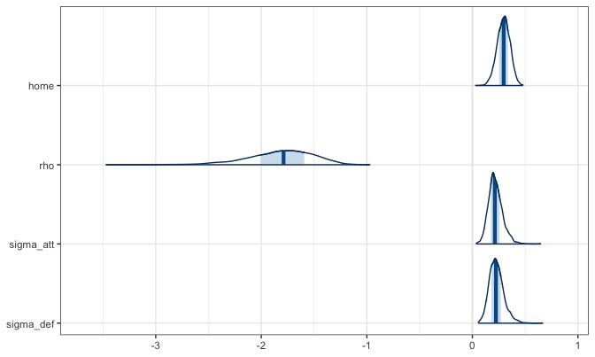
<p class="caption">plot of chunk static_fit_areas</p>
</div>

The Stan code of the fitted model is stored in the `stan_code` element of the output, e.g. `cat(fit_bp$stan_code)`.

The other models are selected through the `model` argument. The Dixon-Coles model adds the low-score dependence parameter $\rho$, whereas the negative binomial model adds the dispersion parameters $\phi_1$ (home) and $\phi_2$ (away):


``` r
fit_dc <- stan_foot(
  data = italy_2000,
  model = "dixon_coles",
  chains = n_chains,
  parallel_chains = n_chains,
  iter_sampling = n_iter,
  seed = seed
)

fit_nb <- stan_foot(
  data = italy_2000,
  model = "neg_bin",
  chains = n_chains,
  parallel_chains = n_chains,
  iter_sampling = n_iter,
  seed = seed
)
```


``` r
print(fit_dc, pars = c("home", "rho"))
#> Summary of Stan football model
#> ------------------------------
#> 
#> Posterior summaries for model parameters:
#> # A tibble: 2 x 10
#>   variable   mean median    sd   mad     q5   q95  rhat ess_bulk ess_tail
#>   <chr>     <dbl>  <dbl> <dbl> <dbl>  <dbl> <dbl> <dbl>    <dbl>    <dbl>
#> 1 home      0.41   0.411 0.046 0.046  0.333 0.485  1       4466.    2808.
#> 2 rho      -0.071 -0.073 0.06  0.061 -0.167 0.031  1.00    4117.    1689.
print(fit_nb, pars = c("home", "phi1", "phi2"))
#> Summary of Stan football model
#> ------------------------------
#> 
#> Posterior summaries for model parameters:
#> # A tibble: 3 x 10
#>   variable   mean median    sd   mad    q5    q95  rhat ess_bulk ess_tail
#>   <chr>     <dbl>  <dbl> <dbl> <dbl> <dbl>  <dbl> <dbl>    <dbl>    <dbl>
#> 1 home      0.417  0.416 0.051 0.049 0.333  0.501  1.00    7278.    2766.
#> 2 phi1     12.0   11.7   2.82  2.82  7.77  17.0    1       7564.    3071.
#> 3 phi2      8.59   8.22  2.76  2.69  4.67  13.7    1.00    8350.    3115.
```

The Dixon-Coles $\rho$ is slightly negative, with a 90% posterior interval covering zero, and the negative binomial dispersions are large (the variance of a negative binomial converges to the Poisson one as $\phi \to \infty$), implying a mild overdispersion only: both point at the double Poisson model as an adequate description of this season, in agreement with the information criteria of the maximum likelihood fits. Note that the home effect of these two models is not directly comparable with the bivariate Poisson one, since in the latter the marginal scoring rates also include the covariance term $\lambda_3$.

## Changing the default priors

One of the common practices in Bayesian statistics is to change the priors and perform some **sensitivity tests**. The `prior_par` argument accepts a list with the elements `ability` (prior family and location for the team-specific abilities), `ability_sd` (prior for the group-level standard deviations $\sigma_{\text{att}}, \sigma_{\text{def}}$) and `home` (Gaussian prior for the home effect). For instance, we may consider Student-$t$ distributed abilities with 4 degrees of freedom and a half-Laplace prior for the standard deviations:

\begin{align}
\text{att}_t & \sim t(4, \mu_{\text{att}}, \sigma_{\text{att}}), \qquad \text{def}_t \sim t(4, \mu_{\text{def}}, \sigma_{\text{def}}), \\
\sigma_{\text{att}}, \sigma_{\text{def}} & \sim \mathsf{Laplace}^+(0, 1).
\end{align}

The group-level standard deviations cannot be fixed to a numerical value, hence the scale of the `ability` prior must be left to `NULL`:


``` r
fit_bp_t <- stan_foot(
  data = italy_2000,
  model = "biv_pois",
  prior_par = list(
    ability = student_t(4, 0, NULL),
    ability_sd = laplace(0, 1),
    home = normal(0, 10)
  ),
  chains = n_chains,
  parallel_chains = n_chains,
  iter_sampling = n_iter,
  seed = seed
)
```

We compare the marginal posteriors of $\sigma_{\text{att}}$ under the default priors and under the alternative ones:


``` r
posterior_bp_t <- fit_bp_t$fit$draws(format = "matrix")
sigma_att_post <- cbind(
  posterior_bp[, "sigma_att"],
  posterior_bp_t[, "sigma_att"]
)
colnames(sigma_att_post) <- c("Default", "Student-t + Laplace")

color_scheme_set("gray")
mcmc_areas(sigma_att_post) +
  ggtitle("Posterior of sigma_att under two prior specifications") +
  theme_bw()
```

<div class="figure" style="text-align: center">
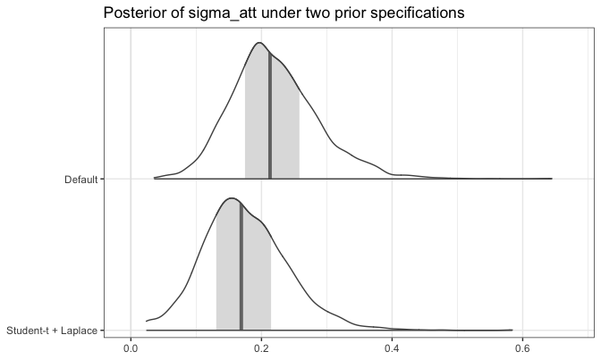
<p class="caption">plot of chunk comparing_priors</p>
</div>

The Student-$t$ + Laplace specification induces a smaller group-level variability, i.e. a larger shrinkage of the abilities towards the grand mean.

## Alternative algorithms

The `method` argument selects the inference algorithm. Approximate algorithms are much faster than HMC and can be useful for exploratory purposes, for instance the Pathfinder algorithm:


``` r
fit_bp_pf <- stan_foot(
  data = italy_2000,
  model = "biv_pois",
  method = "pathfinder",
  seed = seed
)
```


``` r
print(fit_bp_pf, pars = c("home", "rho", "sigma_att", "sigma_def"))
#> Summary of Stan football model
#> ------------------------------
#> 
#> Posterior summaries for model parameters:
#> # A tibble: 4 x 7
#>   variable    mean median    sd   mad     q5    q95
#>   <chr>      <dbl>  <dbl> <dbl> <dbl>  <dbl>  <dbl>
#> 1 home       0.272  0.269 0.068 0.082  0.198  0.39 
#> 2 rho       -1.68  -1.62  0.234 0.219 -2.15  -1.43 
#> 3 sigma_att  0.183  0.177 0.038 0.029  0.124  0.245
#> 4 sigma_def  0.225  0.221 0.041 0.034  0.162  0.287
```

# Dynamic models

## Weekly dynamics within a season

The `dynamic_type` argument selects the type of dynamics: `"weekly"` for match-day dynamics within a single season, and `"seasonal"` for dynamics across the values of the `periods` column. With weekly dynamics the data must contain a single season, and each match day is made of $T/2$ matches. Let's fit a weekly-dynamic bivariate Poisson model to the Serie A 2000/2001, leaving the last four match days (36 matches) out-of-sample through the `predict` argument, which we will use later for the predictions:


``` r
fit_weekly <- stan_foot(
  data = italy_2000,
  model = "biv_pois",
  dynamic_type = "weekly",
  predict = 36,
  chains = n_chains,
  parallel_chains = n_chains,
  iter_sampling = n_iter,
  seed = seed
)
```


``` r
print(fit_weekly, pars = c("rho", "sigma_att", "sigma_def"))
#> Summary of Stan football model
#> ------------------------------
#> 
#> Posterior summaries for model parameters:
#> # A tibble: 3 x 10
#>   variable       mean median    sd   mad     q5    q95  rhat ess_bulk ess_tail
#>   <chr>         <dbl>  <dbl> <dbl> <dbl>  <dbl>  <dbl> <dbl>    <dbl>    <dbl>
#> 1 rho          -1.75  -1.72  0.306 0.293 -2.30  -1.31   1.00   3838.    3286. 
#> 2 sigma_att[1]  0.052  0.052 0.018 0.018  0.023  0.084  1.33     10.6     17.6
#> 3 sigma_def[1]  0.069  0.068 0.019 0.019  0.036  0.1    1.24     13.0     38.9
```

In the dynamic models the home effect is period-specific as well (`home[t]`), hence we display the evolution standard deviations only. They are small, as within a single season the abilities change slowly from one match day to the next; however, their $\hat{R}$ values are well above 1.1 and their effective sample sizes are tiny: the sampler struggles to explore the posterior of the evolution scales in the weekly model, a well-known issue of centred random-walk parameterizations when the evolution variance is small, and a longer run, a larger `adapt_delta` or a more informative prior on `ability_sd` would be advisable before drawing conclusions. The `foot_abilities` function depicts the posterior median and the 50% and 95% credible intervals of the attack (red) and defence (blue) abilities over the match days, for all the teams or for those selected through the `teams` argument:


``` r
foot_abilities(fit_weekly, italy_2000,
  teams = c("AS Roma", "Juventus", "Lazio Roma", "AC Milan", "AS Bari", "SSC Napoli")
)
```

<div class="figure" style="text-align: center">
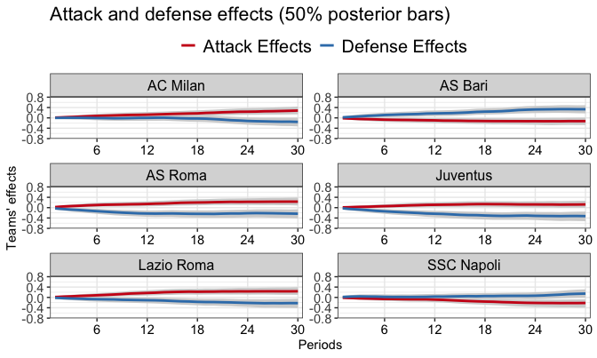
<p class="caption">plot of chunk weekly_abilities</p>
</div>

The trajectories start from a common location (the abilities of the first match day are centred at 0) and progressively diverge: the best teams of that season (AS Roma, Juventus, Lazio Roma) develop increasing attack and/or decreasing defence abilities, whereas the relegated teams (AS Bari, SSC Napoli) show the opposite pattern.

## Seasonal dynamics and the evolution variance

With `dynamic_type = "seasonal"` the abilities evolve across the values of the `periods` column, here the eight half-seasons of `italy_2018_2021`. In this setting the specification of the **evolution variance** matters, and the package offers four alternatives, selected through the `dynamic_par` and `dynamic_weight` arguments.

**Separate variances (default).** As in @egidi2018combining, two distinct standard deviations $\sigma_{\text{att}}$ and $\sigma_{\text{def}}$, shared by all the teams and periods, govern the evolution of the attack and of the defence abilities (parameters `sigma_att`, `sigma_def`).

**Common variance.** As in @owen2011dynamic, a single standard deviation $\sigma_{\text{att}} = \sigma_{\text{def}} = \sigma$ is shared by the two abilities (parameter `sigma_common`). It is selected with `dynamic_par = list(common_sd = TRUE)`.

**Variance inflation after the summer break.** @koopman2015dynamic allow the evolution variance to increase at the structural breaks of the championship, i.e. after the summer break, when rosters change the most:

\begin{equation}
\sigma^2_{k, \tau} = \sigma^2_{k} + \sigma^2_{\text{break}} \, I_\tau, \qquad k \in \{\text{att}, \text{def}\},
\end{equation}

where $I_\tau = 1$ if period $\tau$ follows a summer break and 0 otherwise. It is selected with `dynamic_par = list(kl_variance = TRUE)`. The package needs to know which periods follow a summer break: each season is assumed to be made of `periods_per_season` consecutive periods (2 by default, i.e. two half-seasons), so that the break precedes the periods $1 + m \times$ `periods_per_season`, $m = 1, 2, \ldots$. With our coding the breaks precede the periods 3, 5 and 7 (parameters `sigma_att_kl`, `sigma_def_kl`, `sigma_break`).

**Weighted dynamic models.** All the specifications above use a *constant* evolution variance, which may over-borrow information from the previous period when a team changes abruptly (e.g. a new coach or a massive transfer campaign) and under-borrow when the team is stable. @macridemartino2026weighted propose to weight the evolution adaptively through **commensurate priors** [@hobbs2011hierarchical]: for each team $t$, ability $k \in \{\text{att}, \text{def}\}$ and period $\tau \ge 2$,

\begin{equation}
k_{t, \tau} \sim \mathrm{N}\left(k_{t, \tau-1}, \, 1 / \phi_{k, t, \tau}\right),
\end{equation}

where the commensurate precision $\phi_{k, t, \tau}$ governs how closely the current ability agrees with the previous one, and it is assigned a two-component mixture of half-normal distributions (a continuous **spike-and-slab** prior):

\begin{equation}
\phi_{k, t, \tau} \sim p_t \, \mathrm{N}^+(\mu_s, \psi_s) + (1 - p_t) \, \mathrm{N}^+(\mu_l, \psi_l), \qquad p_t \sim \mathrm{Beta}(1, 1).
\end{equation}

The spike $\mathrm{N}^+(\mu_s, \psi_s)$ is concentrated on large precisions, implying a strong borrowing of information from the previous period, whereas the slab $\mathrm{N}^+(\mu_l, \psi_l)$ is diffuse on small precisions and allows the ability to move away from its past value. The data decide, for each team and period, how much information to borrow. The weighted models are selected with `dynamic_weight = TRUE`, and the spike and slab hyperparameters are set through `dynamic_par$spike` and `dynamic_par$slab`, with defaults `normal(9, 1.5)` and `normal(0, 3)` as in @macridemartino2026weighted (parameters `prob_spike`, `comm_prec_att`, `comm_prec_def`, `comm_sd_att`, `comm_sd_def`). Note that `dynamic_weight = TRUE`, `common_sd = TRUE` and `kl_variance = TRUE` are mutually exclusive, and that none of them is available for the Student-$t$ model.

We fit the four specifications of a dynamic double Poisson model to the first seven half-seasons, leaving the last half-season (190 matches) out-of-sample:


``` r
# separate evolution sds (Egidi et al., 2018)
fit_dyn <- stan_foot(
  data = italy_2018_2021,
  model = "double_pois",
  dynamic_type = "seasonal",
  predict = 190,
  chains = n_chains,
  parallel_chains = n_chains,
  iter_sampling = n_iter,
  seed = seed
)

# common evolution sd (Owen, 2011)
fit_dyn_owen <- stan_foot(
  data = italy_2018_2021,
  model = "double_pois",
  dynamic_type = "seasonal",
  dynamic_par = list(common_sd = TRUE),
  predict = 190,
  chains = n_chains,
  parallel_chains = n_chains,
  iter_sampling = n_iter,
  seed = seed
)

# variance inflation after the summer break (Koopman & Lit, 2015)
fit_dyn_kl <- stan_foot(
  data = italy_2018_2021,
  model = "double_pois",
  dynamic_type = "seasonal",
  dynamic_par = list(kl_variance = TRUE, periods_per_season = 2),
  predict = 190,
  chains = n_chains,
  parallel_chains = n_chains,
  iter_sampling = n_iter,
  seed = seed
)

# weighted dynamic model (Macrì Demartino et al., 2026)
fit_dyn_wdm <- stan_foot(
  data = italy_2018_2021,
  model = "double_pois",
  dynamic_type = "seasonal",
  dynamic_weight = TRUE,
  dynamic_par = list(spike = normal(9, 1.5), slab = normal(0, 3)),
  predict = 190,
  chains = n_chains,
  parallel_chains = n_chains,
  iter_sampling = n_iter,
  seed = seed
)
```

The evolution parameters of the three constant-variance specifications can be compared through the `print` method; for the Koopman and Lit model we also display the summer break indicators passed to Stan:


``` r
print(fit_dyn, pars = c("sigma_att", "sigma_def"))
#> Summary of Stan football model
#> ------------------------------
#> 
#> Posterior summaries for model parameters:
#> # A tibble: 2 x 10
#>   variable      mean median    sd   mad    q5   q95  rhat ess_bulk ess_tail
#>   <chr>        <dbl>  <dbl> <dbl> <dbl> <dbl> <dbl> <dbl>    <dbl>    <dbl>
#> 1 sigma_att[1] 0.194  0.192 0.023 0.022 0.158 0.234  1.01     546.    1130.
#> 2 sigma_def[1] 0.11   0.108 0.017 0.018 0.084 0.14   1.02     333.     850.
print(fit_dyn_owen, pars = "sigma_common")
#> Summary of Stan football model
#> ------------------------------
#> 
#> Posterior summaries for model parameters:
#> # A tibble: 1 x 10
#>   variable         mean median    sd   mad    q5   q95  rhat ess_bulk ess_tail
#>   <chr>           <dbl>  <dbl> <dbl> <dbl> <dbl> <dbl> <dbl>    <dbl>    <dbl>
#> 1 sigma_common[1] 0.155  0.155 0.014 0.014 0.133  0.18  1.00     441.     937.
fit_dyn_kl$stan_data$is_summer_break
#> [1] 0 0 1 0 1 0 1
print(fit_dyn_kl, pars = c("sigma_att_kl", "sigma_def_kl", "sigma_break"))
#> Summary of Stan football model
#> ------------------------------
#> 
#> Posterior summaries for model parameters:
#> # A tibble: 3 x 10
#>   variable         mean median    sd   mad    q5   q95  rhat ess_bulk ess_tail
#>   <chr>           <dbl>  <dbl> <dbl> <dbl> <dbl> <dbl> <dbl>    <dbl>    <dbl>
#> 1 sigma_att_kl[1] 0.192  0.191 0.023 0.023 0.157 0.232  1.00     605.    1416.
#> 2 sigma_def_kl[1] 0.107  0.105 0.018 0.018 0.079 0.138  1.01     337.     656.
#> 3 sigma_break[1]  0.046  0.04  0.033 0.033 0.004 0.109  1.00    1412.    1241.
```

The attack abilities evolve more than the defence ones ($\sigma_{\text{att}} \approx 0.19$ against $\sigma_{\text{def}} \approx 0.11$), and the common standard deviation of the Owen model lies in between. The additional variability after the summer break estimated by the Koopman and Lit model is small ($\sigma_{\text{break}} \approx 0.05$): in these seasons the changes of the abilities across the summer are comparable to those between the two halves of a season.

In the weighted model the posterior of the spike probability $p_t$ tells how much each team borrows from its past: values close to 1 indicate stable teams, whereas lower values indicate teams whose abilities changed abruptly in some periods.


``` r
print(fit_dyn_wdm,
  pars = "prob_spike",
  teams = c("Juventus", "AC Milan", "SSC Napoli", "Atalanta", "AS Roma")
)
#> Summary of Stan football model
#> ------------------------------
#> 
#> Posterior summaries for model parameters:
#> # A tibble: 5 x 10
#>   variable           mean median    sd   mad    q5   q95  rhat ess_bulk ess_tail
#>   <chr>             <dbl>  <dbl> <dbl> <dbl> <dbl> <dbl> <dbl>    <dbl>    <dbl>
#> 1 prob_spike[Atala~ 0.805  0.836 0.147 0.141 0.517 0.981  1.00    480.      631.
#> 2 prob_spike[Juven~ 0.776  0.817 0.174 0.16  0.434 0.982  1.01    334.      538.
#> 3 prob_spike[SSC N~ 0.809  0.859 0.17  0.142 0.464 0.99   1.01    246.      399.
#> 4 prob_spike[AS Ro~ 0.864  0.903 0.129 0.101 0.6   0.993  1.01    358.      366.
#> 5 prob_spike[AC Mi~ 0.836  0.877 0.144 0.121 0.549 0.989  1.01    399.      562.
```

For the five teams displayed, the posterior means of $p_t$ range between 0.78 and 0.86: the top teams of these seasons borrow strongly from their past, so that for them the weighted model behaves like a dynamic model with a small evolution variance. The dynamic abilities can be depicted with `foot_abilities` also in the seasonal case, e.g. for the default specification:


``` r
foot_abilities(fit_dyn, italy_2018_2021,
  teams = c("Juventus", "Inter", "AC Milan", "SSC Napoli")
)
```

<div class="figure" style="text-align: center">
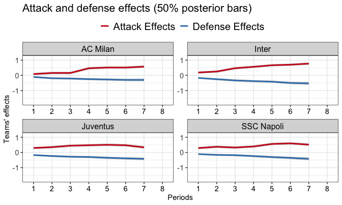
<p class="caption">plot of chunk seasonal_abilities</p>
</div>

The trajectories over the seven half-seasons reflect the recent history of the Serie A: the steady improvement of Inter, in both attack and defence, and the jump of the attack ability of AC Milan from the second half of 2019/2020 (period 4), which anticipate the titles of 2020/2021 and 2021/2022, respectively, whereas Juventus, champion in 2019/2020, shows a slight decline in the last period. Note that the abilities of the teams that leave the league (relegation) are not informed by any data in the following periods, and simply evolve according to their prior.

# Historical strengths: the Bradley-Terry-Davidson model

## The model

The Bradley-Terry model [@bradley_Terry1952] is one of the most popular techniques for ranking players or teams from pairwise comparisons. Each team $T_k$, $k = 1, \ldots, N_T$, is characterized by a latent strength $\alpha_k > 0$, and the probability that $T_i$ defeats $T_j$ is $\alpha_i / (\alpha_i + \alpha_j)$. Since the model does not account for draws, @davidson1970 introduced an additional tie parameter. In the log-parameterization, with $\psi_k = \log(\alpha_k)$ and $\nu$ the log-tie parameter, the probabilities of a home win, a draw and an away win in a match between $T_i$ and $T_j$ are

\begin{align}
p_{ij}^W & = \dfrac{\exp(\psi_i)}{\exp(\psi_i) + \exp(\psi_j) + \exp(\nu + (\psi_i + \psi_j)/2)}, \\
p_{ij}^D & = \dfrac{\exp(\nu + (\psi_i + \psi_j)/2)}{\exp(\psi_i) + \exp(\psi_j) + \exp(\nu + (\psi_i + \psi_j)/2)}, \\
p_{ij}^L & = 1 - p_{ij}^W - p_{ij}^D,
\end{align}

and the log-strengths are identifiable under the constraint $\sum_{k=1}^{N_T} \psi_k = 0$. A home effect can be added to $\psi_i$ as a multiplicative order effect [@davidson_beaver_1977], which becomes additive on the log scale. The Bayesian BTD model [@demartino2024alternative] assigns independent Gaussian priors to the log-strengths and to the log-tie parameter, $\psi_k \sim \mathrm{N}(\mu_\psi, \sigma_\psi)$ and $\nu \sim \mathrm{N}(\mu_\nu, \sigma_\nu)$, which satisfy the conditions for ranking systems discussed by @whelan2017prior. As for the goal-based models, the log-strengths can be **static** or **dynamic**, with auto-regressive priors of order 1 across the periods, $\psi_{k, \tau} \sim \mathrm{N}(\psi_{k, \tau - 1}, \sigma_\psi)$.

## Fitting the model with `btd_foot`

The `btd_foot` function requires a data frame with the columns `periods`, `home_team`, `away_team` and `match_outcome`, the latter coded as 1 for a home win, 2 for a draw and 3 for an away win. We derive the outcomes for the first seven half-seasons of `italy_2018_2021`, i.e. the training periods of the dynamic models above:


``` r
italy_2018_2021_btd <- italy_2018_2021 %>%
  filter(periods <= 7) %>%
  mutate(match_outcome = case_when(
    home_goals > away_goals ~ 1,
    home_goals == away_goals ~ 2,
    home_goals < away_goals ~ 3
  )) %>%
  select(periods, home_team, away_team, match_outcome)
```

The main arguments are `dynamic_rank` (static or dynamic log-strengths), `home_effect`, `prior_par` (Gaussian priors for `logStrength`, `logTie` and `home`), `rank_measure` (the posterior summary used to rank the teams: `"median"`, `"mean"` or `"map"`) and `method`. We fit a dynamic and a static model:


``` r
fit_btd_dyn <- btd_foot(
  data = italy_2018_2021_btd,
  dynamic_rank = TRUE,
  home_effect = TRUE,
  rank_measure = "median",
  chains = n_chains,
  parallel_chains = n_chains,
  iter_sampling = n_iter,
  adapt_delta = 0.9,
  max_treedepth = 12,
  seed = seed
)

fit_btd_stat <- btd_foot(
  data = italy_2018_2021_btd,
  dynamic_rank = FALSE,
  home_effect = TRUE,
  rank_measure = "map",
  chains = n_chains,
  parallel_chains = n_chains,
  iter_sampling = n_iter,
  seed = seed
)
```

The `print` method of the `btdFoot` class displays the rankings, the posterior summaries of the parameters, or both (`display` argument), for the selected parameters and teams:


``` r
print(fit_btd_dyn,
  display = "parameters",
  pars = c("logStrength", "logTie", "home"),
  teams = c("Juventus", "Inter")
)
#> Bayesian Bradley-Terry-Davidson model
#> ------------------------------------------------
#> Rank measure used: median 
#> 
#> Posterior summaries for model parameters:
#> # A tibble: 16 x 10
#>    variable         mean median    sd   mad     q5   q95  rhat ess_bulk ess_tail
#>    <chr>           <dbl>  <dbl> <dbl> <dbl>  <dbl> <dbl> <dbl>    <dbl>    <dbl>
#>  1 logStrength[1~  4.07   4.01  1.00  1.01   2.52  5.80   1.00    3962.    2701.
#>  2 logStrength[2~  1.73   1.71  0.721 0.706  0.594 2.97   1.00    3345.    3066.
#>  3 logStrength[3~  3.44   3.42  0.88  0.865  2.05  4.97   1.00    3723.    3326.
#>  4 logStrength[4~  1.41   1.40  0.721 0.73   0.248 2.56   1       3542.    3367.
#>  5 logStrength[5~  2.13   2.12  0.789 0.808  0.869 3.43   1.00    3687.    3513.
#>  6 logStrength[6~  2.38   2.38  0.789 0.79   1.08  3.64   1.00    3192.    3452.
#>  7 logStrength[7~  1.69   1.68  0.852 0.832  0.311 3.10   1       3341.    2990.
#>  8 logStrength[1~  1.53   1.52  0.713 0.689  0.384 2.72   1       3968.    3334.
#>  9 logStrength[2~  0.837  0.836 0.669 0.674 -0.254 1.93   1.00    4020.    2946.
#> 10 logStrength[3~  2.98   2.98  0.825 0.818  1.64  4.38   1.00    4227.    3482.
#> 11 logStrength[4~  1.85   1.82  0.755 0.755  0.666 3.12   1.00    3723.    3236.
#> 12 logStrength[5~  2.62   2.61  0.805 0.821  1.33  3.96   1       3904.    3078.
#> 13 logStrength[6~  4.17   4.13  0.996 0.995  2.60  5.89   1.00    3394.    2630.
#> 14 logStrength[7~  3.76   3.75  0.994 0.995  2.21  5.49   1       3405.    3330.
#> 15 logTie         -0.016 -0.013 0.065 0.059 -0.127 0.089  1.01     433.     638.
#> 16 home            0.358  0.36  0.082 0.08   0.22  0.493  1.02     305.     311.
print(fit_btd_stat, display = "rankings")
#> Bayesian Bradley-Terry-Davidson model
#> ------------------------------------------------
#> Rank measure used: map 
#> 
#> Top teams based on relative log-strengths:
#>    periods            team log_strengths
#> 15       1           Inter         2.130
#> 9        1        Juventus         2.032
#> 8        1        Atalanta         1.668
#> 19       1        AC Milan         1.592
#> 10       1      SSC Napoli         1.472
#> 2        1      Lazio Roma         1.113
#> 18       1         AS Roma         1.039
#> 6        1 Sassuolo Calcio         0.418
#> 21       1   Hellas Verona         0.198
#> 7        1       Torino FC         0.184
```

## Visualization tools

The `plot_btdPosterior` function depicts the posterior distributions of the log-strengths (default), of the log-tie or of the home effect, as boxplots or density plots. In the dynamic case, a sequence of boxplots is produced for each period:


``` r
plot_btdPosterior(fit_btd_dyn,
  teams = c("Juventus", "Inter", "AC Milan", "SSC Napoli"),
  ncol = 2
)
```

<div class="figure" style="text-align: center">

<p class="caption">plot of chunk plot_btdPosterior_dyn</p>
</div>


``` r
plot_btdPosterior(fit_btd_stat,
  teams = c("Juventus", "Inter", "AC Milan", "SSC Napoli"),
  plot_type = "density",
  scales = "free_y"
)
```

<div class="figure" style="text-align: center">
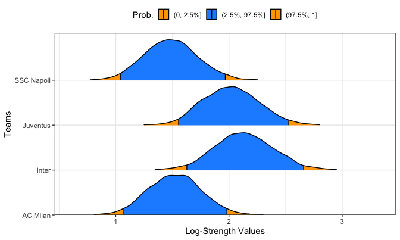
<p class="caption">plot of chunk plot_btdPosterior_stat_dens</p>
</div>

The `plot_logStrength` function plots the posterior summary of the log-strengths selected through `rank_measure`, over the periods in the dynamic case:


``` r
plot_logStrength(fit_btd_dyn,
  teams = c("Juventus", "Inter", "AC Milan", "SSC Napoli")
)
```

<div class="figure" style="text-align: center">

<p class="caption">plot of chunk plot_logStrength</p>
</div>

## Using the strengths as a covariate in `stan_foot`

The estimated log-strengths can be passed to `stan_foot` through the `ranking` argument, either as a `btdFoot` object or as a data frame with the columns `periods`, `team` and `rank_points` (which allows any external ranking, e.g. the [FIFA ranking](https://inside.fifa.com/fifa-world-ranking), to be used). The difference between the ranking points of the two teams enters the scoring rates through the coefficient $\gamma$; the ranking periods must match the training periods of the data, and the `norm_method` argument optionally standardizes the points within each period. We fit a dynamic double Poisson model with the dynamic BTD log-strengths as a covariate:


``` r
fit_dyn_rank <- stan_foot(
  data = italy_2018_2021,
  model = "double_pois",
  ranking = fit_btd_dyn,
  dynamic_type = "seasonal",
  predict = 190,
  chains = n_chains,
  parallel_chains = n_chains,
  iter_sampling = n_iter,
  seed = seed
)
```


``` r
print(fit_dyn_rank, pars = c("gamma", "sigma_att", "sigma_def"))
#> Summary of Stan football model
#> ------------------------------
#> 
#> Posterior summaries for model parameters:
#> # A tibble: 3 x 10
#>   variable      mean median    sd   mad    q5   q95  rhat ess_bulk ess_tail
#>   <chr>        <dbl>  <dbl> <dbl> <dbl> <dbl> <dbl> <dbl>    <dbl>    <dbl>
#> 1 gamma        0.363  0.362 0.023 0.023 0.324 0.401  1.01    368.    1172. 
#> 2 sigma_att[1] 0.072  0.07  0.022 0.022 0.04  0.111  1.04     79.7    104. 
#> 3 sigma_def[1] 0.027  0.026 0.012 0.011 0.01  0.048  1.12     26.0     55.5
```

A positive $\gamma$ means that the stronger team according to the BTD ranking is expected to score more (and concede less) than what its attack and defence abilities alone would imply. Once the strengths are included, the evolution standard deviations shrink considerably with respect to `fit_dyn`, since the ranking covariate absorbs most of the between-period variation of the abilities; the low effective sample size of $\sigma_{\text{def}}$ suggests that a longer run would be advisable for this model.

# Model checking

Checking the model fit is a vital statistical task. We can evaluate hypothetical replications $\mathcal{D}^{\text{rep}}$ under the **posterior predictive distribution**

$$p(\mathcal{D}^{\text{rep}} \mid \mathcal{D}) = \int p(\mathcal{D}^{\text{rep}} \mid \boldsymbol{\theta}) \, \pi(\boldsymbol{\theta} \mid \mathcal{D}) \, d\boldsymbol{\theta},$$

and check whether these replications are close to the observed data: these are the **posterior predictive checks**; see @gelman2014bayesian for an overview. The `pp_foot` function provides:

- an aggregated plot of the observed frequencies of the goal differences $Z_n = X_n - Y_n$ against the replicated ones (`type = "aggregated"`);

- a plot of the match-ordered goal differences with their 50% and 95% credible intervals (`type = "matches"`).


``` r
pp_foot(object = fit_bp, data = italy_2000, type = "aggregated")
#> $pp_plot
```

<div class="figure" style="text-align: center">

<p class="caption">plot of chunk pp_foot</p>
</div>

```
#> 
#> $pp_table
#>   goal diff. Bayesian p-value
#> 1         -3            0.338
#> 2         -2            0.869
#> 3         -1            0.984
#> 4          0            0.050
#> 5          1            0.247
#> 6          2            0.081
#> 7          3            0.925
pp_foot(object = fit_bp, data = italy_2000, type = "matches")
#> $pp_plot
```

<div class="figure" style="text-align: center">
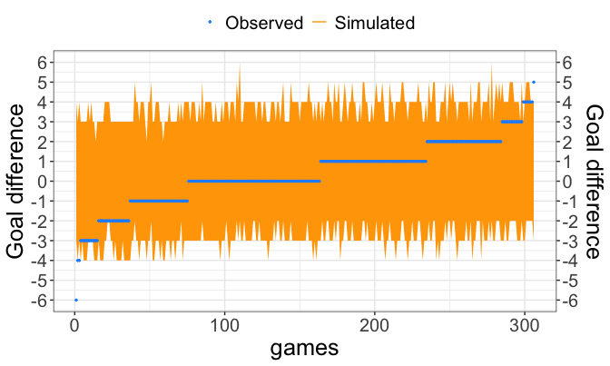
<p class="caption">plot of chunk pp_foot</p>
</div>

```
#> 
#> $pp_table
#>   1-alpha emp. coverage
#> 1    0.95         0.948
```

In the first plot, blue lines denote the observed frequencies and yellow jittered points the replicated ones: the goal differences are decently captured by the static bivariate Poisson model, with the draws (goal difference equal to 0) only slightly underestimated. In the second plot, the ordered observed goal differences fall within their posterior predictive intervals. Other checks can be obtained with the `bayesplot` package from the in-sample replications `y_rep` stored in the `CmdStanFit` object, e.g. the overlay of the density of the observed goal differences with the replicated ones:


``` r
draws_bp <- posterior::as_draws_rvars(fit_bp$fit$draws())
y_rep <- posterior::draws_of(draws_bp[["y_rep"]])
goal_diff <- italy_2000$home_goals - italy_2000$away_goals

ppc_dens_overlay(goal_diff, y_rep[, , 1] - y_rep[, , 2], bw = 0.5) +
  theme_bw()
```

<div class="figure" style="text-align: center">
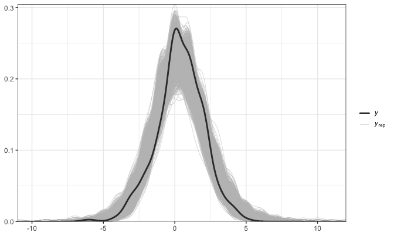
<p class="caption">plot of chunk pp_checks</p>
</div>

# Predictions

## Posterior out-of-sample probabilities

By considering the **posterior predictive distribution** of future data $\tilde{\mathcal{D}}$,

$$p(\tilde{\mathcal{D}} \mid \mathcal{D}) = \int p(\tilde{\mathcal{D}} \mid \boldsymbol{\theta}) \, \pi(\boldsymbol{\theta} \mid \mathcal{D}) \, d\boldsymbol{\theta},$$

we acknowledge the whole uncertainty about the model parameters when predicting out-of-sample matches. The matches to predict are the last `predict` rows of the data: in `fit_weekly` we left the last four match days of the 2000/2001 season out-of-sample. The `foot_prob` function returns the posterior probabilities of the results of the out-of-sample matches, together with the home win, draw and away win probabilities and the most likely result; for a single match it also depicts the score probabilities:


``` r
foot_prob(
  object = fit_weekly, data = italy_2000,
  home_team = "Reggina Calcio", away_team = "AC Milan"
)
#> $prob_table
#>        home_team away_team prob_h prob_d prob_a         mlo
#> 1 Reggina Calcio  AC Milan  0.258   0.25  0.492 0-1 (0.119)
#> 
#> $prob_plot
```

<div class="figure" style="text-align: center">

<p class="caption">plot of chunk foot_prob</p>
</div>

Darker cells are associated with higher posterior probabilities, whereas the red square is the observed result, a 2-1 home win. The model favoured AC Milan (away win probability close to 0.5, most likely result 0-1) and assigned the observed result a small, but non-negligible, probability (remember, football is about rare events).

## Home win probabilities

The out-of-sample posterior probabilities of a home win, $p_{\text{home}} = \text{Pr}(\tilde{X} > \tilde{Y}) = \frac{1}{S} \sum_{s=1}^S I(\tilde{x}^{(s)} > \tilde{y}^{(s)})$, computed from the $S$ posterior draws $(\tilde{x}^{(s)}, \tilde{y}^{(s)})$, can be depicted for all the out-of-sample matches with `foot_round_robin`:


``` r
foot_round_robin(object = fit_weekly, data = italy_2000)
#> $round_table
#>              Home           Away Home_prob Observed
#> 1   Hellas Verona     Bologna FC     0.300        -
#> 2           Inter     Bologna FC     0.351        -
#> 3  Udinese Calcio     SSC Napoli     0.402        -
#> 4  ACF Fiorentina     SSC Napoli     0.445        -
#> 5        US Lecce     Lazio Roma     0.187        -
#> 6           Inter     Lazio Roma     0.225        -
#> 7  Brescia Calcio        AS Bari     0.527        -
#> 8  Reggina Calcio        AS Bari     0.476        -
#> 9  Udinese Calcio Vicenza Calcio     0.324        -
#> 10 Brescia Calcio Vicenza Calcio     0.426        -
#> 11        AS Roma       Parma AC     0.339        -
#> 12       US Lecce       Parma AC     0.185        -
#> 13        AS Roma       AC Milan     0.371        -
#> 14 Reggina Calcio       AC Milan     0.258        -
#> 15  Hellas Verona     AC Perugia     0.298        -
#> 16       Juventus     AC Perugia     0.500        -
#> 17 ACF Fiorentina       Atalanta     0.330        -
#> 18       Juventus       Atalanta     0.442        -
#> 19     SSC Napoli        AS Roma     0.185        -
#> 20        AS Bari        AS Roma     0.172        -
#> 21     Lazio Roma Udinese Calcio     0.587        -
#> 22       Atalanta Udinese Calcio     0.456        -
#> 23     Bologna FC       US Lecce     0.454        -
#> 24 Vicenza Calcio       US Lecce     0.444        -
#> 25       AC Milan Brescia Calcio     0.416        -
#> 26     AC Perugia Brescia Calcio     0.309        -
#> 27     SSC Napoli  Hellas Verona     0.364        -
#> 28       Parma AC  Hellas Verona     0.550        -
#> 29     AC Perugia Reggina Calcio     0.369        -
#> 30       Atalanta Reggina Calcio     0.356        -
#> 31     Lazio Roma ACF Fiorentina     0.515        -
#> 32       AC Milan ACF Fiorentina     0.520        -
#> 33     Bologna FC       Juventus     0.247        -
#> 34 Vicenza Calcio       Juventus     0.237        -
#> 35        AS Bari          Inter     0.326        -
#> 36       Parma AC          Inter     0.549        -
#> 
#> $round_plot
```

<div class="figure" style="text-align: center">
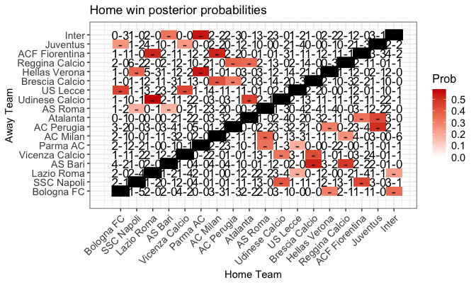
<p class="caption">plot of chunk foot_round_robin</p>
</div>

Red cells denote likely home wins (e.g. Lazio Roma - Fiorentina, Juventus - AC Perugia), whereas lighter cells denote likely away wins (e.g. AS Bari - AS Roma).

## League table reconstruction

Predicting the final league table is one of the most popular tasks in football analytics. The `foot_rank` function provides:

- the **in-sample reconstruction** of the league table, using the replications $\mathcal{D}^{\text{rep}}$ of a model fitted without predictions;

- the **out-of-sample prediction** of the final points, using the predictions $\tilde{\mathcal{D}}$ of a model fitted with `predict > 0`.

The `visualize` argument selects an aggregated plot of the final table (`"aggregated"`) or the team-specific trajectories of the cumulated points (`"individual"`, the default), with yellow ribbons for the credible intervals and blue lines for the observed points. For the static model:


``` r
foot_rank(object = fit_bp, data = italy_2000, visualize = "aggregated")
#> $rank_table
#>             teams obs. points median q25 q75
#> 1         AS Roma          75     60  54  66
#> 2        Juventus          73     60  54  66
#> 3      Lazio Roma          69     58  52  64
#> 4        Parma AC          56     55  48  61
#> 5        AC Milan          49     51  44  57
#> 6        Atalanta          44     48  42  54
#> 7           Inter          51     47  41  53
#> 8  ACF Fiorentina          43     47  41  53
#> 9  Brescia Calcio          44     47  41  53
#> 10     AC Perugia          42     46  39  52
#> 11     Bologna FC          43     45  39  51
#> 12 Udinese Calcio          38     43  37  49
#> 13 Vicenza Calcio          36     42  36  47
#> 14       US Lecce          37     41  35  47
#> 15 Reggina Calcio          37     40  34  46
#> 16     SSC Napoli          36     40  35  46
#> 17  Hellas Verona          37     39  34  45
#> 18        AS Bari          20     33  27  39
#> 
#> $rank_plot
```

<div class="figure" style="text-align: center">
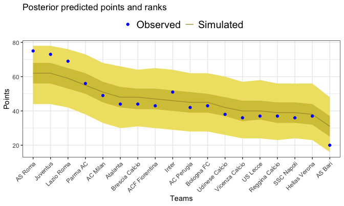
<p class="caption">plot of chunk rank_insample</p>
</div>

and for the weekly-dynamic model with the last four match days out-of-sample:


``` r
foot_rank(object = fit_weekly, data = italy_2000, visualize = "aggregated")
#> $rank_table
#>             teams obs. points median q25 q75
#> 1         AS Roma          75     74  72  76
#> 2      Lazio Roma          69     70  68  72
#> 3        Juventus          73     68  66  70
#> 4        Parma AC          56     57  55  59
#> 5        AC Milan          49     53  51  55
#> 6      Bologna FC          43     48  46  49
#> 7        Atalanta          44     48  46  49
#> 8           Inter          51     48  47  50
#> 9      AC Perugia          42     45  43  47
#> 10 ACF Fiorentina          43     43  42  46
#> 11 Brescia Calcio          44     42  40  44
#> 12 Udinese Calcio          38     38  37  40
#> 13 Vicenza Calcio          36     37  35  39
#> 14       US Lecce          37     36  34  38
#> 15 Reggina Calcio          37     34  33  36
#> 16     SSC Napoli          36     32  31  34
#> 17  Hellas Verona          37     32  31  34
#> 18        AS Bari          20     24  22  26
#> 
#> $rank_plot
```

<div class="figure" style="text-align: center">
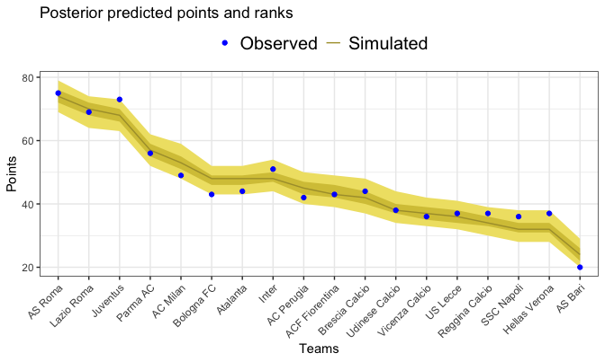
<p class="caption">plot of chunk rank_outsample</p>
</div>

``` r
foot_rank(
  object = fit_weekly, data = italy_2000,
  teams = c("AS Roma", "Juventus", "Lazio Roma", "AC Milan"),
  visualize = "individual"
)
```

<div class="figure" style="text-align: center">
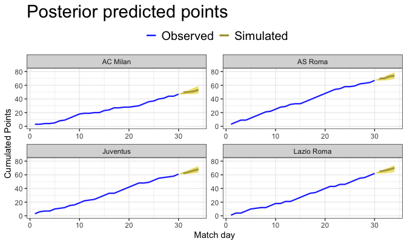
<p class="caption">plot of chunk rank_outsample</p>
</div>

# Model comparison

## Predictive performance with `compare_foot`

The `compare_foot` function compares the out-of-sample predictions of fitted models (or of user-supplied matrices of home win, draw and away win probabilities) against the observed results of a test set, through the accuracy, the Brier score, the ranked probability score (RPS), the pseudo-$R^2$ and the average of the correct probabilities (ACP), optionally with the confusion matrices. We compare the two seasonal double Poisson models with constant evolution variances, `fit_dyn` (separate attack and defence standard deviations) and `fit_dyn_owen` (common standard deviation), on the last half-season of 2021/2022, i.e. the 190 matches left out-of-sample:


``` r
italy_2021_test <- italy_2018_2021 %>%
  filter(periods == 8)

compare_results <- compare_foot(
  source = list(
    egidi = fit_dyn,
    owen = fit_dyn_owen
  ),
  test_data = italy_2021_test,
  metric = c("accuracy", "brier", "RPS", "pseudoR2", "ACP"),
  conf_matrix = FALSE
)

print(compare_results, digits = 3)
#> Predictive Performance Metrics
#>  Model   RPS accuracy brier pseudoR2   ACP
#>  egidi 0.206    0.490 0.618    0.356 0.409
#>   owen 0.206    0.505 0.617    0.357 0.411
```

Lower Brier and RPS values and higher accuracy, pseudo-$R^2$ and ACP values denote better predictions. The two specifications are practically equivalent on a single half-season, with the common-variance model marginally ahead on most metrics. The `source` list accepts any number of fitted models (e.g. the other dynamic specifications, or the model with the BTD ranking as a covariate), so that alternative models can be compared on exactly the same test set.

## Information criteria with `loo`

Predictive information criteria such as the leave-one-out cross-validation criterion (LOOIC) and the WAIC [@vehtari2016practical] are available through the `loo` package, since all the Stan models store the pointwise log-likelihood. The lower the value, the better the estimated predictive accuracy. We compare the static models fitted to the 2000/2001 season:


``` r
loo_list <- list(
  biv_pois = fit_bp$fit$loo(),
  biv_pois_t_priors = fit_bp_t$fit$loo(),
  dixon_coles = fit_dc$fit$loo(),
  neg_bin = fit_nb$fit$loo()
)

loo_compare(loo_list)
#>                   elpd_diff se_diff
#> biv_pois           0.0       0.0   
#> biv_pois_t_priors -0.8       0.4   
#> dixon_coles       -1.7       3.2   
#> neg_bin           -9.0       3.6
```

The bivariate Poisson model, with either prior specification, and the Dixon-Coles model are equivalent in terms of expected log predictive density, since their differences are within the standard errors, whereas the negative binomial model is clearly worse: in the 2000/2001 Serie A the overdispersion is not needed, and the extra dispersion parameters are penalized.

# References
