<!-- -->
# Modeling football outcomes

Modeling football outcomes became incredibly popular over the last years. However, an **encompassing computational tool** able to fit in one step many alternative football models is missing yet.

With the ```footBayes``` package we want to fill the gap and to give the possibility to **fit, interpret and graphically explore** the following goal-based Bayesian football models using the underlying Stan <span style="color:red"> [@rstan2020]</span> environment using the CmdStanR <span style="color:red"> [@cmdstanr_2024]</span> interface:

- <span style="color:green">Double Poisson</span>: <span style="color:red"> @baio2010bayesian, @groll2015prediction, @egidi2018combining </span>;

- <span style="color:green">Bivariate Poisson</span>: <span style="color:red"> @karlis2003analysis </span>;

- <span style="color:green">Negative Binomial</span>: <span style="color:red"> @reep_1971 </span>;

- <span style="color:green">Skellam</span> for goals' differences: <span style="color:red"> @karlis2009bayesian </span>;

- <span style="color:green">Zero-Inflated Skellam</span> for goals' differences: <span style="color:red"> @karlis2009bayesian </span>;

- <span style="color:green">Student-$t$</span> for goals' differences: <span style="color:red"> @gelman2014stan </span>;

- <span style="color:green">Diagonal-Inflated Bivariate Poisson</span>: <span style="color:red">@karlis2003analysis </span>.

While these models offer robust frameworks for modeling football match outcomes, their predictive performance can be further improved by incorporating additional historical information about team strengths. To this aim, the **Bradley-Terry-Davidson (BTD) model** <span style="color:red">[@davidson1970] </span> is an interesting method for deriving historical team strengths based on match outcomes. The ```footBayes``` package implements a Bayesian version of the Bradley-Terry-Davidson model, as detailed in <span style="color:red">@demartino2024alternative</span>. The resulting relative log-strengths can then be used as an additional covariate in the goal-based models.

Precisely, we'll learn how to:

- Fit a Bayesian Bradley-Terry-Davidson model both **dynamic** and **static**;

- Fit **static** maximum likelihood and Bayesian models;

- Fit **dynamic** Bayesian models;

- Change the prior distributions and perform some **sensitivity tests**;

- Interpret **parameters' estimates**;

- Retrieve predictive intervals for team-specific **football abilities**;

- Check the models through graphical **posterior predictive checks**;

- Obtain out-of-sample **predictions**;

- Reconstruct the final **rank's league**;

- Compare models.

The package is also available at the following link:

[https://github.com/LeoEgidi/footBayes](https://github.com/LeoEgidi/footBayes)

In my opinion building packages is like an art's work, likely to be *never-ending*. To say in art's terms, I love this quote from Antoine de Saint-Exupéry (partially rephrased):

>"A (software) designer knows that he has reached perfection not when there is nothing more to add, but when there is nothing left to take away!"

## Bradley-Terry-Davidson model

The Bradley-Terry model <span style="color:red">[@bradley_Terry1952] </span> is one of the most popular modelling techniques in a pairwise comparison context for ranking players or teams. The model assumes that each team $T_k$, with $k = 1, \ldots, N_T$,
is characterized by a latent parameter, $\alpha_k > 0$, representing its intrinsic strength. The odds of winning a match are then determined by
the ratio of these parameters. Specifically, for a match between team $T_i$ and team $T_j$, with $i\neq j = 1, \ldots, N_T$ , the probability that $T_i$ defeats $T_j$ in the \textit{n}-th match, with $n = 1, \ldots, N$, is
\begin{align}
    p_{ij}^W = \mathbb{P}(T_{i}\; \text{defeats} \; T_{j}) = \dfrac{\alpha_i}{\alpha_i+\alpha_j},
\label{basic_BT}
\end{align}
where $\alpha_{i}$ and $\alpha_{j}$ are the strength parameters of the teams involved in the match. Parameter identifiability is obtained by imposing a constraint such as $\sum_{k=1}^{N_T} \alpha_k=1$.

The model is commonly reparameterized by the logarithm of the strength parameters
\begin{align}
   p_{ij}^W = \dfrac{\exp(\psi_i)}{\exp(\psi_i)+\exp(\psi_j)},
\end{align}
where $\psi_i = \log(\alpha_i)$ and $\psi_j = \log(\alpha_j)$. Consequently, the parameters are identifiable if $\sum_{k=1}^{N_T} \psi_k=0$.


The standard Bradley-Terry model does not account for draws. To address this limitation, several alternatives have been proposed. <span style="color:red">@davidson1970 </span> introduced an additional parameter, $\zeta$, that balances the probability of ties against the probability of not having ties, thereby computing three distinct probabilities. The log-parametrization of the BTD model is
\begin{align}
    p_{ij}^W &= \dfrac{\exp(\psi_i)}{\exp(\psi_i)+\exp(\psi_j)+\exp(\nu+ (\psi_i+\psi_j)/2)},\\
    p_{ij}^D &=  \dfrac{\exp(\nu+(\psi_i+\psi_j)/2)}{\exp(\psi_i)+\exp(\psi_j)+\exp(\nu+ (\psi_i+\psi_j)/2)},\\
    p_{ij}^L &= \dfrac{\exp(\psi_j)}{\exp(\psi_i)+\exp(\psi_j)+\exp(\nu+ (\psi_i+\psi_j)/2)},
\end{align}
where $\nu = \log(\zeta)$. Since the three-way process events are mutually exclusive, the following constraint is imposed $p_{ij}^W + p_{ij}^D + p_{ij}^L = 1.$

The Bayesian BTD model requires specifying prior distributions for both the team log-strength parameters and the tie parameter. Specifically, the prior placed on $\nu$ reflects our initial belief about the impact of teams' strengths on tie outcomes <span style="color:red">@IssaMattos2022 </span>.
Let $w_{ij}$ represent the binary outcome where team $T_i$ defeats team $T_j$, and let $d_{ij}$ indicate the binary outcome of a draw between teams $T_i$ and $T_j$. Then, the hierarchical Bayesian BTD model is
\begin{align}
    w_{ij} \mid p_{ij}^W &\sim \mathrm{Bernoulli}(p_{ij}^W),\\
    d_{ij} \mid p_{ij}^D &\sim \mathrm{Bernoulli}(p_{ij}^D),\\
    \psi &\sim \mathrm{N}(\mu_\psi,\sigma^2_\psi),\\
    \nu &\sim \mathrm{N}(\mu_\nu,\sigma^2_\nu),
\end{align}
where $\mu_\psi$ and $\mu_\nu$ are the mean for the team log-strength and log-tie parameters, and $\sigma^2_\psi$ and $\sigma^2_\nu$ denote the corresponding variances. Specifically, identical independent Gaussian distributions for each log-strength parameter and for the log-tie parameter, satisfies all the four conditions specifically suited for ranking system proposed by <span style="color:red">@whelan2017prior </span>.

## Bivariate-Poisson model

One main concern with the double Poisson model relies on the fact that the goals scored during a match by two competing teams are conditionally independent. However, in team sports, such as football, water-polo, handball, hockey, and basketball it is reasonable to assume that the
two outcome variables are **correlated** since **the two teams interact during the game**. Consider, for instance, the realistic football case of the home
team leading with 1-0, when only ten minutes are left to play. The away team can then become
more determined and can take more risk in an effort to score and achieve the draw within the end of the match. Or, even when one of the two teams
is leading say with 3-0, or 4-0, it is likely it will be relaxing a bit, and the opposing team could score at least one goal quite easily. To this
aim, goals' correlation due to a change in the behaviour of the team or both teams could be captured by a dependence parameter, accounting for
positive correlation.
Positive parametric goals' dependence is made possible by using a **bivariate Poisson distribution**.

Consider random variables $X_r, r =1,2,3$, which follow independent Poisson distributions with
parameters $\lambda_r >0$. Then the random variables $X=X_1 + X_3$ and $Y =X_2 + X_3$ jointly follow a
bivariate Poisson distribution $\text{BP}(\lambda_1, \lambda_2, \lambda_3)$, with joint probability function

\begin{align}
\begin{split}
P_{X, Y}(x,y)&= \textrm{Pr}(X=x, Y=y)\\
&= \exp \{ -(\lambda_1+\lambda_2+\lambda_3) \}\frac{\lambda_1^x}{x!}\frac{\lambda_2^y}{y!}\times \\
& \sum_{k=0}^{\min{(x,y)}}\binom{x}{k}\binom{y}{k}k!\left( \frac{\lambda_3}{\lambda_1 \lambda_2}  \right)^k.
\end{split}
\label{eq:biv_density}
\end{align}

Marginally each random variable follows a Poisson distribution with $\textrm{E}(X)=\lambda_{1}+\lambda_{3}, \ \textrm{E}(Y)=\lambda_{2}+\lambda_{3}$, and $\textrm{cov}(X,Y)=\lambda_{3}$; $\lambda_{3}$ acts as a measure of dependence between the goals scored by the two competing teams. If $\lambda_3 = 0$ then the two variables are conditionally independent and the bivariate Poisson distribution
reduces to the product of two independent Poisson distributions, the double Poisson case.

Let $(x_{n}, y_{n})$ denote the
observed number of goals scored by the home
and the away team in the $n$-th game,
respectively. A general bivariate Poisson model
allowing for goals' correlation, as in <span style="color:red">@karlis2003analysis </span> is the following:

\begin{align}
X_n, Y_n| \lambda_{1n}, \lambda_{2n}, \lambda_{3n} & \sim \mathsf{BivPoisson}(\lambda_{1n}, \lambda_{2n}, \lambda_{3n})\\
\log(\lambda_{1n})  & = \mu+\text{home}+ \text{att}_{h_n}+\text{def}_{a_n} + \frac{\gamma}{2}\omega_n\\
\log(\lambda_{2n})  & = \mu +\text{att}_{a_n}+\text{def}_{h_n} - \frac{\gamma}{2}\omega_n \\
\log(\lambda_{3n})  &=\beta_0 + \phi_1 \beta^{\text{home}}_{h_n}+\phi_2\beta^{\text{away}}_{a_n} + \phi_3\boldsymbol{\beta} w_n,
\end{align}

where  $\lambda_{1n}, \lambda_{2n}$ represent the
  **scoring rates** for the home and the away team,
  respectively; $\mu$ represents the **constant intercept**; $\text{home}$ represents the **home-effect**, i.e. the well-known advantage of the team hosting the game; $\text{att}_t$ and
   $\text{def}_t$ represent the **attack** and the
   **defence** abilities,
 respectively, for each team $t$,  $t=1,\ldots,T$;
 the nested indexes $h_{n}, a_{n}=1,\ldots,T$
 denote the home and the away team playing in the $n$-th game,
 respectively; $\beta_0$ is a constant parameter; $\beta^{\text{home}}_{h_n}$ and $\beta^{\text{away}}_{a_n}$ are parameters that depend on the
home and away team respectively, $w_{n}$ is a vector of covariates for the $n$-th match used to model the covariance term and $\boldsymbol{\beta}$ is the corresponding vector of
regression coefficients. Furthermore, $\omega_n = (rank\_points_{h_n}-rank\_points_{a_n})$ captures the **difference in relative strengths** (ranking points) between the home and away teams in the  $n$-th match. Finally, the parameter $\gamma$ tries to correct for the ranking points difference occurring between two competing teams. The parameters $\phi_1, \phi_2$ and $\phi_3$ are dummy binary indicators taking values 0 or 1 which may activate distinct sources of the linear
predictor. Hence when $\phi_1=\phi_2=\phi_3=0$ we consider constant covariance as in <span style="color:red">@Egidi_Torelli_2020 </span>, whereas when $(\phi_1, \phi_2, \phi_3)=(1,1,0)$ we
assume that the covariance depends on the teams' parameters only but not on further match covariates, and so on.

 The case $\lambda_{3n}=0$ (the scores' correlation parameter equals zero) reduces to
 the double Poisson model, as in <span style="color:red">@baio2010bayesian </span>.

To achieve model's identifiability, attack/defence parameters are imposed a **sum-to-zero** constraint:

 \begin{equation}
\sum_{t=1}^{T} \text{att}_{t}=0, \ \sum_{t=1}^{T}\text{def}_{t}=0.
\label{eq:sum_to_zero}
\end{equation}

Another identifiability constraint, largely proposed in the football literature, is the **corner**-constraint, which
assumes the abilities for the $T$-th team are equal to the negative sum of the others, and then achieves a sum-to-zero as well:

\begin{equation}
\text{att}_T= -\sum_{t=1}^{T-1} \text{att}_{t}, \ \text{def}_T=- \sum_{t=1}^{T-1}\text{def}_{t}.
\label{eq:corner2}
\end{equation}


The current version of the package allows for the fit of diagonal-inflated Bivariate Poisson <span style="color:red">@karlis2003analysis </span> and zero-inflated Skellam models to better capture the probability of draw occurrences. A draw between two teams is represented by the outcomes on the diagonal of the probability table. To correct for the excess of draws we may add an inflation component on
the diagonal of the probability function. This model is an extension of the simple zero-inflated
model that allows only for an excess in (0,0) draws. Let's focus on the diagonal-inflated bivariate Poisson model, specified as:

\begin{equation}
P_{X, Y}(x,y) = \textrm{Pr}(X=x, Y=y) = \begin{cases} (1-p) \text{BP}(\lambda_1, \lambda_2, \lambda_3) \ \ \ & \text{if} \    x \ne y \\ (1-p) \text{BP}(\lambda_1, \lambda_2, \lambda_3) + pD(x, \eta) \ \ \ & \text{if} \   x = y, \end{cases}
\end{equation}

where $D(x, \eta)$ is a discrete distribution with parameter vector $\eta$.


Now it's time to fit and interpret the models, and we'll mainly focus on the bivariate Poisson case. Classical estimates for BP models are provided, among the others, by <span style="color:red">@karlis2003analysis</span>  (MLE through an EM algorithm) and <span style="color:red">@koopman2015dynamic</span>; in the following, we quickly revise the maximum likelihood approach, but we'll deeply focus on Bayesian estimation with the underlying ```CmdStan``` software to better capture:

- parameters' uncertainty;

- predictions' uncertainty;

- model checking.

 <!-- Instead of using the marginal number of goals, -->
 <!-- another alternative is to modelling directly -->
 <!-- the score difference $(y^{H}_{n}- y^{A}_{n})$. -->
 <!-- We can use the Poisson-difference distribution -->
 <!-- (or Skellam distribution) to model goal -->
 <!-- difference in the $n$-th match ( see <span style="color:red"> @karlis2009bayesian </span>): -->

 <!-- \begin{align} -->
 <!-- y^{H}_{n}- y^{A}_{n}| \lambda_{1n}, \lambda_{2n} & \sim PD(\lambda_{1n}, \lambda_{2n}), -->
 <!-- \end{align} -->

 <!-- and the scoring rates $\lambda_{1n}, \lambda_{2n}$ are -->
 <!-- unchanged with respect to the bivariate/double Poisson model. -->

 <!-- If we want to use a continue distribution, we can -->
 <!-- use a student t distribution with 7 degrees of -->
 <!-- freedom as in <span style="color:red"> @gelman2014stan </span>: -->

 <!-- \begin{align} -->
 <!-- y^{H}_{n}- y^{A}_{n} & \sim t(7, \text{ab}_{h_{n}}-\text{ab}_{a_n}, \sigma_y)\\ -->
 <!-- \text{ab}_T &\sim \mathrm{N}(\mu + b \times \text{prior_score}_T, \sigma_{\text{ab}}), -->
 <!-- \end{align} -->

 <!-- where $\text{ab}_T$ is the overall ability for -->
 <!-- the $T$-th team, whereas $\text{prior_score}_T$ -->
 <!-- is a prior measure of team's strength (for instance a -->
 <!-- ranking). -->

### Likelihood approach

Given the parameter-vector $\boldsymbol{\theta}= (\{\text{att}_t,\text{def}_t,t=1,\ldots,T \}, \mu, \text{home}, \beta^{\text{home}}_{h_n}, \beta^{\text{away}}_{a_n}, \beta_0, \boldsymbol{\beta})$, the likelihood function of the bivariate Poisson model above takes the following form:


\begin{eqnarray}
L(\boldsymbol{\theta})   = & \prod_{n=1}^N \exp \{ -(\lambda_{1n}+\lambda_{2n}+\lambda_{3n}) \}\frac{\lambda_{1n}^{x_n}}{{x_n}!}\frac{\lambda_{2n}^{y_n}}{{y_n}!}\times \\ &\sum_{k=0}^{\min{(x_n,y_n)}}\binom{x_n}{k}\binom{y_n}{k}k!\left( \frac{\lambda_{3n}}{\lambda_{1n} \lambda_{2n}}  \right)^k.
\label{eq:lik_biv}
\end{eqnarray}

Maximum-likelihood parameters estimation can be performed by searching the MLE $\hat{\boldsymbol{\theta}}$ such that:

$$\hat{\boldsymbol{\theta}} = \underset{\theta \in \Theta}{\text{argmax}}\ L(\boldsymbol{\theta}),$$

by imposing the following system of partial (log)-likelihood equations:

$$l'(\boldsymbol{\theta})=0.$$
Wald and deviance-confidence intervals may be constructed for the MLE $\hat{\boldsymbol{\theta}}$. A 95\% Wald-type interval satisfies:

$$\hat{\boldsymbol{\theta}} \pm 1.96 \ \text{se}(\hat{\boldsymbol{\theta}}).$$
As we'll see, the ```footBayes``` package allows the MLE computational approach (along with Wald-type and profile-likelihood confidence intervals) for static models only, i.e. when the model complexity is considered acceptable. As the parameters' space grows---as it commonly happens when adding dynamic patterns---MLE becomes computationally expensive and less reliable.

### Bayesian approach

The goal of the Bayesian analysis is to carry out inferential conclusions from the joint posterior distribution $\pi(\boldsymbol{\theta}|\mathcal{D})$, where $\mathcal{D}= (x_n, y_n)_{n=1,\ldots,N}$ denotes the set of observed data for the $N$ matches. The joint posterior satisfies

$$\pi(\boldsymbol{\theta}|\mathcal{D}) = \frac{p(\mathcal{D}|\boldsymbol{\theta})\pi(\boldsymbol{\theta})}{p(\mathcal{D})} \propto p(\mathcal{D}|\boldsymbol{\theta})\pi(\boldsymbol{\theta}),$$

where $p(\mathcal{D}|\boldsymbol{\theta})$ is the model sampling distribution (proportional to the likelihood function), $\pi(\boldsymbol{\theta})$ is the joint prior distribution for $\boldsymbol{\theta}$, and $p(\mathcal{D})= \int_{\Theta} p(\mathcal{D}|\boldsymbol{\theta})\pi(\boldsymbol{\theta}) d\theta$ is the marginal likelihood that does not depend on $\theta$.

In terms of inferential conclusions, we are usually interested in summaries from the marginal posterior distributions of the single parameters: posterior means, medians, credibility intervals, etc.. We can write out the formula for the posterior distribution of the bivariate Poisson model above as:

$$\pi(\boldsymbol{\theta}|\mathcal{D}) \propto \pi(\boldsymbol{\theta}) \prod_{n=1}^N \mathsf{BivPoisson}(\lambda_{1n}, \lambda_{2n}, \lambda_{3n}),$$

where $\pi(\boldsymbol{\theta})= \pi(\text{att}) \pi(\text{def})\pi(\mu)\pi(\text{home}) \pi(\beta^{\text{home}}_{h_n})\pi( \beta^{\text{away}}_{a_n})\pi(\beta_0)\pi(\boldsymbol{\beta}) \pi(\phi)$ is the joint ptior distribution under the assumption of a-priori independent parameters' components.

The standard approach is to assign some **weakly-informative** prior distributions to the team-specific abilities. These parameters are considered  **exchangeable** from two common (prior) distributions:

 \begin{align}
 \text{att}_t &\sim \mathrm{N}(\mu_{\text{att}}, \sigma_{\text{att}})\\
 \text{def}_t &\sim \mathrm{N}(\mu_{\text{def}}, \sigma_{\text{def}}), \ \  t= \ 1,\ldots,T,
 \end{align}

with **hyperparameters** $\mu_{\text{att}}, \sigma_{\text{att}}, \mu_{\text{def}}, \sigma_{\text{def}}$. The model formulation is completed by assigning some weakly-informative priors to the remaining parameters. In what follows, some priors' options will be handled directly by the user.


In the majority of the cases, $\pi(\boldsymbol{\theta}|\mathcal{D})$ does not have a closed form and for such reason we need to approximate it by simulation. The most popular class of algorithms designed to achieve this task is named **Markov Chain Monte Carlo Methods** (see <span style="color:red">@Casella_Robert_2013</span> for a deep theoretical overview). These methods allow us to generate weakly correlated samples from Markov chains whose stationary distributions coincide with the target posterior.

The **footBayes** package provides a suite of advanced algorithms for approximating posterior distributions. Each of these methods offers a different balance of computational efficiency and approximation accuracy, providing users with flexible tools for posterior analysis. Its features include:


##### Hamiltonian Monte Carlo (HMC)

The package leverages HMC via the Stan software for efficient MCMC sampling. Named after Hamiltonian dynamics in physics, HMC mitigates the random-walk behavior and inefficiencies often encountered with Gibbs sampling or the Metropolis-Hastings algorithm. For further details see <span style="color:red">@betancourt2017conceptual</span> and the [CmdStan users's guide page](https://mc-stan.org/docs/cmdstan-guide/mcmc_config.html).

##### Variational Inference Methods

**footBayes** supports two variational inference techniques:

-   **Automatic Differentiation Variational Inference (ADVI):**\
    ADVI approximates the Evidence Lower Bound (ELBO) using Monte Carlo integration and optimizes it in the real-coordinate space via stochastic gradient ascent. For further details see <span style="color:red">@kucukelbir2017automatic</span> and the [CmdStan users's guide page](https://mc-stan.org/docs/cmdstan-guide/variational_config.html).

-   **Pathfinder Algorithm:**\
    Starting from a random initialization, Pathfinder follows a quasi-Newton optimization path. It estimates the local covariance using negative inverse Hessian estimates from the LBFGS optimizer and returns draws from the Gaussian approximation that minimizes the Kullback-Leibler (KL) divergence to the true posterior. For further details see <span style="color:red">@Pathfinder</span> and the [CmdStan users's guide page](https://mc-stan.org/docs/cmdstan-guide/pathfinder_config.html).

##### Laplace Approximation

This method operates in an unconstrained parameter space. For parameters that are originally constrained, the approximation is computed at the mode in the unconstrained space, and the resulting normal approximation is transformed back into the constrained space before output. For further details see its [CmdStan users's guide page](https://mc-stan.org/docs/cmdstan-guide/laplace_sample_config.html).


# Installing the package

Using `footBayes` package requires installing the R package [`cmdstanr`](https://mc-stan.org/cmdstanr/) (not available on CRAN) and the command-line interface to Stan: [`CmdStan`](https://mc-stan.org/users/interfaces/cmdstan.html). You may follow the instructions in [Getting started with CmdStanR](https://mc-stan.org/cmdstanr/articles/cmdstanr.html) to install both.

You can install the released version of `footBayes` from CRAN with:


``` r
install.packages("footBayes", type = "source")
```

Please note that it is important to set `type = "source"`. Otherwise, the 'CmdStan' models in the package may not be compiled during installation.

Alternatively to CRAN, you can install the development version from GitHub with:


``` r
library(devtools)
install_github("LeoEgidi/footBayes")
```

and load the following required packages (please, install them on your laptops):


``` r
library(footBayes)
library(loo)
library(ggplot2)
library(ggridges)
library(dplyr)
library(bayesplot)
```

# Bradley-Terry-Davidson model fit

The ```btd_foot``` function fits a Bayesian Bradley–Terry–Davidson (BTD) model by approximating the posterior distribution using one of the methods described above (HMC, ADVI, Pathfinder, or Laplace approximation), and supports both static and dynamic ranking models to estimate team strengths over time.

## Using ```btd_foot```
In this section, we will walk through the steps to use the ```btd_foot``` function effectively, including preparing the data, choosing model options, and interpreting the results. Specifically the data must be in a specific format required by the ```btd_foot``` function. It should be a data frame with the following columns:

- **periods**: An integer representing the time point of each observation (e.g., season, week).
- **home_team**: The name of the home team (character string).
- **away_team**: The name of the away team (character string).
- **match_outcome**: The outcome of the match, coded as:
  - `1` if the home team wins.
  - `2` for a tie/draw.
  - `3` if the away team wins.

To this aim, we will use data from the Italian football league for the seasons 2020 and 2021.

``` r
library(dplyr)
library(footBayes)

data("italy")

italy_2020_2021 <- italy %>%
  dplyr::select(Season, home, visitor, hgoal, vgoal) %>%
  dplyr::filter(Season == "2020" | Season == "2021") %>%
  dplyr::mutate(match_outcome = dplyr::case_when(
    hgoal > vgoal ~ 1, # Home team wins
    hgoal == vgoal ~ 2, # Draw
    hgoal < vgoal ~ 3 # Away team wins
  )) %>%
  dplyr::mutate(periods = dplyr::case_when(
    dplyr::row_number() <= 190 ~ 1,
    dplyr::row_number() <= 380 ~ 2,
    dplyr::row_number() <= 570 ~ 3,
    TRUE ~ 4
  )) %>% # Assign periods based on match number
  dplyr::select(periods,
    home_team = home,
    away_team = visitor, match_outcome
  )
```


One of the most important features implemented in the ```btd_foot``` function is the possibility to choose between assuming that team strengths are constant over time or allowing team strengths to change across different time periods. Specifically, following the approach proposed by  <span style="color:red"> @owen2011dynamic </span>, <span style="color:red"> @egidi2018combining</span>, and <span style="color:red"> @demartino2024alternative</span> for the attack and defense abilities in goal-based models, we can assume that the log-strength parameters vary across a given number of weeks or seasons $1, \ldots, \mathcal{T}$. To capture these dynamics, we assign the priors for the log-strength parameters to be auto-regressive of order 1 for each time period $\tau=2,\ldots, \mathcal{T}$:

\begin{align}
\psi_{t,\tau} \sim \mathrm{N}(\mu_{\psi_{t,\tau-1}}, \sigma_\psi)
\end{align}


whereas for $\tau = 1$:
\begin{align}
\psi_{t,1} &\sim \mathrm{N}(\mu_\psi,\sigma_\psi),
\end{align}

with $\mu_\psi$ being the initial mean of the log-strength parameter and $\sigma_\psi$ the standard deviation for the log-strength parameter, assumed to be constant across time and teams.
Accordingly, the user can use the ```dynamic_rank``` argument:

- For static Bayesian BTD model: ```dynamic_rank = FALSE```.
- For dynamic Bayesian BTD model: ```dynamic_rank = TRUE```.

The Bayesian BTD model provides posterior distributions for the log-tie and log-strength parameters, reflecting the inherent uncertainty in the ranking system. To develop the final ranking of teams, it is essential to summarize these posterior distributions. The ```rank_measure``` argument determines how the team strengths are summarized:

- ```median```: Uses the posterior median (default).
- ```mean```:  Uses the posterior mean.
- ```map```: Uses the maximum a posteriori estimate.


``` r
# Dynamic Ranking Example with Median Rank Measure
fit_result_dyn <- btd_foot(
  data = italy_2020_2021,
  dynamic_rank = TRUE,
  rank_measure = "median",
  iter_sampling = 1000,
  # parallel_chains = 2,
  chains = 2,
  adapt_delta = 0.9,
  max_treedepth = 12
)
```


The ```btd_foot``` output is an object of class ```btdFoot``` that includes a custom ```print``` function providing detailed posterior summaries of the model parameters. This function allows users to specify the parameters and teams to display via the ```pars ``` and  ```teams``` arguments, respectively, set the number of digits through the  ```digits ``` argument, and determine whether to show rankings, parameters, or both using the  ```display ``` argument.


``` r
print(fit_result_dyn,
  display = "parameters",
  pars = c("logStrength", "logTie"),
  teams = c("AC Milan", "AS Roma")
)
#> Bayesian Bradley-Terry-Davidson model
#> ------------------------------------------------
#> Rank measure used: median 
#> 
#> Posterior summaries for model parameters:
#> # A tibble: 9 × 10
#>   variable               mean median    sd   mad     q5   q95  rhat ess_bulk ess_tail
#>   <chr>                 <dbl>  <dbl> <dbl> <dbl>  <dbl> <dbl> <dbl>    <dbl>    <dbl>
#> 1 logStrength[1, AC M…  2.14   2.11  0.934 0.929  0.651 3.69   1.00    338.      651.
#> 2 logStrength[2, AC M…  1.36   1.32  1.05  1.05  -0.284 3.15   1.01    148.      393.
#> 3 logStrength[3, AC M…  2.38   2.35  1.29  1.34   0.306 4.52   1.01     97.2     374.
#> 4 logStrength[4, AC M…  2.84   2.85  1.50  1.55   0.407 5.27   1.03     75.6     347.
#> 5 logStrength[1, AS R…  1.45   1.43  0.898 0.918 -0.024 2.93   1.00    292.      723.
#> 6 logStrength[2, AS R… -0.032 -0.052 1.05  1.06  -1.72  1.73   1.01    159.      498.
#> 7 logStrength[3, AS R…  0.869  0.874 1.22  1.27  -1.10  2.84   1.02     87.1     246.
#> 8 logStrength[4, AS R…  1.06   1.06  1.43  1.49  -1.25  3.38   1.02     68.3     326.
#> 9 logTie               -0.011 -0.012 0.084 0.083 -0.154 0.127  1.00   1547.     1418.
```


``` r
# Static Ranking Example with MAP Rank Measure
fit_result_stat <- btd_foot(
  data = italy_2020_2021,
  dynamic_rank = FALSE,
  rank_measure = "map",
  iter_sampling = 1000,
  # parallel_chains = 2,
  chains = 2
)
```


``` r
print(fit_result_stat,
  pars = c("logStrength", "logTie"),
  teams = c("AC Milan", "AS Roma")
)
#> Bayesian Bradley-Terry-Davidson model
#> ------------------------------------------------
#> Rank measure used: map 
#> 
#> Top teams based on relative log-strengths:
#>    periods            team log_strengths
#> 11       1           Inter        2.0881
#> 7        1        AC Milan        1.8841
#> 13       1      SSC Napoli        1.3770
#> 6        1        Juventus        1.2338
#> 20       1        Atalanta        1.0132
#> 15       1         AS Roma        0.6685
#> 19       1      Lazio Roma        0.6629
#> 5        1 Sassuolo Calcio        0.3917
#> 1        1  ACF Fiorentina        0.0433
#> 2        1   Hellas Verona       -0.1084
#> 
#> Posterior summaries for model parameters:
#> # A tibble: 3 × 10
#>   variable               mean median    sd   mad     q5   q95  rhat ess_bulk ess_tail
#>   <chr>                 <dbl>  <dbl> <dbl> <dbl>  <dbl> <dbl> <dbl>    <dbl>    <dbl>
#> 1 logStrength[AC Mila…  1.92   1.92  0.689 0.741  0.788  3.02  1.01     164.     335.
#> 2 logStrength[AS Roma]  0.725  0.722 0.67  0.704 -0.384  1.81  1.01     165.     295.
#> 3 logTie               -0.111 -0.112 0.083 0.082 -0.251  0.03  1.00     884.    1192.
```

Another significant feature implemented in the ```btd_foot``` function is the ability to account for the **home-field effect**. This effect represents the psychological or logistical benefits that the home team may have over the visiting team. This is modeled as a multiplicative order effect <span style="color:red"> @davidson_beaver_1977</span> in the Bayesian BTD framework. This multiplicative parameter becomes in the
log-scale an additive term as show
\begin{align}
    p_{ij}^W &= \dfrac{\exp(\psi_i + \text{home})}{\exp(\psi_i + \text{home})+\exp(\psi_j)+\exp(\nu+ (\psi_i+ \text{home} + \psi_j)/2)},\\
    p_{ij}^D &=  \dfrac{\exp(\nu+(\psi_i + \text{home} + \psi_j)/2)}{\exp(\psi_i+ \text{home})+\exp(\psi_j)+\exp(\nu+ (\psi_i + \text{home} + \psi_j)/2)},\\
    p_{ij}^L &= \dfrac{\exp(\psi_j)}{\exp(\psi_i + \text{home})+\exp(\psi_j)+\exp(\nu+ (\psi_i + \text{home} + \psi_j)/2)},
\end{align}
where $\text{home}$ is the home effect parameter. The argument ```home_effect``` permits to consider this extension of the Bayesian BTD where an additional parameter representing the home effect is considered:

- ```home_effect = TRUE```: includes a home effect in the model.
- ```home_effect = FALSE```:  excludes a home effect in the model.

The ```prior_par``` argument allows the user to specify a list of prior distributions for the model parameters. The priors must be normal distributions. The default priors are the following one
\begin{align}
    \psi &\sim \mathrm{N}(0,3),\\
    \nu &\sim \mathrm{N}(0,0.3), \\
    \text{home} & \sim \mathrm{N}(0,5)
\end{align}

Below is an example of how to incorporate the home-field effect into the ```btd_foot``` function by modifying the priors and enabling the ```home_effect``` parameter.


``` r
# Dynamic Ranking Example with Median Rank Measure
fit_result_dyn_2 <- btd_foot(
  data = italy_2020_2021,
  home_effect = TRUE,
  dynamic_rank = TRUE,
  prior_par = list(
    logStrength = normal(2, 10),
    logTie = normal(-1.5, 5),
    home = normal(0, 5)
  ),
  rank_measure = "median",
  iter_sampling = 1000,
  # parallel_chains = 2,
  chains = 2,
  adapt_delta = 0.9,
  max_treedepth = 12
)
```


``` r
print(fit_result_dyn_2,
  display = "parameters",
  pars = c("logTie", "home")
)
#> Bayesian Bradley-Terry-Davidson model
#> ------------------------------------------------
#> Rank measure used: median 
#> 
#> Posterior summaries for model parameters:
#> # A tibble: 2 × 10
#>   variable  mean median    sd   mad     q5   q95  rhat ess_bulk ess_tail
#>   <chr>    <dbl>  <dbl> <dbl> <dbl>  <dbl> <dbl> <dbl>    <dbl>    <dbl>
#> 1 logTie   0.024  0.027 0.092 0.091 -0.132 0.167  1       2180.    1373.
#> 2 home     0.239  0.239 0.111 0.109  0.055 0.414  1.00    2549.    1305.
```


``` r
# Static Ranking Example with MAP Rank Measure
fit_result_stat_2 <- btd_foot(
  data = italy_2020_2021,
  home_effect = TRUE,
  dynamic_rank = FALSE,
  prior_par = list(
    logStrength = normal(2, 10),
    logTie = normal(0, 2.5),
    home = normal(5, 3)
  ),
  rank_measure = "map",
  iter_sampling = 1000,
  # parallel_chains = 2,
  chains = 2
)
```


``` r
print(fit_result_stat_2,
  pars = c("logTie", "home")
)
#> Bayesian Bradley-Terry-Davidson model
#> ------------------------------------------------
#> Rank measure used: map 
#> 
#> Top teams based on relative log-strengths:
#>    periods            team log_strengths
#> 11       1           Inter          3.90
#> 7        1        AC Milan          3.53
#> 13       1      SSC Napoli          3.12
#> 6        1        Juventus          3.04
#> 20       1        Atalanta          2.69
#> 19       1      Lazio Roma          2.54
#> 15       1         AS Roma          2.38
#> 5        1 Sassuolo Calcio          1.97
#> 1        1  ACF Fiorentina          1.57
#> 2        1   Hellas Verona          1.56
#> 
#> Posterior summaries for model parameters:
#> # A tibble: 2 × 10
#>   variable   mean median    sd   mad     q5   q95  rhat ess_bulk ess_tail
#>   <chr>     <dbl>  <dbl> <dbl> <dbl>  <dbl> <dbl> <dbl>    <dbl>    <dbl>
#> 1 logTie   -0.118 -0.119 0.092 0.092 -0.27  0.028  1.03     329.     395.
#> 2 home      0.208  0.208 0.106 0.108  0.037 0.381  1.00     368.     545.
```

The `btd_foot` function offers flexibility in how the posterior distributions are obtained by allowing users to choose the estimation method via the `method` argument. This argument enables the user to balance computational efficiency with the precision of uncertainty estimates. The available options include:

- ```MCMC```: Uses Hamiltonian Monte Carlo (HMC) (Default).

- ```VI```: Uses the Automatic differentiation variational inference (ADVI) algorithm.

- ```pathfinder```:  Uses the Pathfinder variational inference algorithm.

- ```laplace```: Uses the Laplace algorithm.

Below is an example that demonstrates how to use Variational Inference as the estimation method:


``` r
# Variational Inference Example
fit_result_vi <- btd_foot(
  data = italy_2020_2021,
  dynamic_rank = TRUE,
  rank_measure = "mean",
  method = "VI"
)

```

## Visualization tools

After fitting the model, the ```btd_foot``` function outputs an object of class ```btdFoot```. This object can be used by the ```plot_btdPosterior``` function, which is designed to visualize the posterior distributions for the log-strenghts, log-tie and home effect parameters, providing insights into the uncertainty and variability of estimates. Depending on the specifications, it can generate either boxplots or density plots of the posterior distributions. In the case of a dynamic Bayesian BTD model, the function produces a sequence of boxplots for each time period and for each team specified in the ```teams``` argument, or for all analyzed teams if this argument is omitted.


By default, ```plot_btdPosterior``` generates boxplots of the posterior distributions of teams' log-strengths. This is particularly useful for comparing the central tendency and variability of team strengths across different periods or between teams.


``` r
# Dynamic Ranking

plot_btdPosterior(fit_result_dyn)
```

<div class="figure" style="text-align: center">
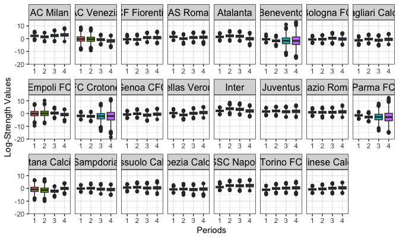
<p class="caption">plot of chunk plot_btdPosterior_dyn</p>
</div>


``` r
# Static Ranking

plot_btdPosterior(fit_result_stat)
```

<div class="figure" style="text-align: center">
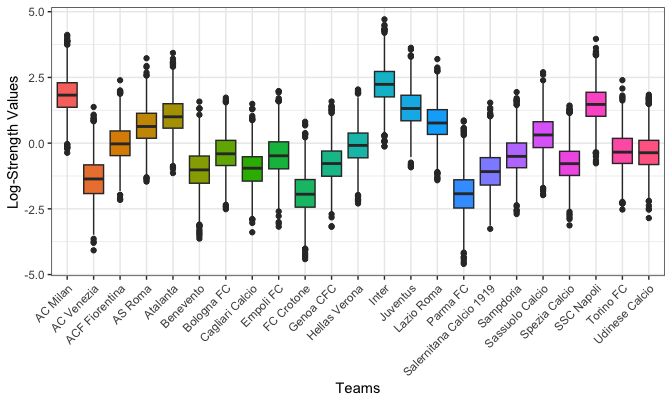
<p class="caption">plot of chunk plot_btdPosterior_stat</p>
</div>

It is also possible to select specific teams to plot by using the ```teams``` argument


``` r
# Dynamic Ranking

plot_btdPosterior(fit_result_dyn,
  teams = c("AC Milan", "AS Roma", "Juventus", "Inter"),
  ncol = 2
)
```

<div class="figure" style="text-align: center">

<p class="caption">plot of chunk plot_btdPosterior_teams_dyn</p>
</div>


``` r
# Static Ranking

plot_btdPosterior(fit_result_stat,
  teams = c("AC Milan", "AS Roma", "Juventus", "Inter"),
  ncol = 2
)
```

<div class="figure" style="text-align: center">

<p class="caption">plot of chunk plot_btdPosterior_teams_stat</p>
</div>


Additionally, it is possible to plot the posterior density by setting  ```plot_type = "density"```


``` r
# Dynamic Ranking

plot_btdPosterior(fit_result_dyn,
  teams = c("AC Milan", "AS Roma", "Juventus", "Inter"),
  plot_type = "density",
  scales = "free_y"
)
```

<div class="figure" style="text-align: center">
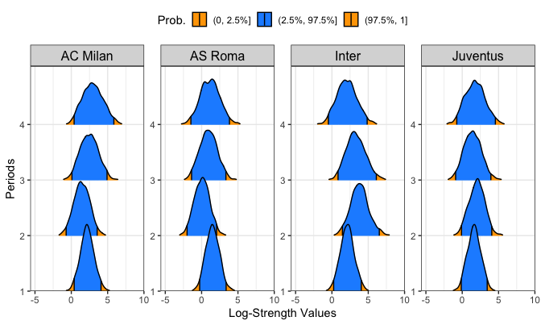
<p class="caption">plot of chunk plot_btdPosterior_teams_dyn_dens</p>
</div>


``` r
# Static Ranking

plot_btdPosterior(fit_result_stat,
  teams = c("AC Milan", "AS Roma", "Juventus", "Inter"),
  plot_type = "density",
  scales = "free_y"
)
```

<div class="figure" style="text-align: center">
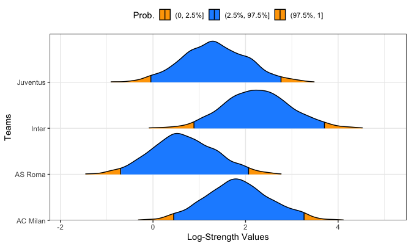
<p class="caption">plot of chunk plot_btdPosterior_teams_stat_dens</p>
</div>


Furthermore, the ```plot_logStrength``` function allows for plotting team rankings based on different summary measures of the posterior log-strengths, including the median, mean, and maximum a posteriori (MAP) estimates used in the ```btd_foot``` function. Specifically, this function generates a ggplot object that represents the log-strength values of teams, facilitating the comparison of team performance across different periods or among various teams. Similar to the ```plot_btdPosterior``` function, specific teams can be selected using the ```teams``` argument.


``` r
# Dynamic Ranking

plot_logStrength(fit_result_dyn,
  teams = c("AC Milan", "AS Roma", "Juventus", "Inter")
)
```

<div class="figure" style="text-align: center">

<p class="caption">plot of chunk plot_logStrength_teams_dyn</p>
</div>

# Goal-based models fit

## Static fit

To start with some analysis, let's now ```italy```  data about the Italian Serie A, specifically season 2000/2001: the season consists of $T=18$ teams, we start fitting a static bivariate Poisson model using:

- The likelihood approach: the ```mle_foot``` function returns the MLE estimates along with 95\% profile-likelihood deviance confidence intervals (by default) and Wald-type confidence intervals. The user can specify the desired confidence interval with the optional argument ```interval = c("profile", "Wald")```.

- The Bayesian approach: the ```stan_foot``` function produces an Hamiltonian Monte Carlo posterior sampling by using the underlying ```rstan``` ecosystem. The user can choose the number of iterations (```iter```), the number of Markov chains (```chains```), and other optional arguments values. The output is an object of class ```stanFoot```.

At this stage, we are currently ignoring any time-dependence in our parameters, considering them to be **static** across distinct match-times.


``` r
### Use Italian Serie A 2000/2001

## with 'dplyr' environment
#
# library(dplyr)
# italy <- as_tibble(italy)
# italy_2000<- italy %>%
#  dplyr::select(Season, home, visitor, hgoal,vgoal) #%>%
#  dplyr::filter(Season=="2000")
# italy_2000

## alternatively, you can use the basic 'subsetting' code,
## not using the 'dplyr' environment:
data("italy")
italy <- as.data.frame(italy)
italy_2000 <- subset(
  italy[, c(2, 3, 4, 6, 7)],
  Season == "2000"
)

colnames(italy_2000) <- c("periods", "home_team", "away_team", "home_goals", "away_goals")


### Fit Stan models
## no dynamics, no predictions
## 4 Markov chains, 'n_iter' iterations each

n_iter <- 200 # number of MCMC iterations after the burn-in
fit1_stan <- stan_foot(
  data = italy_2000,
  model = "biv_pois",
  chains = 4,
  # parallel_chains = 4,
  iter_sampling = n_iter
) # biv poisson
```

Similarly to the ```btd_foot``` function, the custom ```print``` function for an object of class ```stanFoot```  provides the usual Bayesian model summaries , including posterior means, medians, standard deviations, percentiles at 2.5\%, 25\%, 75\%, 97.5\% level, effective sample size (```n_eff```) and Gelman-Rubin statistic (```Rhat```). It accepts the same arguments as described previously.


``` r
## Print of model summary for parameters:

print(fit1_stan,
  pars = c(
    "home", "rho", "sigma_att",
    "sigma_def", "att", "def"
  ),
  teams = c("AC Milan", "AS Roma")
)
#> Summary of Stan football model
#> ------------------------------
#> 
#> Posterior summaries for model parameters:
#> # A tibble: 8 × 10
#>   variable        mean median    sd   mad     q5    q95  rhat ess_bulk ess_tail
#>   <chr>          <dbl>  <dbl> <dbl> <dbl>  <dbl>  <dbl> <dbl>    <dbl>    <dbl>
#> 1 home           0.284  0.289 0.068 0.067  0.166  0.389 1.00      761.     597.
#> 2 rho           -1.76  -1.74  0.317 0.3   -2.29  -1.32  1.00      854.     560.
#> 3 sigma_att      0.205  0.204 0.073 0.067  0.086  0.325 1.02      151.     111.
#> 4 sigma_def      0.219  0.212 0.068 0.066  0.122  0.34  1.00      367.     342.
#> 5 att[AS Roma]   0.266  0.266 0.133 0.136  0.035  0.488 1.01      391.     390.
#> 6 att[AC Milan]  0.132  0.129 0.13  0.133 -0.065  0.35  1.01      774.     474.
#> 7 def[AS Roma]  -0.195 -0.193 0.144 0.142 -0.442  0.038 0.999    1036.     759.
#> 8 def[AC Milan]  0.003  0     0.141 0.126 -0.23   0.246 1.01     1612.     445.
```

The **Gelman-Rubin statistic** $\hat{R}$ (```Rhat```) is below the threshold 1.1 for all the parameters, whereas the **effective sample size** (```n_eff```), measuring the approximate number of iid replications from the Markov chains, does not appear to be problematic. Thus, HMC sampling reached the convergence.

As we could expect, there is a positive effect from the home-effect (posterior mean about 0.3), and this implies that if two teams are equally good (meaning that their attack and defence abilities almost coincide), assuming that the constant intercept $\mu \approx 0$, we get that the average number of goals for the home-team will be $\lambda_{1} = \exp \{0.3 \} \approx 1.35$, against $\lambda_{2} = \exp \{0 \} = 1$.

In the model above, we are assuming that the covariance $\lambda_{3n}$ is constant and not depending on the match and/or on teams characteristics/further covariates:

\begin{align}
\lambda_{3n} =&\ \exp\{\rho\}\\
\rho \sim & \ \mathrm{N}^+(0,1),\\
\end{align}

where $\rho$ is assigned an half-Gaussian distribution with standard deviation equal to 1. According to the fit above, this means that in the model above we get an estimate of $\lambda_{3n}= \exp\{-4.25\} \approx 0.014$, suggesting a low, despite non-null, amount of goals-correlation existing in the 2000/2001 Italian Serie A. Of course, in the next package's version, the user will be allowed to specify a more general linear predictor for $\log(\lambda_{3n})$, as outlined in the BP presentation above, along with some prior distributions for the  parameters involved in the covariance formulation.


We can also depict the marginal posterior distributions for $\rho$ (and eventually for the other fixed-effects parameters) using the ```bayesplot``` package for Bayesian visualizations:


``` r
## Marginal posterior with bayesplot

posterior1 <- fit1_stan$fit$draws(format = "matrix")
mcmc_areas(posterior1, pars = c(
  "home", "rho",
  "sigma_att", "sigma_def"
)) +
  theme_bw()
```

<div class="figure" style="text-align: center">
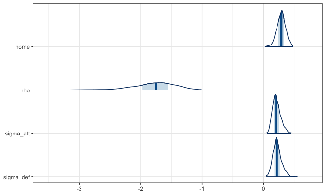
<p class="caption">plot of chunk static_fit_corr</p>
</div>

We can also access the original BP Stan code by typing:


``` r
### Model's code extraction

fit1_stan$stan_code
#>   [1] "functions{"                                                                                                              
#>   [2] ""                                                                                                                        
#>   [3] "      real bipois_lpmf(array[] int r , real mu1,real mu2,real mu3) {"                                                    
#>   [4] "        real ss;"                                                                                                        
#>   [5] "        real log_s;"                                                                                                     
#>   [6] "        real mus;"                                                                                                       
#>   [7] "        int  miny;"                                                                                                      
#>   [8] ""                                                                                                                        
#>   [9] "        miny = min(r[1], r[2]);"                                                                                         
#>  [10] ""                                                                                                                        
#>  [11] "        ss = poisson_lpmf(r[1] | mu1) + poisson_lpmf(r[2] | mu2) -"                                                      
#>  [12] "          exp(mu3);"                                                                                                     
#>  [13] "        if(miny > 0) {"                                                                                                  
#>  [14] "          mus = -mu1-mu2+mu3;"                                                                                           
#>  [15] "          log_s = ss;"                                                                                                   
#>  [16] ""                                                                                                                        
#>  [17] "          for(k in 1:miny) {"                                                                                            
#>  [18] "            log_s = log_s + log(r[1] - k + 1) + mus"                                                                     
#>  [19] "            + log(r[2] - k + 1)"                                                                                         
#>  [20] "            - log(k);"                                                                                                   
#>  [21] "            ss = log_sum_exp(ss, log_s);"                                                                                
#>  [22] "          }"                                                                                                             
#>  [23] "        }"                                                                                                               
#>  [24] "        return(ss);"                                                                                                     
#>  [25] "      }"                                                                                                                 
#>  [26] ""                                                                                                                        
#>  [27] "    }"                                                                                                                   
#>  [28] "    data{"                                                                                                               
#>  [29] "      int N;   // number of games"                                                                                       
#>  [30] "      int<lower=0> N_prev;"                                                                                              
#>  [31] "      array[N,2] int y;"                                                                                                 
#>  [32] "      int nteams;"                                                                                                       
#>  [33] "      array[N] int instants_rank;"                                                                                       
#>  [34] "      int ntimes_rank;                 // dynamic periods for ranking"                                                   
#>  [35] "      array[N] int team1;"                                                                                               
#>  [36] "      array[N] int team2;"                                                                                               
#>  [37] "      array[N_prev]int team1_prev;"                                                                                      
#>  [38] "      array[N_prev] int team2_prev;"                                                                                     
#>  [39] "      matrix[ntimes_rank,nteams] ranking;"                                                                               
#>  [40] "      int<lower=0, upper=1> ind_home;"                                                                                   
#>  [41] "      real mean_home;              // Mean for home effect"                                                              
#>  [42] "      real<lower=0> sd_home;      // Standard deviation for home effect"                                                 
#>  [43] ""                                                                                                                        
#>  [44] "      // priors part"                                                                                                    
#>  [45] "      int<lower=1,upper=4> prior_dist_num;    // 1 gaussian, 2 t, 3 cauchy, 4 laplace"                                   
#>  [46] "      int<lower=1,upper=4> prior_dist_sd_num; // 1 gaussian, 2 t, 3 cauchy, 4 laplace"                                   
#>  [47] ""                                                                                                                        
#>  [48] "      real hyper_df;"                                                                                                    
#>  [49] "      real hyper_location;"                                                                                              
#>  [50] ""                                                                                                                        
#>  [51] "      real hyper_sd_df;"                                                                                                 
#>  [52] "      real hyper_sd_location;"                                                                                           
#>  [53] "      real hyper_sd_scale;"                                                                                              
#>  [54] "    }"                                                                                                                   
#>  [55] "    parameters{"                                                                                                         
#>  [56] "      vector[nteams] att_raw;"                                                                                           
#>  [57] "      vector[nteams] def_raw;"                                                                                           
#>  [58] "      real<lower=0> sigma_att;"                                                                                          
#>  [59] "      real<lower=0> sigma_def;"                                                                                          
#>  [60] "      real home;"                                                                                                        
#>  [61] "      real rho;"                                                                                                         
#>  [62] "      real gamma;"                                                                                                       
#>  [63] "    }"                                                                                                                   
#>  [64] "    transformed parameters{"                                                                                             
#>  [65] "      real adj_h_eff;                   // Adjusted home effect"                                                         
#>  [66] "      vector[nteams] att;"                                                                                               
#>  [67] "      vector[nteams] def;"                                                                                               
#>  [68] "      array[N] vector[3] theta;"                                                                                         
#>  [69] ""                                                                                                                        
#>  [70] "      for (t in 1:nteams){"                                                                                              
#>  [71] "        att[t] = att_raw[t]-mean(att_raw);"                                                                              
#>  [72] "        def[t] = def_raw[t]-mean(def_raw);"                                                                              
#>  [73] "      }"                                                                                                                 
#>  [74] ""                                                                                                                        
#>  [75] "      adj_h_eff = home * ind_home;"                                                                                      
#>  [76] ""                                                                                                                        
#>  [77] "      for (n in 1:N){"                                                                                                   
#>  [78] "        theta[n,1] = exp(adj_h_eff+att[team1[n]]+def[team2[n]]+"                                                         
#>  [79] "                         (gamma/2)*(ranking[instants_rank[n], team1[n]]-ranking[instants_rank[n], team2[n]]));"          
#>  [80] "        theta[n,2] = exp(att[team2[n]]+def[team1[n]]-"                                                                   
#>  [81] "                         (gamma/2)*(ranking[instants_rank[n], team1[n]]-ranking[instants_rank[n], team2[n]]));"          
#>  [82] "        theta[n,3] = exp(rho);"                                                                                          
#>  [83] "      }"                                                                                                                 
#>  [84] "    }"                                                                                                                   
#>  [85] "    model{"                                                                                                              
#>  [86] "      // log-priors for team-specific abilities"                                                                         
#>  [87] "      for (t in 1:(nteams)){"                                                                                            
#>  [88] "        if (prior_dist_num == 1){"                                                                                       
#>  [89] "          target+= normal_lpdf(att_raw[t]|hyper_location, sigma_att);"                                                   
#>  [90] "          target+= normal_lpdf(def_raw[t]|hyper_location, sigma_def);"                                                   
#>  [91] "        }"                                                                                                               
#>  [92] "        else if (prior_dist_num == 2){"                                                                                  
#>  [93] "          target+= student_t_lpdf(att_raw[t]|hyper_df, hyper_location, sigma_att);"                                      
#>  [94] "          target+= student_t_lpdf(def_raw[t]|hyper_df, hyper_location, sigma_def);"                                      
#>  [95] "        }"                                                                                                               
#>  [96] "        else if (prior_dist_num == 3){"                                                                                  
#>  [97] "          target+= cauchy_lpdf(att_raw[t]|hyper_location, sigma_att);"                                                   
#>  [98] "          target+= cauchy_lpdf(def_raw[t]|hyper_location, sigma_def);"                                                   
#>  [99] "        }"                                                                                                               
#> [100] "        else if (prior_dist_num == 4){"                                                                                  
#> [101] "          target+= double_exponential_lpdf(att_raw[t]|hyper_location, sigma_att);"                                       
#> [102] "          target+= double_exponential_lpdf(def_raw[t]|hyper_location, sigma_def);"                                       
#> [103] "        }"                                                                                                               
#> [104] "      }"                                                                                                                 
#> [105] ""                                                                                                                        
#> [106] ""                                                                                                                        
#> [107] "      // log-hyperpriors for sd parameters"                                                                              
#> [108] "      if (prior_dist_sd_num == 1 ){"                                                                                     
#> [109] "        target+=normal_lpdf(sigma_att|hyper_sd_location, hyper_sd_scale);"                                               
#> [110] "        target+=normal_lpdf(sigma_def|hyper_sd_location, hyper_sd_scale);"                                               
#> [111] "      }"                                                                                                                 
#> [112] "      else if (prior_dist_sd_num == 2){"                                                                                 
#> [113] "        target+=student_t_lpdf(sigma_att|hyper_sd_df, hyper_sd_location, hyper_sd_scale);"                               
#> [114] "        target+=student_t_lpdf(sigma_def|hyper_sd_df, hyper_sd_location, hyper_sd_scale);"                               
#> [115] "      }"                                                                                                                 
#> [116] "      else if (prior_dist_sd_num == 3){"                                                                                 
#> [117] "        target+=cauchy_lpdf(sigma_att|hyper_sd_location, hyper_sd_scale);"                                               
#> [118] "        target+=cauchy_lpdf(sigma_def|hyper_sd_location, hyper_sd_scale);"                                               
#> [119] "      }"                                                                                                                 
#> [120] "      else if (prior_dist_sd_num == 4){"                                                                                 
#> [121] "        target+=double_exponential_lpdf(sigma_att|hyper_sd_location, hyper_sd_scale);"                                   
#> [122] "        target+=double_exponential_lpdf(sigma_def|hyper_sd_location, hyper_sd_scale);"                                   
#> [123] "      }"                                                                                                                 
#> [124] ""                                                                                                                        
#> [125] "      // log-priors fixed effects"                                                                                       
#> [126] "      target+=normal_lpdf(home|mean_home,sd_home);"                                                                      
#> [127] "      target+=normal_lpdf(rho|0,1);"                                                                                     
#> [128] "      target+=normal_lpdf(gamma|0,1);"                                                                                   
#> [129] ""                                                                                                                        
#> [130] "      // likelihood"                                                                                                     
#> [131] "      for (n in 1:N){"                                                                                                   
#> [132] "        //target+=bipois_lpmf(y[n,]| theta[n,1],"                                                                        
#> [133] "        //                    theta[n,2], theta[n,3]);"                                                                  
#> [134] "        target+=poisson_lpmf(y[n,1]| theta[n,1]+theta[n,3]);"                                                            
#> [135] "        target+=poisson_lpmf(y[n,2]| theta[n,2]+theta[n,3]);"                                                            
#> [136] "      }"                                                                                                                 
#> [137] "    }"                                                                                                                   
#> [138] "    generated quantities{"                                                                                               
#> [139] "      array[N,2]int y_rep;"                                                                                              
#> [140] "      array[N_prev,2] int y_prev;"                                                                                       
#> [141] "      array[N_prev] vector[3] theta_prev;"                                                                               
#> [142] "      vector[N] log_lik;"                                                                                                
#> [143] "      array[N] int diff_y_rep;"                                                                                          
#> [144] ""                                                                                                                        
#> [145] "      //in-sample replications"                                                                                          
#> [146] "      for (n in 1:N){"                                                                                                   
#> [147] "        y_rep[n,1] = poisson_rng(theta[n,1]+theta[n,3]);"                                                                
#> [148] "        y_rep[n,2] = poisson_rng(theta[n,2]+theta[n,3]);"                                                                
#> [149] "        diff_y_rep[n] = y_rep[n,1] - y_rep[n,2];"                                                                        
#> [150] "        log_lik[n] = poisson_lpmf(y[n,1]| theta[n,1]+theta[n,3])+"                                                       
#> [151] "                     poisson_lpmf(y[n,2]| theta[n,2]+theta[n,3]);"                                                       
#> [152] "        //bipois_lpmf(y[n,]| theta[n,1],"                                                                                
#> [153] "        //                        theta[n,2], theta[n,3]);"                                                              
#> [154] "      }"                                                                                                                 
#> [155] ""                                                                                                                        
#> [156] "      //out-of-sample predictions"                                                                                       
#> [157] "      if (N_prev > 0) {"                                                                                                 
#> [158] "        for (n in 1:N_prev){"                                                                                            
#> [159] "          theta_prev[n,1] = exp(adj_h_eff+att[team1_prev[n]]+"                                                           
#> [160] "                                  def[team2_prev[n]]+"                                                                   
#> [161] "                           (gamma/2)*(ranking[instants_rank[N],team1_prev[n]]-ranking[instants_rank[N],team2_prev[n]]));"
#> [162] "          theta_prev[n,2] = exp(att[team2_prev[n]]+"                                                                     
#> [163] "                                  def[team1_prev[n]]-"                                                                   
#> [164] "                           (gamma/2)*(ranking[instants_rank[N],team1_prev[n]]-ranking[instants_rank[N],team2_prev[n]]));"
#> [165] "          theta_prev[n,3] = exp(rho);"                                                                                   
#> [166] "          y_prev[n,1] = poisson_rng(theta_prev[n,1]+theta_prev[n,3]);"                                                   
#> [167] "          y_prev[n,2] = poisson_rng(theta_prev[n,2]+theta_prev[n,3]);"                                                   
#> [168] "        }"                                                                                                               
#> [169] "      }"                                                                                                                 
#> [170] "    }"
```


In addition the `stan_foot` function provides flexibility in obtaining posterior distributions by allowing users to choose the estimation method via the `method` argument. The available options include:

- ```MCMC```: Uses Hamiltonian Monte Carlo (HMC) (Default).

- ```VI```: Uses the Automatic differentiation variational inference (ADVI) algorithm.

- ```pathfinder```:  Uses the Pathfinder variational inference algorithm.

- ```laplace```: Uses the Laplace algorithm.

Below is an example that demonstrates how to use Pathfinder algorithm as the estimation method:


``` r
# Pathfinder algorithm example
fit1_stan_path <- stan_foot(
  data = italy_2000,
  model = "biv_pois",
  method = "pathfinder"
) # biv poisson

```

We fit now the same model under the MLE approach with Wald-type confidence intervals. We can then print the MLE estimates, e.g for the parameters $\rho$ and $\text{home}$:


``` r
### Fit MLE models
## no dynamics, no predictions
## Wald intervals

fit1_mle <- mle_foot(
  data = italy_2000,
  model = "biv_pois",
  interval = "Wald"
) # mle biv poisson
fit1_mle$home_effect
#>      2.5% mle 97.5%
#> [1,]  0.2 0.3  0.39
```

We got a very similar estimate to the Bayesian model for the home-effect.

### Changing default priors

One of the common practices in Bayesian statistics is to change the priors and perform some **sensitivity tests**. The default priors for the team-specific abilities and their related team-level standard deviations are:

\begin{align}
 \text{att}_t &\sim \mathrm{N}(\mu_{\text{att}}, \sigma_{\text{att}}),\\
 \text{def}_t &\sim \mathrm{N}(\mu_{\text{def}}, \sigma_{\text{def}}),\\
 \sigma_{\text{att}},  \sigma_{\text{def}} &\sim \mathsf{Cauchy}^+(0,5),
 \end{align}

 where $\mathsf{Cauchy}^+$ denotes the half-Cauchy distribution with support $[0, +\infty)$. However, the user is free to elicit some different priors, possibly choosing one among the following distributions: Gaussian (```normal```), student-$t$ (```student_t```), Cauchy (```cauchy```) and Laplace (```laplace```). The ```ability``` optional argument allows to specify the priors for the team-specific parameters $\text{att}$ and $\text{def}$, whereas the optional argument ```ability_sd``` allows to assign a prior to the group-level standard deviations $\sigma_{\text{att}}, \sigma_{\text{def}}$.  For instance, for each team $t, t=1,\ldots,T$, we could consider:

\begin{align}
 \text{att}_t &\sim t(4, \mu_{\text{att}}, \sigma_{\text{att}}),\\
 \text{def}_t &\sim t(4, \mu_{\text{def}}, \sigma_{\text{def}}),\\
 \sigma_{\text{att}},  \sigma_{\text{def}} &\sim \mathsf{Laplace}^+(0,1),
 \end{align}

where $t(\text{df}, \mu, \sigma)$ denotes a student-$t$ distribution with df degrees of freedom, location $\mu$ and scale $\sigma$, whereas $\mathsf{Laplace}^+$ denotes a half-Laplace distribution.


``` r
### Fit Stan models
## changing priors
## student-t for team-specific abilities, laplace for sds

fit1_stan_t <- stan_foot(
  data = italy_2000,
  model = "biv_pois",
  chains = 4,
  prior_par = list(
    ability = student_t(4, 0, NULL),
    ability_sd = laplace(0, 1),
    home = normal(0, 10)
  ),
  # parallel_chains = 4,
  iter_sampling = n_iter
) # biv poisson
```

Then, we can compare the marginal posteriors from the two models, the one with Gaussian team-specific abilities and the default $\mathsf{Cauchy}(0,5)$ for the team-level sds, and the other one specified above, with student-$t$ distributed team-specific abilities and the $\mathsf{Laplace}^+(0,1)$ for the team-level sds. We depict here the comparison for the attack team-level sds only:


``` r
## comparing posteriors

posterior1_t <- fit1_stan_t$fit$draws(format = "matrix")
model_names <- c("Default", "Stud+Laplace")
color_scheme_set(scheme = "gray")
gl_posterior <- cbind(
  posterior1[, "sigma_att"],
  posterior1_t[, "sigma_att"]
)
colnames(gl_posterior) <- c("sigma_att", "sigma_att_t")
mcmc_areas(gl_posterior, pars = c("sigma_att", "sigma_att_t")) +
  xaxis_text(on = TRUE, size = ggplot2::rel(2.9)) +
  yaxis_text(on = TRUE, size = ggplot2::rel(2.9)) +
  scale_y_discrete(labels = ((parse(text = model_names)))) +
  ggtitle("Att/def sds") +
  theme(plot.title = element_text(hjust = 0.5, size = rel(2.6))) +
  theme_bw()
```

<div class="figure" style="text-align: center">

<p class="caption">plot of chunk comparing_priors</p>
</div>

The student+laplace prior induces a lower amount of group-variability in the $\sigma_{\text{att}}$ marginal posterior distribution (then, a larger shrinkage towards the grand mean $\mu_{\text{att}}$).

When specifying the prior for the team-specific parameters through the argument ```ability```, you are not allowed to fix the group-level standard deviations $\sigma_{\text{att}}, \sigma_{\text{def}}$ to some numerical values. Rather, they need to be assigned a reasonable prior distribution.
For such reason, the most appropriate specification for the ```ability``` argument is ```ability = 'dist'(0, NULL)```, where the scale argument is set to ```NULL``` (otherwise, a warning message is occurring).

## Dynamic fit

A structural limitation in the previous models is the assumption of static team-specific parameters, namely teams are assumed to have a constant performance across time, as determined by the attack and defence abilities (att, def). However, teams' performance tend to be *dynamic* and change across different years, if not different weeks. Many factors contribute to this football aspect:

(i) teams act during the summer/winter players' transfermarket, by dramatically changing their rosters;

(ii) some teams' players could be injured in some periods, by affecting the global quality of the team in some matches;

(iii) coaches could be dismissed from their teams due to some non satisfactory results;

(iv) some teams could improve/worsen their attitudes due to the so-called turnover;

and many others. Again, we could assume **dynamics** in the attach/defence
 abilities as in <span style="color:red"> @owen2011dynamic </span>, <span style="color:red"> @egidi2018combining</span> and <span style="color:red"> @demartino2024alternative</span> in terms of weeks or seasons. In such framework, for a given
 number of times $1, \ldots, \mathcal{T}$, the models
 above would be unchanged, but the priors for the abilities
 parameters at each time $\tau, \tau=2,\ldots, \mathcal{T},$ would be **auto-regressive** of order 1:

 \begin{align}
 \text{att}_{t, \tau} & \sim \mathrm{N}({\text{att}}_{t, \tau-1}, \sigma_{\text{att}})\\
 \text{def}_{t, \tau} &\sim \mathrm{N}({\text{def}}_{t, \tau-1}, \sigma_{\text{def}}),
 \end{align}

 whereas for $\tau=1$ we have:

 \begin{align}
 \text{att}_{t, 1} & \sim \mathrm{N}(\mu_{\text{att}}, \sigma_{\text{att}})\\
 \text{def}_{t, 1} &\sim \mathrm{N}(\mu_{\text{def}}, \sigma_{\text{def}}),
 \end{align}

with hyperparameters $\mu_{\text{att}}, \mu_{\text{def}}, \sigma_{\text{att}}, \sigma_{\text{def}}$ and with the standard deviations capturing the time's/evolution's variation of both the teams' skills (here assumed to be constant across time and teams).
 Of course, the identifiability constraint must be imposed for each time $\tau$.

 We can use the ```dynamic_type``` argument in the ```stan_foot``` function, with possible options ```'seasonal'``` or ```'weekly'``` in order to consider more seasons (no examples are given in this course) or more week-times within a single season, respectively.  Let's fit a weekly-dynamic parameters model on the Serie A 2000/2001 season:


``` r
### Fit Stan models
## seasonal dynamics, no predictions
## 2 Markov chains, 'n_iter' iterations each

fit2_stan <- stan_foot(
  data = italy_2000,
  model = "biv_pois",
  dynamic_type = "weekly",
  # parallel_chains = 2,
  chains = 2,
  iter_sampling = n_iter
) # biv poisson
```


``` r
print(fit2_stan, pars = c(
  "home", "rho", "sigma_att",
  "sigma_def"
))
#> Summary of Stan football model
#> ------------------------------
#> 
#> Posterior summaries for model parameters:
#> # A tibble: 4 × 10
#>   variable    mean median    sd   mad     q5    q95  rhat ess_bulk ess_tail
#>   <chr>      <dbl>  <dbl> <dbl> <dbl>  <dbl>  <dbl> <dbl>    <dbl>    <dbl>
#> 1 home       0.279  0.283 0.063 0.064  0.167  0.383  1.02   360.      401. 
#> 2 rho       -1.74  -1.68  0.318 0.302 -2.34  -1.28   1.01   387.      367. 
#> 3 sigma_att  0.043  0.04  0.01  0.01   0.03   0.063  1.63     3.54     32.4
#> 4 sigma_def  0.056  0.054 0.017 0.015  0.032  0.087  2.24     2.65     15.0
```

From the printed summary, we may note that the degree of goals' correlation seems to be again very small here. Moreover, the Gelman-Rubin statistic for $\sigma_{\text{att}}$ is relatively high, whereas the effective sample sizes for $\sigma_{\text{att}}$ and $\sigma_{\text{def}}$ are quite low. This is suggesting possible inefficiencies during the HMC sampling and that a *model-reparametrization* could be suited and effective at this stage.  Another option is to play a bit with the prior specification for $\sigma_{\text{att}}$ and $\sigma_{\text{def}}$, for instance by specifying a prior inducing less shrinkage in the team-specific abilities.

To deal with these issues and broaden the set of candidate models, let's fit also a dynamic double-Poisson model with the ```double_pois``` option for the argument ```model```:


``` r
### Fit Stan models
## weekly dynamics, no predictions
## 2 chains, 'n_iter' iterations each

fit3_stan <- stan_foot(
  data = italy_2000,
  model = "double_pois",
  dynamic_type = "weekly",
  # parallel_chains = 2,
  chains = 2,
  iter_sampling = n_iter
) # double poisson
```


``` r
print(fit3_stan, pars = c(
  "home", "sigma_att",
  "sigma_def"
))
#> Summary of Stan football model
#> ------------------------------
#> 
#> Posterior summaries for model parameters:
#> # A tibble: 3 × 10
#>   variable   mean median    sd   mad    q5   q95  rhat ess_bulk ess_tail
#>   <chr>     <dbl>  <dbl> <dbl> <dbl> <dbl> <dbl> <dbl>    <dbl>    <dbl>
#> 1 home      0.413  0.412 0.042 0.043 0.343 0.482  1.01   388.      270. 
#> 2 sigma_att 0.045  0.044 0.007 0.006 0.037 0.058  1.32     5.03     29.1
#> 3 sigma_def 0.047  0.047 0.005 0.006 0.039 0.055  1.54     3.73     20.6
```


The fitting problems mentioned above remain also for the double Poisson model...Thus, it's time to play a little bit with the prior distributions. Also in the dynamic approach we can change the default priors for the team-specific abilities and their standard deviations, respectively, through the optional arguments ```ability``` and ```ability_sd```. The specification follows almost analogously the static case: with the first argument we may specify the prior's family for the team-specific abilities and the specific priors for $\text{att}_{t,1}, \text{def}_{t,1}$ along with the hyper-prior location $\mu_{\text{att}}, \mu_{\text{def}}$, whereas $\sigma_{\text{att}}$ and $\sigma_{\text{def}}$ need to be assigned some proper prior distribution. Assume to fit the same double Poisson model, but here we suppose student-$t$ distributed team-specific abilities with 4 degrees of freedom to eventually capture more extreme team-specific abilities (more variability, i.e. less shrinkage), along with a $\text{Cauchy}^+(0,25)$ for their standard deviations (to better capture a possible larger evolution variability):

\begin{align}
 \text{att}_{t, \tau} &\ \sim t(4, {\text{att}}_{t, \tau-1}, \sigma_{\text{att}})\\
 \text{def}_{t, \tau} &\ \sim t(4, {\text{def}}_{t, \tau-1}, \sigma_{\text{def}})\\
 \sigma_{\text{att}},  \sigma_{\text{def}} &\ \sim \mathsf{Cauchy}^+(0,25),
 \end{align}


``` r
### Fit Stan models
## weekly dynamics, no predictions
## 2 chains, 'n_iter' iterations each

fit3_stan_t <- stan_foot(
  data = italy_2000,
  model = "double_pois",
  prior_par = list(
    ability = student_t(4, 0, NULL),
    ability_sd = cauchy(0, 25),
    home = normal(0, 5)
  ),
  dynamic_type = "weekly",
  # parallel_chains = 2,
  chains = 2,
  iter_sampling = n_iter
) # double poisson
```


``` r
print(fit3_stan_t, pars = c(
  "home", "sigma_att",
  "sigma_def"
))
#> Summary of Stan football model
#> ------------------------------
#> 
#> Posterior summaries for model parameters:
#> # A tibble: 3 × 10
#>   variable   mean median    sd   mad    q5   q95  rhat ess_bulk ess_tail
#>   <chr>     <dbl>  <dbl> <dbl> <dbl> <dbl> <dbl> <dbl>    <dbl>    <dbl>
#> 1 home      0.41   0.413 0.044 0.04  0.34  0.48   1.01   180.      173. 
#> 2 sigma_att 0.034  0.033 0.01  0.013 0.019 0.051  1.47     4.15     23.9
#> 3 sigma_def 0.046  0.044 0.015 0.018 0.026 0.07   1.99     2.82     20.3
```

As we may conclude, the situation has been only slightly improved.

<!-- For student-$t$ model we obtain global abilities intervals: -->

<!-- ```{r t_dyn, echo =TRUE, eval = FALSE} -->
<!-- fit5 <- stan_foot(data = italy_2000, -->
<!--                 model="student_t", -->
<!--                 dynamic_type = "weekly", -->
<!--                 iter = 1000)  # student_t -->
<!-- foot_abilities(fit5, italy_2000) -->
<!-- ``` -->

# Using ```btd_foot``` and ```stan_foot``` sequentially

One of the main features of the ```footBayes``` package is the ability to first compute the log-strengths using the Bayesian Bradley-Terry-Davidson model through the ```btd_foot``` function and then fit a Bayesian goal-based model using the ```stan_foot```  by passing the previously estimated historical team strengths as an additional covariate via the ```ranking``` argument. Specifically, this argument accepts an element of class ```btdFoot```or alternatively a data frame with the following columns:

- ```periods```: Time periods corresponding to the rankings (integer >= 1),
- ```team```: Team names matching those in data (character string),
- ```rank_points```: Ranking points (relative strengths) for each team (numeric).

The ability to use either ```btdFoot``` objects or custom ranking data frames provides flexibility in how the user can model team strengths, allowing for the integration of various ranking systems, such as the [FIFA ranking](https://inside.fifa.com/fifa-world-ranking).


``` r
# Dynamic Bradley-Terry-Davidson model

data("italy")

italy_2020_2021_rank <- italy %>%
  dplyr::select(Season, home, visitor, hgoal, vgoal) %>%
  dplyr::filter(Season == "2020" | Season == "2021") %>%
  dplyr::mutate(match_outcome = dplyr::case_when(
    hgoal > vgoal ~ 1, # Home team wins
    hgoal == vgoal ~ 2, # Draw
    hgoal < vgoal ~ 3 # Away team wins
  )) %>%
  dplyr::filter(dplyr::row_number() <= 570) %>%
  dplyr::mutate(periods = dplyr::case_when(
    dplyr::row_number() <= 190 ~ 1,
    dplyr::row_number() <= 380 ~ 2,
    dplyr::row_number() <= 570 ~ 3
  )) %>%
  dplyr::select(periods,
    home_team = home,
    away_team = visitor, match_outcome
  )


fit_btd_dyn <- btd_foot(
  data = italy_2020_2021_rank,
  dynamic_rank = TRUE,
  rank_measure = "median",
  iter_sampling = 1000,
  # parallel_chains = 2,
  chains = 2,
  adapt_delta = 0.9,
  max_treedepth = 12
)

# Dynamic Bivariate Poisson Model

italy_2020_2021_fit <- italy %>%
  dplyr::select(Season, home, visitor, hgoal, vgoal) %>%
  dplyr::filter(Season == "2020" | Season == "2021") %>%
  dplyr::filter(dplyr::row_number() <= 570) %>%
  dplyr::mutate(periods = dplyr::case_when(
    dplyr::row_number() <= 190 ~ 1,
    dplyr::row_number() <= 380 ~ 2,
    dplyr::row_number() <= 570 ~ 3
  )) %>% # Assign periods based on match number
  dplyr::select(periods,
    home_team = home,
    away_team = visitor, home_goals = hgoal, away_goals = vgoal
  )


fit_stan_rank <- stan_foot(
  data = italy_2020_2021_fit,
  model = "biv_pois",
  ranking = fit_btd_dyn,
  predict = 180,
  prior_par = list(
    ability = student_t(4, 0, NULL),
    ability_sd = cauchy(0, 25),
    home = normal(0, 5)
  ),
  dynamic_type = "season",
  chains = 2,
  # parallel_chains = 2,
  iter_sampling = 1000
)
```


``` r
print(fit_stan_rank,
  pars = c("home", "rho", "sigma_att", "sigma_def")
)
#> Summary of Stan football model
#> ------------------------------
#> 
#> Posterior summaries for model parameters:
#> # A tibble: 4 × 10
#>   variable    mean median    sd   mad     q5    q95  rhat ess_bulk ess_tail
#>   <chr>      <dbl>  <dbl> <dbl> <dbl>  <dbl>  <dbl> <dbl>    <dbl>    <dbl>
#> 1 home       0.158  0.161 0.068 0.067  0.046  0.265  1.00  1693.     1385. 
#> 2 rho       -1.10  -1.09  0.163 0.159 -1.38  -0.848  1.00  1676.     1630. 
#> 3 sigma_att  0.035  0.03  0.023 0.02   0.006  0.079  1.26     6.25     40.0
#> 4 sigma_def  0.033  0.031 0.025 0.028  0.002  0.077  1.22     6.88     51.6
```


# Model estimates and visualization tools

## Plotting and interpreting team-specific abilities

Once the model has been fitted, there is a large amount of interesting summaries to explore. The function ```foot_abilities``` allows to depict posterior/confidence intervals for global attack and defense abilities on the considered data (attack abilities are plotted in red, whereas defense abilities in blue colors). The *higher the attack and the lower the defence* for a given team, and *the better is the overall team's strength*.

We can produce the team-specific abilities for the two static fits above, ```fit1_mle``` (MLE) and ```fit1_stan``` (Bayes), with red bars for the attack and blue bars for the defence, respectively:


``` r
## Plotting abilities: credible and confidence 95% intervals

foot_abilities(object = fit1_stan, data = italy_2000)
foot_abilities(object = fit1_mle, data = italy_2000)
```

<div class="figure" style="text-align: center">
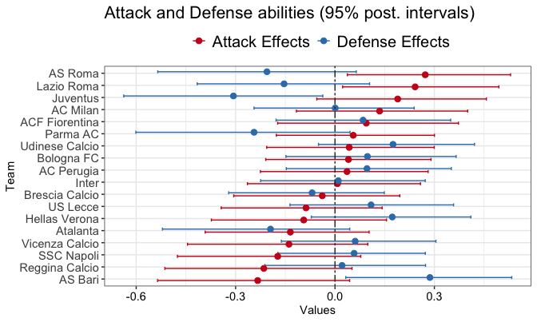
<p class="caption">plot of chunk abilities</p>
</div>

AS Roma, the team winning the Serie A 2000/2001, is associated with the highest attack ability and the lowest defence ability according to both the models. In general, the models seem to well capture the static abilities: AS Roma, Lazio Roma and Juventus (1st, 3rd and 2nd at the end of that season, respectively) are rated as the best teams in terms of their abilities, whereas AS Bari, SSC Napoli and Vicenza Calcio (all relegated at the end of the season) have the worst abilities.

We can also depict the team-specific dynamic plots for the dynamic models:


``` r
## Plotting abilities: credible and confidence 95% intervals

foot_abilities(fit2_stan, italy_2000)
```

<div class="figure" style="text-align: center">
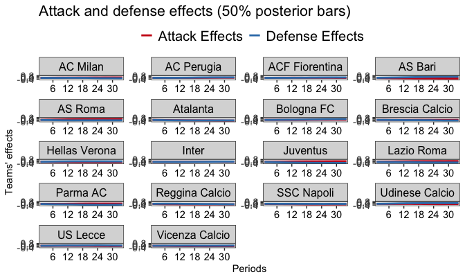
<p class="caption">plot of chunk abilities_dyn</p>
</div>

As we can see, dynamic abilities naturally evolve over the time: better teams (AS Roma, Lazio Roma, Juventus, Parma) are associated with increasing attack abilities and decreasing defence abilities, whereas the worst ones (AS Bari, SSC NApoli, and Hellas Verona) exhibit decreasing attacking skills and increasing defensive skills. The reason for these increasing/decreasing behaviours is straightforward: at the beginning, all the attack/defence parameters have been initialized to have location equal to 0. The user is free to change the location, and in the final package's version he will also have the possibility to elicit different team-specific hyper-prior locations.

# Model checking

Checking the model fit is a relevant and vital statistical task. To this purpose, we can evaluate hypothetical replications $\mathcal{D}^{\text{rep}}$ under the **posterior predictive distribution**

$$p(\mathcal{D}^{\text{rep}}| \mathcal{D}) = \int p(\mathcal{D}^{\text{rep}}| \boldsymbol{\theta}) \pi(\boldsymbol{\theta}| \mathcal{D}) d\boldsymbol{\theta},$$
and check whether these replicated values are somehow close to the observed data $\mathcal{D}$. These methods comparing hypothetical replications with the observed data are named **posterior predictive checks** and have great theoretical and applied appeal in Bayesian inference. See <span style="color:red">@gelman2014bayesian</span> for an overview.

The function ```pp_foot``` allows to obtain:

- an aggregated plot depicting the observed frequencies of the observed goal differences $Z_n=X_n-Y_n, \ n=1,\ldots,N$ plotted against the replicated ones;

- a visualization of the match-ordered goal differences along with their 50\% and 95\% credible intervals.


``` r
## PP checks: aggregated goal's differences and ordered goal differences

pp_foot(
  object = fit1_stan, data = italy_2000,
  type = "aggregated"
)
#> $pp_plot
```

<div class="figure" style="text-align: center">
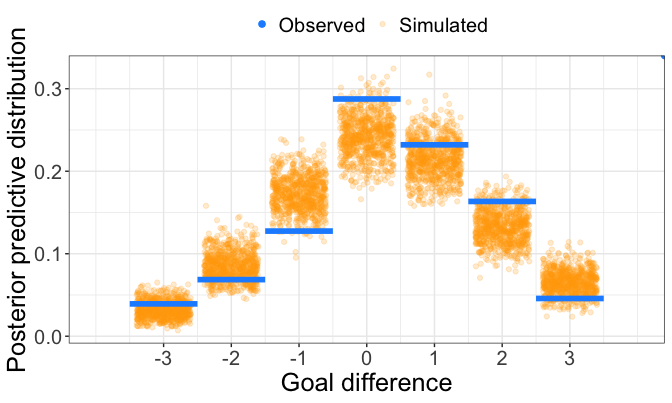
<p class="caption">plot of chunk pp_foot</p>
</div>

```
#> 
#> $pp_table
#>   goal diff. Bayesian p-value
#> 1         -3            0.334
#> 2         -2            0.861
#> 3         -1            0.991
#> 4          0            0.046
#> 5          1            0.245
#> 6          2            0.079
#> 7          3            0.932

pp_foot(
  object = fit1_stan, data = italy_2000,
  type = "matches"
)
#> $pp_plot
```

<div class="figure" style="text-align: center">
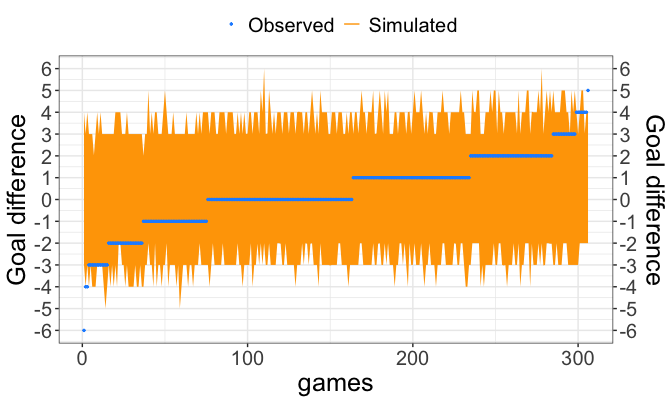
<p class="caption">plot of chunk pp_foot</p>
</div>

```
#> 
#> $pp_table
#>   1-alpha emp. coverage
#> 1    0.95         0.941
```

The aggregated goal difference frequencies seem to be decently captured by the model's replications: in the first plot, blue horizontal lines denote the observed goal differences frequencies registered in the dataset, whereas yellow jittered points denote the correspondent replications. Goal-difference of 0, corresponding to the draws occurrences, is only slightly underestimated by the model. However, in general there are no particular clues of model's misfit.

In the second plot, the ordered observed goal differences are plotted against their replications (50% and 95% credible intervals), and from this plot also we do not have particular signs of model's misfits.

Other useful PP checks, such as the overlap between data density and replicated data densities to check eventual inconsistencies, can be obtained through the standard use of the ```bayesplot``` package, in this case providing an approximation to a continuous distribution using an input kernel choice (```bw = 0.5``` in the ```ppc_dens_overlay``` used below):


``` r
## PPC densities overlay with the bayesplot package

# extracting the replications
draws_raw <- fit1_stan$fit$draws()
draws <- posterior::as_draws_rvars(draws_raw)
sims <- list()
sims$y_rep <- posterior::draws_of(draws[["y_rep"]])

goal_diff <- italy_2000$home_goals - italy_2000$away_goals

# plotting data density vs replications densities

ppc_dens_overlay(goal_diff, sims$y_rep[, , 1] - sims$y_rep[, , 2], bw = 0.5) +
  theme_bw()
```

<div class="figure" style="text-align: center">
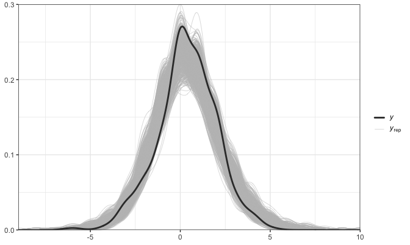
<p class="caption">plot of chunk pp_checks</p>
</div>

From this plot above we have the empirical confirmation that the goal difference is well captured by the static bivariate Poisson model.
<!-- Let's fit now a student-$t$ model, by depicting posterior intervals for global abilities (in orange): -->

<!-- ```{r t, echo =TRUE, eval = FALSE} -->
<!-- ### Fit Stan models -->
<!-- ## no dynamics, no predictions -->

<!-- fit2 <- stan_foot(data = italy_2000_2002, -->
<!--                 model="student_t") # student_t -->
<!-- foot_abilities(fit2, italy_2000_2002) -->
<!-- ``` -->


# Predictions and predictive accuracy

## Posterior out-of-sample probabilities

The hottest feature in sports analytics is to obtain future predictions. By considering the **posterior predictive distribution** for future and observable data $\tilde{\mathcal{D}}$, we acknowledge the whole model's prediction uncertainty (which propagates from the posterior model's uncertainty) and we can then generate observable values $\tilde{D}$ conditioned on the posterior model's parameters estimates:

$$p(\tilde{\mathcal{D}}| \mathcal{D}) = \int p(\tilde{\mathcal{D}}| \boldsymbol{\theta}) \pi(\boldsymbol{\theta}| \mathcal{D}) d\boldsymbol{\theta}.$$

We may then predict test set matches by using the argument ```predict``` of the ```stan_foot``` function, for instance considering the last four weeks of the 2000/2001 season as the test set, and then computing posterior-results probabilities using the function ```foot_prob``` for two teams belonging to the test set, such as Reggina Calcio and AC Milan:


``` r
### Fit Stan models
## weekly dynamics, predictions of last four weeks
## 2 chains 'n_iter' iterations each

fit4_stan <- stan_foot(
  data = italy_2000,
  model = "biv_pois",
  predict = 36,
  dynamic_type = "weekly",
  # parallel_chains = 2,
  chains = 2,
  iter_sampling = n_iter
) # biv poisson
```


``` r
foot_prob(
  object = fit4_stan, data = italy_2000,
  home_team = "Reggina Calcio",
  away_team = "AC Milan"
)
#> $prob_table
#>        home_team away_team prob_h prob_d prob_a        mlo
#> 1 Reggina Calcio  AC Milan   0.35  0.247  0.403 1-1 (0.11)
#> 
#> $prob_plot
```


<div class="figure" style="text-align: center">
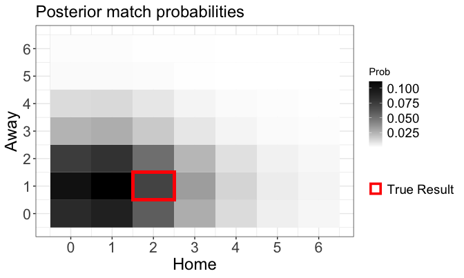
<p class="caption">plot of chunk foot_prob_weekly_predict</p>
</div>

Darker regions are associated with higher posterior probabilities, whereas the red square corresponds to the actual observed result, 2-1 for Reggina Calcio. According to the posterior-results probabilities, this final observed result had in principle about a 5% probability to happen! (Remember, football is about rare events...).

## Home-win posterior probabilities

We can also use the out-of-sample posterior-results probabilities to compute some aggregated **home/draw/loss** probabilities (based then on the $S$ draws from the MCMC method) for a given match:


\begin{align}
p_{\text{home}}= &\ \textrm{Pr}(X>Y) = \frac{1}{S}\sum_{s=1}^S| \tilde{x}^{(s)}> \tilde{y}^{(s)}|\\
p_{\text{draw}} = &\ \textrm{Pr}(X=Y) = \frac{1}{S}\sum_{s=1}^S| \tilde{x}^{(s)}= \tilde{y}^{(s)}|\\
p_{\text{loss}} = &\ \textrm{Pr} (X<Y)=\frac{1}{S}\sum_{s=1}^S| \tilde{x}^{(s)}< \tilde{y}^{(s)}|,
\end{align}

where $(\tilde{x}^{(s)}, \tilde{y}^{(s)})$ represents the $s$-th MCMC pair of the future home goals and away goals for a given match, respectively. According to this scenario, we can depict the home-win posterior probabilities of a given test set through the function ```foot_round_robin```:


``` r
## Home win out-of-sample probabilities

foot_round_robin(object = fit4_stan, data = italy_2000)
#> $round_table
#>              Home           Away Home_prob Observed
#> 1   Hellas Verona     Bologna FC     0.372        -
#> 2           Inter     Bologna FC     0.460        -
#> 3  Udinese Calcio     SSC Napoli     0.472        -
#> 4  ACF Fiorentina     SSC Napoli     0.522        -
#> 5        US Lecce     Lazio Roma     0.320        -
#> 6           Inter     Lazio Roma     0.335        -
#> 7  Brescia Calcio        AS Bari     0.627        -
#> 8  Reggina Calcio        AS Bari     0.575        -
#> 9  Udinese Calcio Vicenza Calcio     0.448        -
#> 10 Brescia Calcio Vicenza Calcio     0.468        -
#> 11        AS Roma       Parma AC     0.372        -
#> 12       US Lecce       Parma AC     0.260        -
#> 13        AS Roma       AC Milan     0.495        -
#> 14 Reggina Calcio       AC Milan     0.350        -
#> 15  Hellas Verona     AC Perugia     0.410        -
#> 16       Juventus     AC Perugia     0.598        -
#> 17 ACF Fiorentina       Atalanta     0.412        -
#> 18       Juventus       Atalanta     0.517        -
#> 19     SSC Napoli        AS Roma     0.290        -
#> 20        AS Bari        AS Roma     0.260        -
#> 21     Lazio Roma Udinese Calcio     0.688        -
#> 22       Atalanta Udinese Calcio     0.598        -
#> 23     Bologna FC       US Lecce     0.547        -
#> 24 Vicenza Calcio       US Lecce     0.522        -
#> 25       AC Milan Brescia Calcio     0.425        -
#> 26     AC Perugia Brescia Calcio     0.385        -
#> 27     SSC Napoli  Hellas Verona     0.415        -
#> 28       Parma AC  Hellas Verona     0.608        -
#> 29     AC Perugia Reggina Calcio     0.522        -
#> 30       Atalanta Reggina Calcio     0.470        -
#> 31     Lazio Roma ACF Fiorentina     0.630        -
#> 32       AC Milan ACF Fiorentina     0.562        -
#> 33     Bologna FC       Juventus     0.322        -
#> 34 Vicenza Calcio       Juventus     0.338        -
#> 35        AS Bari          Inter     0.375        -
#> 36       Parma AC          Inter     0.600        -
#> 
#> $round_plot
```

<div class="figure" style="text-align: center">
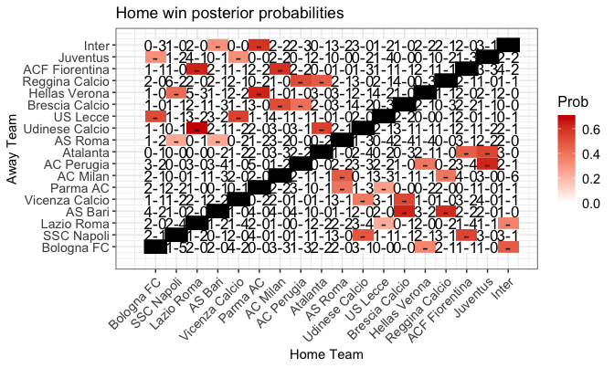
<p class="caption">plot of chunk foot_roundrobin</p>
</div>

Red cells denote more likely home-wins (close to 0.6), such as: Lazio Roma - Fiorentina (observed result: 3-0, home win), Lazio Roma - Udinese (observed result: 3-1, home win), Juventus - AC Perugia (observed result: 1-0, home win), Brescia Calcio - AS Bari (observed result: 3-1, home win). Conversely, lighter cells denote more likely away wins (close to 0.6), such as: AS Bari - AS Roma (observed result: 1-4, away win), AS Bari - Inter (observed result: 1-2, away win).

<!-- Finally, computations of well-known predictive measures on test set data such as the **Brier score** and the **Epstein probability score** will be included in the next package's version, however they could be easily computed by the users. -->

## Rank-league reconstruction

Statisticians and football amateurs are much interested in the final rank-league predictions. However, predicting the final rank position (along with the teams' points) is often assimilated to an *oracle*, rather than a coherent statistical procedure.

We can provide here:

- **rank-league reconstruction** for the first model ```fit1_stan```  by using the **in-sample** replications $\mathcal{D}^{\text{rep}}$ (yellow ribbons for the credible intervals, solid blue lines for the observed cumulated points):


``` r
## Rank league reconstruction

# aggregated plot

foot_rank(object = fit1_stan, data = italy_2000)
```

<div class="figure" style="text-align: center">
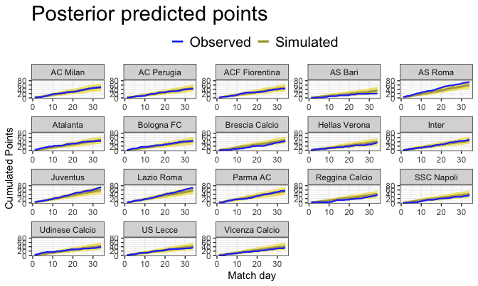
<p class="caption">plot of chunk rank_pred1</p>
</div>

``` r

# team-specific plot

foot_rank(
  object = fit1_stan, data = italy_2000,
  visualize = "individual"
)
```

<div class="figure" style="text-align: center">

<p class="caption">plot of chunk rank_pred1</p>
</div>


- **rank-league prediction** (aggregated or at team-level) for the fourth model ```fit4_stan``` by using the **out-of-sample** replications $\tilde{\mathcal{D}}$ (yellow ribbons for the credible intervals, solid blue lines for the observed cumulated points):


``` r
## Rank predictions for individual teams

# aggregated plot

foot_rank(object = fit4_stan, data = italy_2000)
```

<div class="figure" style="text-align: center">

<p class="caption">plot of chunk rank_pred2</p>
</div>

``` r

# team-specific plot

foot_rank(
  object = fit4_stan, data = italy_2000,
  teams = c("AC Milan", "AS Roma"),
  visualize = "individual"
)
```

<div class="figure" style="text-align: center">

<p class="caption">plot of chunk rank_pred2</p>
</div>

``` r

foot_rank(
  object = fit4_stan, data = italy_2000,
  visualize = "individual"
)
```

<div class="figure" style="text-align: center">

<p class="caption">plot of chunk rank_pred2</p>
</div>


# Model comparisons

## Comparing Football Prediction Models using ```compare_foot```

Evaluating the performance of these models is crucial to understand their predictive power and reliability. The ```compare_foot``` function provides a comprehensive way to compare different models or probability matrices using metrics like accuracy, Brier score, ranked probability score (RPS), Pseudo $R^2$, and average coverage probability (ACP). It also offers the option to compute confusion matrices for a detailed performance analysis.


``` r
italy_2020_2021_fit <- italy %>%
  dplyr::select(Season, home, visitor, hgoal, vgoal) %>%
  dplyr::filter(Season == "2020" | Season == "2021") %>%
  dplyr::mutate(periods = dplyr::case_when(
    dplyr::row_number() <= 190 ~ 1,
    dplyr::row_number() <= 380 ~ 2,
    dplyr::row_number() <= 570 ~ 3,
    TRUE ~ 4
  )) %>% # Assign periods based on match number
  dplyr::select(periods,
    home_team = home,
    away_team = visitor, home_goals = hgoal, away_goals = vgoal
  )


fit_comp_1 <- stan_foot(
  data = italy_2020_2021_fit,
  model = "biv_pois",
  home_effect = TRUE,
  predict = 190,
  dynamic_type = "season",
  # parallel_chains = 4,
  iter_sampling = n_iter
)

fit_comp_2 <- stan_foot(
  data = italy_2020_2021_fit,
  model = "double_pois",
  home_effect = TRUE,
  predict = 190,
  dynamic_type = "season",
  # parallel_chains = 4,
  iter_sampling = n_iter
)


italy_2020_2021_test <- italy %>%
  dplyr::select(Season, home, visitor, hgoal, vgoal) %>%
  dplyr::filter(Season == "2014" | Season == "2015") %>%
  dplyr::mutate(periods = dplyr::case_when(
    dplyr::row_number() <= 190 ~ 1,
    dplyr::row_number() <= 380 ~ 2,
    dplyr::row_number() <= 570 ~ 3,
    TRUE ~ 4
  )) %>%
  dplyr::filter(dplyr::row_number() > 570) %>%
  dplyr::select(periods,
    home_team = home,
    away_team = visitor,
    home_goals = hgoal,
    away_goals = vgoal
  )
```


``` r
compare_results_models <- compare_foot(
  source = list(
    biv_pois = fit_comp_1,
    double_pois = fit_comp_2
  ),
  test_data = italy_2020_2021_test,
  metric = c("accuracy", "brier", "ACP", "pseudoR2", "RPS"),
  conf_matrix = TRUE
)


print(compare_results_models, digits = 3)
#> Predictive Performance Metrics
#>        Model   RPS accuracy brier pseudoR2   ACP
#>     biv_pois 0.255    0.347 0.717    0.311 0.348
#>  double_pois 0.255    0.384 0.717    0.307 0.360
#> 
#> Confusion Matrices
#> Model: biv_pois 
#> 
#>           Actual
#> Predicted  Home Win Draw Away Win
#>   Home Win       50   28       32
#>   Draw            0    0        0
#>   Away Win       39   25       16
#> 
#> Model: double_pois 
#> 
#>           Actual
#> Predicted  Home Win Draw Away Win
#>   Home Win       60   35       35
#>   Draw            0    0        0
#>   Away Win       29   18       13
```


## LOOIC and WAIC
Comparing statistical models in terms of some **predictive information criteria** should conclude many analysis and can be carried out by using the Leave-one-out cross-validation criterion (**LOOIC**) and the Watanabe Akaike Information criterion (**WAIC**) performed by using the ```loo``` package. For more details about LOOIC and WAIC, read the paper <span style="color:red">@vehtari2016practical</span>.

The general formulation for the predictive information criteria is the following:

$$ \text{crit}=-2 \widehat{\text{elpd}} =  -2 (\widehat{\text{lpd}}- \text{parameters penalty})$$

- <span style="color:green">$\widehat{\text{elpd}}$</span>: estimate of the expected log predictive density of the fitted model.

- <span style="color:green">$\widehat{\text{lpd}}$</span> is a measure of the log predictive density of the fitted model.

- <span style="color:green">parameters penalty</span> is a penalization accounting for the effective number of parameters of the fitted model.


The interpretation is the following: the lower is the value for an information criterion, and the better is the estimated model's predictive accuracy.  Moreover, if two competing models share the same value for the log predictive density, the model with less parameters is favored.

This is the **Occam's Razor** occurring in statistics:

> "Frustra fit per plura quod potest fieri per pauciora"
>

We can perform Bayesian model comparisons using the ``$loo()`` method, which computes an approximate LOO-CV using the ```loo``` package. To use this method, you must compute and store the pointwise log-likelihood in your Stan program. We will compare the static and weekly dynamic models for the 2000/2001 Italian Serie A:


``` r
### Model comparisons
## LOOIC, loo function

# compute loo

loo1 <- fit1_stan$fit$loo()
loo1_t <- fit1_stan_t$fit$loo()
loo2 <- fit2_stan$fit$loo()
loo3 <- fit3_stan$fit$loo()
loo3_t <- fit3_stan_t$fit$loo()


# compare three looic

loo_compare(loo1, loo1_t, loo2, loo3, loo3_t)
#>        elpd_diff se_diff
#> model1  0.0       0.0   
#> model2 -0.4       0.4   
#> model3 -2.7       2.4   
#> model4 -4.1       4.0   
#> model5 -6.9       4.0
```

According to the above model LOOIC comparisons, the weekly-dynamic double Poisson models  attain the lowest LOOIC values and are then the favored models in terms of predictive accuracy. The static model's ```fit1_stan``` final looic is suggesting that the assumption of static team-specific parameters is too restrictive and oversimplified to capture teams' skills over time and make reliable predictions. Anyway, from model checking we have the suggestion that even the static model has a reliable goodness of fit and could be used for some simplified analysis not requiring complex dynamic patterns.

# Extensions in next versions

Extensions and to-do list for the next package's versions:

1. **Data Web-scraping**: automatic routine to scrape data from internet;

2. **More numerical outputs**: posterior probabilities, betting strategies, etc.;

3. **Diagnostics, pp checks** designed for football;

4. **Teams' statistics**

5. **More covariates** to be included in the model (possibly by users).

6. **More priors choices**


# References


<!-- ## Vignette Info -->

<!-- Note the various macros within the `vignette` section of the metadata block above. These are required in order to instruct R how to build the vignette. Note that you should change the `title` field and the `\VignetteIndexEntry` to match the title of your vignette. -->

<!-- ## Styles -->

<!-- The `html_vignette` template includes a basic CSS theme. To override this theme you can specify your own CSS in the document metadata as follows: -->

<!--     output:  -->
<!--       rmarkdown::html_vignette: -->
<!--         css: mystyles.css -->

<!-- ## Figures -->

<!-- The figure sizes have been customised so that you can easily put two images side-by-side.  -->

<!-- ```{r, fig.show='hold'} -->
<!-- plot(1:10) -->
<!-- plot(10:1) -->
<!-- ``` -->

<!-- You can enable figure captions by `fig_caption: yes` in YAML: -->

<!--     output: -->
<!--       rmarkdown::html_vignette: -->
<!--         fig_caption: yes -->

<!-- Then you can use the chunk option `fig.cap = "Your figure caption."` in **knitr**. -->


<!-- Also a quote using `>`: -->

<!-- > "He who gives up [code] safety for [code] speed deserves neither." -->
<!-- ([via](https://twitter.com/hadleywickham/status/504368538874703872)) -->
<!--%\usepackage[utf8]{inputenc}-->
