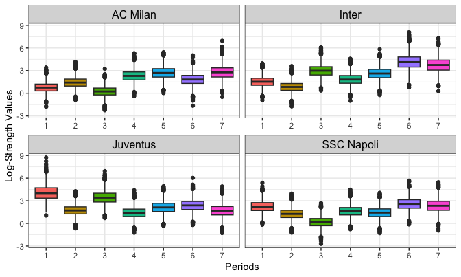
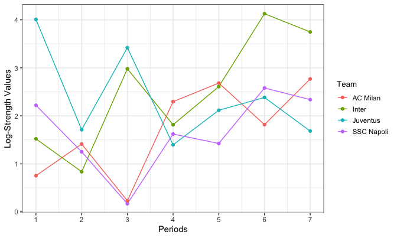

::: {.callout-note collapse="true"}
## Setup

The examples use the packages, the MCMC settings and the 2018/2019 - 2021/2022 data created in [Get started](get-started.qmd):

```r
library(footBayes)
library(dplyr)
library(ggplot2)
library(bayesplot)
library(loo)

n_iter <- 1000
n_chains <- 4
seed <- 2026

data("italy")
italy <- as.data.frame(italy)

italy_2000 <- italy %>%
  filter(Season == "2000") %>%
  arrange(Date) %>%
  select(periods = Season, home_team = home, away_team = visitor,
         home_goals = hgoal, away_goals = vgoal)

italy_2018_2021 <- italy %>%
  filter(Season %in% c("2018", "2019", "2020", "2021")) %>%
  arrange(Season, Date) %>%
  group_by(Season) %>%
  mutate(half = if_else(row_number() <= n() / 2, 1, 2)) %>%
  ungroup() %>%
  mutate(periods = 2 * (as.numeric(Season) - 2018) + half) %>%
  select(periods, home_team = home, away_team = visitor,
         home_goals = hgoal, away_goals = vgoal)
```
:::

The goal-based models of the previous articles describe the number of goals scored by each team. A simpler and complementary approach is to look only at the **outcome** of each match (win, draw or loss) and to estimate a single **strength** per team, from which a ranking follows. This article shows how to fit the Bayesian Bradley-Terry-Davidson (BTD) model with `footBayes`, how to read its output, and how to use the estimated strengths as a covariate of a goal-based model:

| Function | What it does | Output |
|:--|:--|:--|
| `btd_foot()` | Fits the static or dynamic BTD model | A `btdFoot` object with the fit and the team rankings |
| `print()` | Summarizes a `btdFoot` object | Ranking table and/or posterior summaries of the parameters |
| `plot_btdPosterior()` | Shows the posterior distributions | Boxplots or density plots of the log-strengths, of the log-tie or of the home effect |
| `plot_logStrength()` | Shows the ranking measure of the log-strengths | Trajectories over the periods (dynamic) or a dot plot (static) |
| `stan_foot(ranking = ...)` | Uses the strengths as a covariate | A goal-based model with the coefficient $\gamma$ of the ranking difference |

## The model

The Bradley-Terry model [@bradley_Terry1952] is one of the most popular techniques for ranking players or teams from pairwise comparisons. Each team $T_k$, $k = 1, \ldots, N_T$, is characterized by a latent strength $\alpha_k > 0$, and the probability that $T_i$ defeats $T_j$ is $\alpha_i / (\alpha_i + \alpha_j)$. Since the model does not account for draws, @davidson1970 introduced an additional tie parameter. In the log-parameterization, with $\psi_k = \log(\alpha_k)$ and $\nu$ the log-tie parameter, the probabilities of a home win, a draw and an away win in a match between $T_i$ and $T_j$ are

\begin{align}
p_{ij}^W & = \dfrac{\exp(\psi_i)}{\exp(\psi_i) + \exp(\psi_j) + \exp(\nu + (\psi_i + \psi_j)/2)}, \\
p_{ij}^D & = \dfrac{\exp(\nu + (\psi_i + \psi_j)/2)}{\exp(\psi_i) + \exp(\psi_j) + \exp(\nu + (\psi_i + \psi_j)/2)}, \\
p_{ij}^L & = 1 - p_{ij}^W - p_{ij}^D,
\end{align}

and the log-strengths are identifiable under the constraint $\sum_{k=1}^{N_T} \psi_k = 0$. A home effect can be added to $\psi_i$ as a multiplicative order effect [@davidson_beaver_1977], which becomes additive on the log scale. The Bayesian BTD model [@demartino2024alternative] assigns independent Gaussian priors to the log-strengths and to the log-tie parameter, $\psi_k \sim \mathrm{N}(\mu_\psi, \sigma_\psi)$ and $\nu \sim \mathrm{N}(\mu_\nu, \sigma_\nu)$. These priors satisfy the conditions for ranking systems discussed by @whelan2017prior. As in the goal-based models, the log-strengths can be **static** or **dynamic**; in the dynamic case they have auto-regressive priors of order 1 across the periods, $\psi_{k, \tau} \sim \mathrm{N}(\psi_{k, \tau - 1}, \sigma_\psi)$.

### How to read the parameters

Two properties of the formulas above help to interpret the estimates:

- only the **differences** between log-strengths matter: the ratio between the win and the loss probabilities is $p_{ij}^W / p_{ij}^L = \exp(\psi_i - \psi_j)$, or $\exp(\psi_i + \text{home} - \psi_j)$ with the home effect. The values of the log-strengths are therefore relative to the other teams, and their average is zero in each period because of the sum-to-zero constraint;
- the log-tie parameter $\nu$ controls the draw probability: for two teams with the same strength on neutral ground, $p^W = p^L = 1 / (2 + e^{\nu})$ and $p^D = e^{\nu} / (2 + e^{\nu})$, so that $\nu = 0$ gives three outcomes with probability 1/3 each, and a larger $\nu$ makes the draws more likely.

### Static and dynamic log-strengths

In the **static** model each team has a single log-strength, estimated from all its matches, whatever the period in which they were played. In the **dynamic** model each team has one log-strength per period: the log-strengths of the first period have prior $\mathrm{N}(\mu_\psi, \sigma_\psi)$, and those of the following periods are centred on the value of the previous period. The same $\sigma_\psi$, i.e. the scale of the `logStrength` prior, is also the standard deviation of the random walk. Unlike the evolution standard deviations of the dynamic goal-based models (see [Dynamic models](dynamic-models.qmd)), it is **fixed** by the user rather than estimated. The larger $\sigma_\psi$, the more the log-strengths are allowed to change from one period to the next.

## Preparing the data

The `btd_foot` function requires a data frame with the columns `periods`, `home_team`, `away_team` and `match_outcome`, the latter coded as 1 for a home win, 2 for a draw and 3 for an away win. We derive the outcomes for the first seven half-seasons of `italy_2018_2021`, i.e. the training periods of the seasonal models in [Dynamic models](dynamic-models.qmd):

``` r
italy_2018_2021_btd <- italy_2018_2021 %>%
  filter(periods <= 7) %>%
  mutate(match_outcome = case_when(
    home_goals > away_goals ~ 1,
    home_goals == away_goals ~ 2,
    home_goals < away_goals ~ 3
  )) %>%
  select(periods, home_team, away_team, match_outcome)
```

The resulting data frame contains 1330 matches, 190 for each of the seven half-seasons (from the first half of 2018/2019, period 1, to the first half of 2021/2022, period 7). The matches are played by 28 different teams, 20 in each period. A few remarks on the format:

- the goals are no longer needed: the BTD model uses only the outcome of each match, so that a 1-0 and a 4-0 home win carry the same information;
- `periods` must contain integer values, and the data should be sorted by period, since the order in which the periods first appear in the data defines the time order of the dynamic model;
- the data must not contain missing values, and `match_outcome` must contain only the values 1, 2 and 3.

The last half-season (period 8) is excluded on purpose: the strengths will be used as a covariate of a goal-based model that leaves period 8 out-of-sample (see [below](#btd-covariate)), and the ranking periods must correspond to the training periods of that model.

## Fitting the model with `btd_foot`

The main arguments of `btd_foot` are:

| Argument | Meaning | Default |
|:--|:--|:--|
| `dynamic_rank` | `TRUE` for one log-strength per team and period, `FALSE` for a single log-strength per team | `FALSE` |
| `home_effect` | Whether to include the home effect `home` | `FALSE` |
| `prior_par` | Gaussian priors, built with `normal()`, for `logStrength` ($\mu_\psi, \sigma_\psi$), `logTie` ($\mu_\nu, \sigma_\nu$) and `home` | `normal(0, 3)`, `normal(0, 0.3)`, `normal(0, 5)` |
| `rank_measure` | Posterior summary of the log-strengths used to rank the teams: `"median"`, `"mean"` or `"map"` | `"median"` |
| `method` | Inference algorithm: `"MCMC"`, `"VI"`, `"pathfinder"` or `"laplace"` | `"MCMC"` |
| `...` | Arguments passed to `cmdstanr`, e.g. `chains`, `iter_sampling`, `adapt_delta`, `max_treedepth`, `seed` | 4 chains, 1000 sampling iterations, `adapt_delta = 0.8`, `max_treedepth = 10` |

The `"map"` (maximum a posteriori) measure is computed as the mode of a kernel density estimate of the posterior draws of each log-strength. If `iter_warmup` is not specified, the number of warmup iterations is set equal to `iter_sampling`.

We fit a dynamic and a static model, both with the home effect and the default priors:

``` r
fit_btd_dyn <- btd_foot(
  data = italy_2018_2021_btd,
  dynamic_rank = TRUE,
  home_effect = TRUE,
  rank_measure = "median",
  chains = n_chains,
  parallel_chains = n_chains,
  iter_sampling = n_iter,
  adapt_delta = 0.9,
  max_treedepth = 12,
  seed = seed
)

fit_btd_stat <- btd_foot(
  data = italy_2018_2021_btd,
  dynamic_rank = FALSE,
  home_effect = TRUE,
  rank_measure = "map",
  chains = n_chains,
  parallel_chains = n_chains,
  iter_sampling = n_iter,
  seed = seed
)
```

The dynamic model has $7 \times 28 = 196$ log-strengths instead of 28, linked by the random walk prior, and is fitted with `adapt_delta = 0.9` and `max_treedepth = 12` instead of the defaults 0.8 and 10. A larger `adapt_delta` makes the sampler use a smaller step size, and a larger `max_treedepth` allows longer trajectories at each iteration. These two are the first settings to increase if Stan warns about divergent transitions or about the maximum tree depth.

The priors can be changed by passing only the elements to modify; the others keep their default values. For instance, a smaller scale of the `logStrength` prior favours smoother trajectories in the dynamic model:

```r
# other ways of calling the function
btd_foot(
  data = italy_2018_2021_btd,
  dynamic_rank = TRUE,
  home_effect = TRUE,
  prior_par = list(logStrength = normal(0, 1))
)
```

Only normal priors are allowed; any other distribution returns an error.

### The `btdFoot` object

`btd_foot` returns an object of class `btdFoot`, a list with the elements:

- `fit`: the `CmdStanFit` object returned by `cmdstanr`, which contains all the posterior draws;
- `rank`: a data frame with the columns `periods`, `team` and `log_strengths`, the latter being the posterior summary of the log-strengths chosen through `rank_measure`. The dynamic model has one row per team and period, the static model one row per team, with `periods` equal to 1;
- `data`, `stan_data`, `stan_code`, `stan_args`: the input data, the data list passed to Stan, the Stan code of the model and the `cmdstanr` arguments used;
- `rank_measure` and `alg_method`: the ranking measure and the inference algorithm.

## Printing the results

The `print` method of the `btdFoot` class displays the rankings, the posterior summaries of the parameters, or both, according to the `display` argument (`"rankings"`, `"parameters"` or `"both"`, the default). The `pars` argument selects the parameters to summarize, and `teams` restricts the log-strengths to the selected teams.

### Posterior summaries of the parameters

``` r
print(fit_btd_dyn,
  display = "parameters",
  pars = c("logStrength", "logTie", "home"),
  teams = c("Juventus", "Inter")
)
#> Bayesian Bradley-Terry-Davidson model
#> ------------------------------------------------
#> Rank measure used: median 
#> 
#> Posterior summaries for model parameters:
#> # A tibble: 16 × 10
#>    variable         mean median    sd   mad     q5   q95  rhat ess_bulk ess_tail
#>    <chr>           <dbl>  <dbl> <dbl> <dbl>  <dbl> <dbl> <dbl>    <dbl>    <dbl>
#>  1 logStrength[1…  4.07   4.01  1.00  1.01   2.52  5.80   1.00    3962.    2701.
#>  2 logStrength[2…  1.73   1.71  0.721 0.706  0.594 2.97   1.00    3345.    3066.
#>  3 logStrength[3…  3.44   3.42  0.88  0.865  2.05  4.97   1.00    3723.    3326.
#>  4 logStrength[4…  1.41   1.40  0.721 0.73   0.248 2.56   1       3542.    3367.
#>  5 logStrength[5…  2.13   2.12  0.789 0.808  0.869 3.43   1.00    3687.    3513.
#>  6 logStrength[6…  2.38   2.38  0.789 0.79   1.08  3.64   1.00    3192.    3452.
#>  7 logStrength[7…  1.69   1.68  0.852 0.832  0.311 3.10   1       3341.    2990.
#>  8 logStrength[1…  1.53   1.52  0.713 0.689  0.384 2.72   1       3968.    3334.
#>  9 logStrength[2…  0.837  0.836 0.669 0.674 -0.254 1.93   1.00    4020.    2946.
#> 10 logStrength[3…  2.98   2.98  0.825 0.818  1.64  4.38   1.00    4227.    3482.
#> 11 logStrength[4…  1.85   1.82  0.755 0.755  0.666 3.12   1.00    3723.    3236.
#> 12 logStrength[5…  2.62   2.61  0.805 0.821  1.33  3.96   1       3904.    3078.
#> 13 logStrength[6…  4.17   4.13  0.996 0.995  2.60  5.89   1.00    3394.    2630.
#> 14 logStrength[7…  3.76   3.75  0.994 0.995  2.21  5.49   1       3405.    3330.
#> 15 logTie         -0.016 -0.013 0.065 0.059 -0.127 0.089  1.01     433.     638.
#> 16 home            0.358  0.36  0.082 0.08   0.22  0.493  1.02     305.     311.
```

Each row is a parameter, and the columns are the posterior mean, median, standard deviation (`sd`), median absolute deviation (`mad`), the 5% and 95% quantiles (`q5`, `q95`), the $\widehat{R}$ convergence diagnostic (`rhat`, close to 1 at convergence) and the bulk and tail effective sample sizes (`ess_bulk`, `ess_tail`).

The names of the log-strengths are truncated by the tibble printing (`logStrength[1~`). In the dynamic model the full name is `logStrength[period, team]`, e.g. `logStrength[1, Juventus]`, where the first index is the period and the team index is replaced by the team name. The log-strengths are listed team by team: rows 1-7 are the log-strengths of **Juventus** in the periods 1 to 7, and rows 8-14 those of **Inter**. In the static model the names have a single index, `logStrength[team]`.

How to read the results:

- **log-strengths**: Juventus has its highest median in period 1 (4.01), the first half of 2018/2019, in which it collected 53 points in 19 matches, whereas Inter has its highest median in period 6 (4.13), the second half of 2020/2021, in which it collected 50 points. The posterior standard deviations are between 0.67 and 1.00: each team plays only 19 matches per half-season, and part of the variation from one period to the next is within the posterior uncertainty;
- **log-tie** `logTie`: the posterior median is -0.013, with a 90% credible interval $(-0.127, 0.089)$ that includes zero. Since $e^{\nu} \approx 1$, two teams with the same strength on neutral ground would draw with probability close to 1/3;
- **home effect** `home`: the posterior median is 0.36, with a 90% credible interval $(0.22, 0.493)$ away from zero. Playing at home multiplies the strength $\alpha_i$ by $e^{0.36} \approx 1.43$.

Plugging the posterior medians into the formulas above, with the home effect added to the home team, gives a sense of the scale: two teams of equal strength would have probabilities 0.396, 0.327 and 0.277 of a home win, a draw and an away win; Juventus hosting Inter in period 1 (log-strengths 4.01 and 1.52) would have 0.772, 0.183 and 0.045. These plug-in values are only illustrative, since they ignore the posterior uncertainty.

The log-strengths have a large effective sample size (above 2600) and $\widehat{R}$ values of 1.00, whereas `logTie` and `home` have smaller effective sample sizes (433 and 305 bulk) and $\widehat{R}$ values of 1.01 and 1.02. A longer run would make their summaries more precise.

### Rankings

``` r
print(fit_btd_stat, display = "rankings")
#> Bayesian Bradley-Terry-Davidson model
#> ------------------------------------------------
#> Rank measure used: map 
#> 
#> Top teams based on relative log-strengths:
#>    periods            team log_strengths
#> 15       1           Inter         2.130
#> 9        1        Juventus         2.032
#> 8        1        Atalanta         1.668
#> 19       1        AC Milan         1.592
#> 10       1      SSC Napoli         1.472
#> 2        1      Lazio Roma         1.113
#> 18       1         AS Roma         1.039
#> 6        1 Sassuolo Calcio         0.418
#> 21       1   Hellas Verona         0.198
#> 7        1       Torino FC         0.184
```

The table shows the ten rows of the `rank` element with the largest `log_strengths`, here the posterior modes (`map`) of the static log-strengths. The numbers on the left are the row names of `rank`, i.e. the internal indices of the teams. The column `periods` is 1 for all the teams, since the static model has a single period. With the seven half-seasons pooled, Inter (2.130) and Juventus (2.032) are very close at the top, followed by Atalanta (1.668), AC Milan (1.592) and SSC Napoli (1.472). These values are relative, since the log-strengths of the 28 teams sum to zero.

For a dynamic model, the same table sorts all the team-period pairs together and therefore shows the ten highest log-strengths across all the periods. The complete ranking of each period is in `fit_btd_dyn$rank`. A few other ways of calling the method:

```r
# rankings and posterior summaries of all the variables
print(fit_btd_dyn)

# home effect and log-strengths of two teams, with 2 digits
print(fit_btd_stat,
  display = "parameters",
  pars = c("logStrength", "home"),
  teams = c("Atalanta", "AC Milan"),
  digits = 2
)
```

When `pars` is not specified, the summary includes all the variables of the Stan model, including the log-likelihood `log_lik` and the replicated outcomes `y_rep` of every match, so the output is very long. Teams in `teams` that are not in the data are dropped with a warning.

## Posterior distributions with `plot_btdPosterior`

`plot_btdPosterior` depicts the posterior distributions of one group of parameters, selected through `pars`: the log-strengths (`"logStrength"`, the default), the log-tie (`"logTie"`) or the home effect (`"home"`). The other arguments are:

- `plot_type`: `"boxplot"` (default) or `"density"`; the density plots highlight the 95% credible interval;
- `teams`: the teams to show (all the teams by default);
- `ncol` and `scales`: the number of columns and the axis scales (`"free"`, `"fixed"`, `"free_x"`, `"free_y"`) of the panels. They are used only for the log-strengths of the dynamic model, which has one panel per team, and their defaults are 8 and `"free_x"`.

In the dynamic case, each team has its own panel with one boxplot per period:

``` r
plot_btdPosterior(fit_btd_dyn,
  teams = c("Juventus", "Inter", "AC Milan", "SSC Napoli"),
  ncol = 2
)
```

{fig-align="center" width="700"}

The horizontal axis reports the periods and the vertical axis the log-strength. Each box spans the interquartile range of the posterior draws, the line inside it is the posterior median, and the points are the draws beyond the whiskers. With `scales = "free_x"` the vertical axis is shared by all the panels, so the four teams can be compared directly. Juventus has its highest values in periods 1 and 3 and lower values from period 4 onwards, whereas Inter reaches its highest values in periods 6 and 7; AC Milan and SSC Napoli are at their lowest in period 3. The boxes of consecutive periods often overlap, which reflects the uncertainty discussed above.

In the static case, the log-strengths of all the selected teams share the same axis. Here we use density plots:

``` r
plot_btdPosterior(fit_btd_stat,
  teams = c("Juventus", "Inter", "AC Milan", "SSC Napoli"),
  plot_type = "density",
  scales = "free_y"
)
```

{fig-align="center" width="700"}

Each curve is the posterior density of the static log-strength of a team. The blue area is the 95% credible interval, and the orange tails are the lowest and highest 2.5% of the posterior probability. Since the static model pools 3.5 seasons, the densities are much more concentrated than the dynamic posteriors, with 95% intervals about one unit wide. The densities of Inter and Juventus largely overlap, as do those of AC Milan and SSC Napoli: the data do not clearly separate the two teams within each pair, whereas the first pair is shifted to the right of the second by about half a unit. The `scales` argument has no effect here, since the static plot has a single panel.

The log-tie and the home effect are plotted in the same way:

```r
# other ways of calling the function
plot_btdPosterior(fit_btd_dyn, pars = "home", plot_type = "density")
plot_btdPosterior(fit_btd_stat, pars = "logTie")
```

`pars = "home"` returns an error for a model fitted with `home_effect = FALSE`.

## Rankings with `plot_logStrength`

`plot_logStrength` plots the `log_strengths` column of the `rank` element, i.e. the posterior summary selected through `rank_measure`, for the teams in `teams` (all the teams by default). In the dynamic case it draws one line per team over the periods:

``` r
plot_logStrength(fit_btd_dyn,
  teams = c("Juventus", "Inter", "AC Milan", "SSC Napoli")
)
```

{fig-align="center" width="700"}

The points are the posterior medians of the dynamic log-strengths (the medians of the boxplots above). The plot makes the changes in the ranking of the four teams easier to follow: among them, Juventus has the highest median in periods 1 to 3, AC Milan in period 4 and Inter in periods 6 and 7, while AC Milan and Inter are very close in period 5. Since only point estimates are shown, this plot should be read together with `plot_btdPosterior`. For a static model, `plot_logStrength` instead shows one horizontal segment per team, from zero to its log-strength, with the teams sorted by strength.

## Using the strengths as a covariate in `stan_foot` {#btd-covariate}

### How the ranking enters the model

The estimated log-strengths can be passed to `stan_foot` through the `ranking` argument, either as a `btdFoot` object or as a data frame with the columns `periods`, `team` and `rank_points` (so that any external ranking, e.g. the [FIFA ranking](https://inside.fifa.com/fifa-world-ranking), can be used). As described in [Goal-based models](goal-based-models.qmd), the difference $\omega_n = \text{rank\_points}_{h_n} - \text{rank\_points}_{a_n}$ between the ranking points of the home and of the away team enters the log scoring rates as $+\frac{\gamma}{2} \omega_n$ for the home team and $-\frac{\gamma}{2} \omega_n$ for the away team. The coefficient $\gamma$ has a $\mathrm{N}(0, 1)$ prior. For a `btdFoot` object, the ranking points are the `log_strengths` of the `rank` element. In the Student-$t$ model the ranking enters the team abilities through a coefficient `beta` instead.

### Matching ranking and training periods

The $k$-th period of the ranking (in order of appearance) is used for the matches of the $k$-th training period of the data. The rules are:

| Number of ranking periods | Behaviour |
|:--|:--|
| 1 | The same ranking is used for all the matches |
| Equal to the number of training periods | The periods are matched one to one |
| Other | An error, unless `ranking_map` gives, for each training match, the ranking period to use |

The training periods are the values of `periods` (with `dynamic_type = "seasonal"`) or the match days (with `dynamic_type = "weekly"`) of the first `nrow(data) - predict` matches; a static model has a single training period. The out-of-sample matches use the ranking of the last training period. In our example `italy_2018_2021` has eight half-seasons, and `predict = 190` leaves the last one out-of-sample: the seven training periods match the seven periods of `fit_btd_dyn`, and the matches of period 8 are predicted with the log-strengths of period 7.

The `norm_method` argument transforms the ranking points within each period before the fit: `"none"` (default) leaves them unchanged, `"standard"` subtracts the mean and divides by twice the standard deviation, `"mad"` subtracts the median and divides by the median absolute deviation, and `"min_max"` rescales them to $[0, 1]$. The normalization changes the scale of $\omega_n$, hence the interpretation of $\gamma$.

### Fitting and interpreting the model

We fit a dynamic double Poisson model with the dynamic BTD log-strengths as a covariate:

``` r
fit_dyn_rank <- stan_foot(
  data = italy_2018_2021,
  model = "double_pois",
  ranking = fit_btd_dyn,
  dynamic_type = "seasonal",
  predict = 190,
  chains = n_chains,
  parallel_chains = n_chains,
  iter_sampling = n_iter,
  seed = seed
)
```

``` r
print(fit_dyn_rank, pars = c("gamma", "sigma_att", "sigma_def"))
#> Summary of Stan football model
#> ------------------------------
#> 
#> Posterior summaries for model parameters:
#> # A tibble: 3 × 10
#>   variable      mean median    sd   mad    q5   q95  rhat ess_bulk ess_tail
#>   <chr>        <dbl>  <dbl> <dbl> <dbl> <dbl> <dbl> <dbl>    <dbl>    <dbl>
#> 1 gamma        0.363  0.362 0.023 0.023 0.324 0.401  1.01    368.    1172. 
#> 2 sigma_att[1] 0.072  0.07  0.022 0.022 0.04  0.111  1.04     79.7    104. 
#> 3 sigma_def[1] 0.027  0.026 0.012 0.011 0.01  0.048  1.12     26.0     55.5
```

A positive $\gamma$ means that the stronger team according to the BTD ranking is expected to score more (and concede less) than its attack and defence abilities alone would imply. The posterior median of $\gamma$ is 0.362, with a 90% credible interval $(0.324, 0.401)$. Since the ranking points are not normalized here, a difference of one unit in the BTD log-strengths multiplies the scoring rate of the home team by $e^{0.362/2} \approx 1.20$ and that of the away team by $e^{-0.362/2} \approx 0.83$.

Once the strengths are included, the evolution standard deviations shrink considerably with respect to `fit_dyn` (see [Dynamic models](dynamic-models.qmd)): their posterior medians fall from 0.192 to 0.07 for `sigma_att` and from 0.108 to 0.026 for `sigma_def`. They shrink because the ranking covariate absorbs most of the between-period variation of the abilities. The low effective sample size of $\sigma_{\text{def}}$ (26 bulk), together with $\widehat{R} = 1.12$, suggests that a longer run would be advisable for this model.

A few other ways of passing the ranking:

```r
# a static ranking: a single period, used for all the matches
stan_foot(
  data = italy_2018_2021, model = "double_pois",
  ranking = fit_btd_stat,
  dynamic_type = "seasonal", predict = 190
)

# a data frame with the columns periods, team and rank_points,
# normalized within each period
btd_rank <- fit_btd_dyn$rank %>% rename(rank_points = log_strengths)
stan_foot(
  data = italy_2018_2021, model = "double_pois",
  ranking = btd_rank, norm_method = "standard",
  dynamic_type = "seasonal", predict = 190
)
```

The resulting models can be compared with the model without the ranking covariate on the same out-of-sample matches, as shown in [Model comparison](model-comparison.qmd).

## Practical notes

- **Teams not playing in a period.** The dynamic model estimates a log-strength for every team in every period, including the teams that did not play in Serie A in that period (28 teams, but only 20 in each half-season). These log-strengths are informed only by the random walk prior, and they are included in the `rank` element and in the sum-to-zero constraint.
- **Choice of `rank_measure`.** The measure affects only the `rank` element, i.e. the printed ranking, `plot_logStrength` and the covariate passed to `stan_foot`; the posterior draws in `fit` are the same.
- **Other algorithms.** `method = "VI"`, `"pathfinder"` or `"laplace"` give faster approximations of the posterior; the arguments in `...` are passed to the corresponding `cmdstanr` method.
- **Common errors.** `btd_foot` stops if a required column is missing, if the data contain missing values, if `match_outcome` contains values other than 1, 2 and 3, or if a prior is not normal. `plot_btdPosterior` and `plot_logStrength` stop if a team in `teams` is not in the data. `stan_foot` stops with "Ranking periods and data must be equal to directly map the periods" when the number of ranking periods differs from the number of training periods and `ranking_map` is not given.
