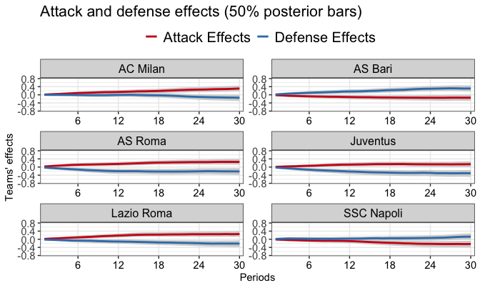

::: {.callout-note collapse="true"}
## Setup

The examples use the packages, the MCMC settings and the two working datasets created in [Get started](get-started.qmd):

```r
library(footBayes)
library(dplyr)
library(ggplot2)
library(bayesplot)
library(loo)

n_iter <- 1000
n_chains <- 4
seed <- 2026

data("italy")
italy <- as.data.frame(italy)

italy_2000 <- italy %>%
  filter(Season == "2000") %>%
  arrange(Date) %>%
  select(periods = Season, home_team = home, away_team = visitor,
         home_goals = hgoal, away_goals = vgoal)

italy_2018_2021 <- italy %>%
  filter(Season %in% c("2018", "2019", "2020", "2021")) %>%
  arrange(Season, Date) %>%
  group_by(Season) %>%
  mutate(half = if_else(row_number() <= n() / 2, 1, 2)) %>%
  ungroup() %>%
  mutate(periods = 2 * (as.numeric(Season) - 2018) + half) %>%
  select(periods, home_team = home, away_team = visitor,
         home_goals = hgoal, away_goals = vgoal)
```
:::

In the static models the attack and defence abilities of a team are constant over the whole period covered by the data. In the **dynamic** models they are allowed to change over time. The data are split into a sequence of periods (the match days of a single season, or groups of matches such as seasons and half-seasons), and the abilities of each period are linked to those of the previous one. This article shows how to fit dynamic models with `stan_foot()`, how to choose among the four specifications of the evolution variance offered by the package, and how to read the output of `print()` and `foot_abilities()` for a dynamic fit. The dynamic models are controlled by three arguments of `stan_foot()`:

| Argument | Values | What it controls |
|:--|:--|:--|
| `dynamic_type` | `"weekly"` or `"seasonal"` | The periods over which the abilities evolve: the match days of a single season, or the distinct values of the `periods` column |
| `dynamic_par` | A list with elements `common_sd`, `kl_variance`, `periods_per_season`, `spike`, `slab` | The specification of the evolution variance and its hyperparameters |
| `dynamic_weight` | `FALSE` (default) or `TRUE` | The weighted dynamic model with commensurate priors |

When `dynamic_type` is missing, the abilities are static (see [Static models](static-models.qmd)).

## How dynamic abilities work

### Abilities that evolve over periods

Let $\tau = 1, \ldots, \mathcal{T}$ index the training periods. Each team $t$ has an attack ability $\text{att}_{t, \tau}$ and a defence ability $\text{def}_{t, \tau}$ in every period, and a match played in period $\tau$ uses the abilities of that period. For instance, in the double Poisson model the scoring rates of a match between the home team $h$ and the away team $a$ are

$$\log \lambda_1 = \text{home}_\tau + \text{att}_{h, \tau} + \text{def}_{a, \tau}, \qquad \log \lambda_2 = \text{att}_{a, \tau} + \text{def}_{h, \tau}.$$

The abilities of consecutive periods are linked by the auto-regressive priors introduced in [Goal-based models](goal-based-models.qmd#static-and-dynamic-abilities),

$$\text{att}_{t, \tau} \sim \mathrm{N}(\text{att}_{t, \tau-1}, \sigma_{\text{att}}), \qquad \text{def}_{t, \tau} \sim \mathrm{N}(\text{def}_{t, \tau-1}, \sigma_{\text{def}}), \qquad \tau = 2, \ldots, \mathcal{T},$$

where the second argument of $\mathrm{N}(\cdot, \cdot)$ is a standard deviation. A few consequences are useful for reading the results:

- **Evolution standard deviations.** $\sigma_{\text{att}}$ and $\sigma_{\text{def}}$ measure how much an ability can move from one period to the next: the smaller they are, the more each period borrows from the previous one. They are not the between-team standard deviations of the static models, although they carry the same names. In the first period the abilities have prior mean 0 (the location of `prior_par$ability`) and the same standard deviations. The sum-to-zero constraint is imposed in every period.
- **Sign of the abilities.** A higher attack ability means more goals scored, whereas a higher defence ability means more goals *conceded*: the lower the defence ability, the better the defence.
- **Home effect.** The home effect is period-specific as well, $\text{home}_\tau$ (`home[1]`, ..., `home[T]` in the output). By default the home effects have independent $\mathrm{N}(0, 5)$ priors (set through `prior_par$home`) and are not linked by a random walk. The dynamic Student-$t$ model is an exception: it has a single overall ability per team and a single home effect.
- **Teams without matches.** All the teams in `data` have abilities in all the periods. If a team does not play in some period (e.g. after a relegation), no match informs its abilities in that period, and they evolve according to the prior only.
- **Out-of-sample matches.** The matches left out-of-sample through `predict` that fall after the last training period are predicted with the abilities and the home effect of the **last training period**: the random walk is not projected forward (see [Predictions](predictions.qmd)).

### Weekly or seasonal dynamics

The two values of `dynamic_type` differ in how the periods are obtained from the data:

| | `dynamic_type = "weekly"` | `dynamic_type = "seasonal"` |
|:--|:--|:--|
| `periods` column | A single value (one season); otherwise `stan_foot()` stops | At least two distinct values; with a single value `stan_foot()` warns that no dynamics is used |
| Periods of the model | Match days, derived from the row order | The distinct values of `periods`, numbered in order of first appearance |
| Requirements | Rows sorted chronologically, in complete match days of $T/2$ matches each ($T$ teams) | Rows sorted chronologically |

With weekly dynamics the dates are not used: the rows are split into consecutive blocks of $T/2$ matches, the first block being match day 1, the second match day 2, and so on. The number of in-sample matches (the rows of `data` minus `predict`) must be a multiple of $T/2$; otherwise `stan_foot()` stops with an error. If a match is postponed and placed in the data at the date it was actually played, the blocks no longer coincide with the real match days.

With seasonal dynamics the values of `periods` do not need to be consecutive integers, since they are renumbered $1, 2, \ldots$ in order of first appearance. For this reason the data must be sorted chronologically, with the matches to predict at the bottom.

## Weekly dynamics within a season

The Serie A 2000/2001 has 18 teams, i.e. 9 matches per match day and 306 matches in 34 match days. In `italy_2000`, sorted by date, every block of 9 consecutive rows contains all the 18 teams, so the blocks coincide with the match days. We fit a weekly-dynamic bivariate Poisson model, leaving the last four match days (36 matches) out-of-sample through the `predict` argument, which we will use in [Predictions](predictions.qmd):

``` r
fit_weekly <- stan_foot(
  data = italy_2000,
  model = "biv_pois",
  dynamic_type = "weekly",
  predict = 36,
  chains = n_chains,
  parallel_chains = n_chains,
  iter_sampling = n_iter,
  seed = seed
)
```

The model is fitted to the first $306 - 36 = 270$ matches, i.e. the abilities evolve over 30 match days. The evolution variance has the default specification (separate standard deviations for attack and defence, see below). The out-of-sample match days 31 to 34 are predicted with the abilities of match day 30.

### Evolution standard deviations

Since the home effect has 30 components, one per match day, we display the bivariate Poisson covariance parameter and the evolution standard deviations only:

``` r
print(fit_weekly, pars = c("rho", "sigma_att", "sigma_def"))
#> Summary of Stan football model
#> ------------------------------
#> 
#> Posterior summaries for model parameters:
#> # A tibble: 3 × 10
#>   variable       mean median    sd   mad     q5    q95  rhat ess_bulk ess_tail
#>   <chr>         <dbl>  <dbl> <dbl> <dbl>  <dbl>  <dbl> <dbl>    <dbl>    <dbl>
#> 1 rho          -1.74  -1.71  0.293 0.284 -2.26  -1.32   1.00   3466.    3229. 
#> 2 sigma_att[1]  0.054  0.053 0.016 0.015  0.029  0.082  1.25     12.3     28.2
#> 3 sigma_def[1]  0.063  0.063 0.018 0.018  0.036  0.094  1.09     30.4     90.6
```

The columns are the usual posterior summaries: mean, median, standard deviation (`sd`), median absolute deviation (`mad`), 5% and 95% quantiles (`q5`, `q95`, i.e. a 90% credible interval), the $\hat{R}$ statistic (`rhat`) and the bulk and tail effective sample sizes (`ess_bulk`, `ess_tail`), computed from $4 \times 1000 = 4000$ draws. The evolution standard deviations are printed as `sigma_att[1]` and `sigma_def[1]` because the Stan programs of the dynamic models declare them as arrays of length one when they are used and of length zero otherwise, so that a single program covers all the specifications of the evolution variance. The index `[1]` carries no further meaning.

- `rho` is the logarithm of the covariance parameter of the bivariate Poisson, $\lambda_3 = \exp\{\rho\}$. At the posterior median the covariance parameter equals $\exp\{-1.71\} \approx 0.18$, and the estimate is close to the static fit in [Static models](static-models.qmd) (posterior mean $-1.82$). Its $\hat{R}$ is 1.00 and its effective sample sizes exceed 3000.
- `sigma_att[1]` and `sigma_def[1]` are small (posterior means 0.054 and 0.063): within a single season the abilities change slowly from one match day to the next.

However, the $\hat{R}$ values of the two evolution standard deviations are too large (1.25 for `sigma_att[1]`, well above 1.1, and 1.09 for `sigma_def[1]`, above the usual 1.01 threshold). Their bulk effective sample sizes (12.3 and 30.4 out of 4000 draws) are also tiny: the sampler struggles to explore the posterior of the evolution standard deviations in the weekly model. These two summaries should not be trusted as they are: a longer run, a larger `adapt_delta` or a more informative prior on `ability_sd` (the prior of the evolution standard deviations) would be advisable before drawing conclusions; see [Practical notes](#practical-notes).

### Plotting the abilities with `foot_abilities`

For a dynamic fit, `foot_abilities()` plots the abilities over the periods, for all the teams or for those selected through the `teams` argument:

``` r
foot_abilities(fit_weekly, italy_2000,
  teams = c("AS Roma", "Juventus", "Lazio Roma", "AC Milan", "AS Bari", "SSC Napoli")
)
```

{fig-align="center" width="700"}

How to read the plot:

- there is one panel per team, in alphabetical order;
- the **red** line is the posterior median of the attack ability and the **blue** line the posterior median of the defence ability;
- the **grey bands** are the 50% posterior intervals (25% and 75% quantiles), as stated in the title; for dynamic fits no 95% interval is drawn;
- the **horizontal axis** shows the training periods, here the match days 1 to 30 (labelled "Periods"); the out-of-sample match days 31 to 34 are not displayed.

The trajectories start close to 0, since the abilities of the first match day have prior mean 0 and a prior standard deviation equal to the small evolution standard deviations; they then progressively diverge. The best teams of that season (AS Roma, Juventus, Lazio Roma, the first three in the final table) develop increasing attack and/or decreasing defence abilities, whereas the relegated teams (AS Bari, SSC Napoli) show the opposite pattern. By match day 30 the defence ability of AS Bari is about 0.3, the worst among the six teams displayed, and the attack ability of SSC Napoli has fallen to about $-0.2$. The bands become slightly wider towards match day 30, whose abilities are not followed by any further in-sample match.

Use `type = "attack"` or `type = "defense"` to plot one ability only:

```r
foot_abilities(fit_weekly, italy_2000, type = "attack",
  teams = c("AS Roma", "Juventus")
)
```

## Seasonal dynamics and the evolution variance

With `dynamic_type = "seasonal"` the abilities evolve across the values of the `periods` column. In `italy_2018_2021` the four Serie A seasons from 2018/2019 to 2021/2022 (20 teams and 380 matches each) are split into two halves of 190 matches, in chronological order, for a total of eight half-seasons:

| Season | First 190 matches | Last 190 matches |
|:--|:--|:--|
| 2018/2019 | 1 | 2 |
| 2019/2020 | 3 | 4 |
| 2020/2021 | 5 | 6 |
| 2021/2022 | 7 | 8 (out-of-sample) |

The last half-season is left out-of-sample below, so that the models are fitted to seven periods. Overall, 28 teams appear in the data, but only 20 of them play in each period. For instance, Empoli FC has matches in periods 1, 2, 7 and 8 only, so its abilities in periods 3 to 6 are driven by the prior.

### Four specifications of the evolution variance

In this setting the specification of the **evolution variance** matters, and the package offers four alternatives, selected through the `dynamic_par` and `dynamic_weight` arguments:

| Specification | Arguments | Evolution standard deviation | Parameters | Reference |
|:--|:--|:--|:--|:--|
| Separate variances (default) | none | $\sigma_{\text{att}}$, $\sigma_{\text{def}}$ | `sigma_att`, `sigma_def` | @egidi2018combining |
| Common variance | `dynamic_par = list(common_sd = TRUE)` | $\sigma$, shared by attack and defence | `sigma_common` | @owen2011dynamic |
| Variance inflation after the summer break | `dynamic_par = list(kl_variance = TRUE, periods_per_season = 2)` | $\sqrt{\sigma^2_k + \sigma^2_{\text{break}} I_\tau}$ | `sigma_att_kl`, `sigma_def_kl`, `sigma_break` | @koopman2015dynamic |
| Weighted dynamic model | `dynamic_weight = TRUE`, `dynamic_par = list(spike = ..., slab = ...)` | $1 / \phi_{k, t, \tau}$, specific to each team, ability and period | `prob_spike`, `comm_prec_att`, `comm_prec_def`, `comm_sd_att`, `comm_sd_def` | @macridemartino2026weighted |

`common_sd = TRUE`, `kl_variance = TRUE` and `dynamic_weight = TRUE` are mutually exclusive, and none of them is available for the Student-$t$ model. The variance inflation after the summer break requires `dynamic_type = "seasonal"`, whereas the other three specifications can also be used with weekly dynamics.

**Separate variances (default).** As in @egidi2018combining, two distinct standard deviations $\sigma_{\text{att}}$ and $\sigma_{\text{def}}$, shared by all the teams and periods, govern the evolution of the attack and of the defence abilities (parameters `sigma_att`, `sigma_def`).

**Common variance.** As in @owen2011dynamic, a single standard deviation $\sigma_{\text{att}} = \sigma_{\text{def}} = \sigma$ is shared by the two abilities (parameter `sigma_common`). It is selected with `dynamic_par = list(common_sd = TRUE)`.

**Variance inflation after the summer break.** @koopman2015dynamic allow the evolution variance to increase at the structural breaks of the championship, i.e. after the summer break, when rosters change the most:

\begin{equation}
\sigma^2_{k, \tau} = \sigma^2_{k} + \sigma^2_{\text{break}} \, I_\tau, \qquad k \in \{\text{att}, \text{def}\},
\end{equation}

where $I_\tau = 1$ if period $\tau$ follows a summer break and 0 otherwise. It is selected with `dynamic_par = list(kl_variance = TRUE)`. The package needs to know which periods follow a summer break: each season is assumed to be made of `periods_per_season` consecutive periods (2 by default, i.e. two half-seasons), counted from the first period of the data. The breaks therefore precede the periods $1 + m \times$ `periods_per_season`, $m = 1, 2, \ldots$. With our coding the breaks precede the periods 3, 5 and 7. The base standard deviations are called `sigma_att_kl` and `sigma_def_kl` (instead of `sigma_att` and `sigma_def`), and the additional standard deviation at the breaks `sigma_break`. A season split into, e.g., three periods requires `periods_per_season = 3`. The training data must contain more than `periods_per_season` periods, so that at least one break is observed.

**Weighted dynamic models.** All the specifications above use a *constant* evolution variance, which may over-borrow information from the previous period when a team changes abruptly (e.g. a new coach or a massive transfer campaign) and under-borrow when the team is stable. @macridemartino2026weighted propose weighting the evolution adaptively through **commensurate priors** [@hobbs2011hierarchical]: for each team $t$, ability $k \in \{\text{att}, \text{def}\}$ and period $\tau \ge 2$,

\begin{equation}
k_{t, \tau} \sim \mathrm{N}\left(k_{t, \tau-1}, \, 1 / \phi_{k, t, \tau}\right),
\end{equation}

where the commensurate precision $\phi_{k, t, \tau}$ governs how closely the current ability agrees with the previous one, and it is assigned a two-component mixture of half-normal distributions (a continuous **spike-and-slab** prior):

\begin{equation}
\phi_{k, t, \tau} \sim p_t \, \mathrm{N}^+(\mu_s, \psi_s) + (1 - p_t) \, \mathrm{N}^+(\mu_l, \psi_l), \qquad p_t \sim \mathrm{Beta}(1, 1).
\end{equation}

The spike $\mathrm{N}^+(\mu_s, \psi_s)$ is concentrated on large precisions, which implies strong borrowing of information from the previous period, whereas the slab $\mathrm{N}^+(\mu_l, \psi_l)$ is diffuse on small precisions and allows the ability to move away from its past value. The data decide, for each team and period, how much information to borrow. The weighted models are selected with `dynamic_weight = TRUE`, and the spike and slab hyperparameters are set through `dynamic_par$spike` and `dynamic_par$slab`, with defaults `normal(9, 1.5)` and `normal(0, 3)` as in @macridemartino2026weighted. The model adds the following parameters:

- `prob_spike`: the mixture weight $p_t$, one per team, shared by the attack and defence precisions of all the periods;
- `comm_prec_att`, `comm_prec_def`: the precisions $\phi_{k, t, \tau}$, one per period and team;
- `comm_sd_att`, `comm_sd_def`: the corresponding evolution standard deviations, $1 / \phi_{k, t, \tau}$.

Since the second argument of $\mathrm{N}(\cdot, \cdot)$ is a standard deviation, a precision of 9, the centre of the default spike, corresponds to an evolution standard deviation of $1/9 \approx 0.11$.

### Fitting the four specifications

We fit the four specifications of a dynamic double Poisson model to the first seven half-seasons, leaving the last half-season (190 matches) out-of-sample:

``` r
# separate evolution sds (Egidi et al., 2018)
fit_dyn <- stan_foot(
  data = italy_2018_2021,
  model = "double_pois",
  dynamic_type = "seasonal",
  predict = 190,
  chains = n_chains,
  parallel_chains = n_chains,
  iter_sampling = n_iter,
  seed = seed
)

# common evolution sd (Owen, 2011)
fit_dyn_owen <- stan_foot(
  data = italy_2018_2021,
  model = "double_pois",
  dynamic_type = "seasonal",
  dynamic_par = list(common_sd = TRUE),
  predict = 190,
  chains = n_chains,
  parallel_chains = n_chains,
  iter_sampling = n_iter,
  seed = seed
)

# variance inflation after the summer break (Koopman & Lit, 2015)
fit_dyn_kl <- stan_foot(
  data = italy_2018_2021,
  model = "double_pois",
  dynamic_type = "seasonal",
  dynamic_par = list(kl_variance = TRUE, periods_per_season = 2),
  predict = 190,
  chains = n_chains,
  parallel_chains = n_chains,
  iter_sampling = n_iter,
  seed = seed
)

# weighted dynamic model (Macrì Demartino et al., 2026)
fit_dyn_wdm <- stan_foot(
  data = italy_2018_2021,
  model = "double_pois",
  dynamic_type = "seasonal",
  dynamic_weight = TRUE,
  dynamic_par = list(spike = normal(9, 1.5), slab = normal(0, 3)),
  predict = 190,
  chains = n_chains,
  parallel_chains = n_chains,
  iter_sampling = n_iter,
  seed = seed
)
```

The elements of `dynamic_par` that are not supplied keep their defaults, so `dynamic_par = list(common_sd = TRUE)` is enough for the Owen model. The spike and slab passed to `fit_dyn_wdm` are the defaults, written out for clarity.

### Constant evolution variances

The evolution parameters of the three constant-variance specifications can be compared through the `print` method; for the Koopman and Lit model we also display the summer break indicators passed to Stan:

``` r
print(fit_dyn, pars = c("sigma_att", "sigma_def"))
#> Summary of Stan football model
#> ------------------------------
#> 
#> Posterior summaries for model parameters:
#> # A tibble: 2 × 10
#>   variable      mean median    sd   mad    q5   q95  rhat ess_bulk ess_tail
#>   <chr>        <dbl>  <dbl> <dbl> <dbl> <dbl> <dbl> <dbl>    <dbl>    <dbl>
#> 1 sigma_att[1] 0.194  0.192 0.023 0.022 0.158 0.234  1.01     546.    1130.
#> 2 sigma_def[1] 0.11   0.108 0.017 0.018 0.084 0.14   1.02     333.     850.
print(fit_dyn_owen, pars = "sigma_common")
#> Summary of Stan football model
#> ------------------------------
#> 
#> Posterior summaries for model parameters:
#> # A tibble: 1 × 10
#>   variable         mean median    sd   mad    q5   q95  rhat ess_bulk ess_tail
#>   <chr>           <dbl>  <dbl> <dbl> <dbl> <dbl> <dbl> <dbl>    <dbl>    <dbl>
#> 1 sigma_common[1] 0.155  0.155 0.014 0.014 0.133  0.18  1.00     441.     937.
fit_dyn_kl$stan_data$is_summer_break
#> [1] 0 0 1 0 1 0 1
print(fit_dyn_kl, pars = c("sigma_att_kl", "sigma_def_kl", "sigma_break"))
#> Summary of Stan football model
#> ------------------------------
#> 
#> Posterior summaries for model parameters:
#> # A tibble: 3 × 10
#>   variable         mean median    sd   mad    q5   q95  rhat ess_bulk ess_tail
#>   <chr>           <dbl>  <dbl> <dbl> <dbl> <dbl> <dbl> <dbl>    <dbl>    <dbl>
#> 1 sigma_att_kl[1] 0.192  0.191 0.023 0.023 0.157 0.232  1.00     605.    1416.
#> 2 sigma_def_kl[1] 0.107  0.105 0.018 0.018 0.079 0.138  1.01     337.     656.
#> 3 sigma_break[1]  0.046  0.04  0.033 0.033 0.004 0.109  1.00    1412.    1241.
```

Unlike in the weekly model, all the $\hat{R}$ values are at most 1.02 and the bulk effective sample sizes are above 300: the evolution parameters of these three fits do not show the sampling problems of the weekly one.

- **Separate variances.** The attack abilities evolve more than the defence ones ($\sigma_{\text{att}} \approx 0.19$, 90% interval 0.158–0.234, against $\sigma_{\text{def}} \approx 0.11$, 90% interval 0.084–0.14), and the two intervals do not overlap.
- **Common variance.** The common standard deviation of the Owen model, $\sigma \approx 0.155$, lies in between: with a single value, the attack abilities are allowed to move less, and the defence abilities more, than with the separate specification.
- **Summer break indicators.** `stan_data` is the list of data passed to Stan, and `is_summer_break` contains the indicators $I_\tau$ of the seven training periods: the 1s at positions 3, 5 and 7 mark the first halves of 2019/2020, 2020/2021 and 2021/2022. The out-of-sample period 8 is not included.
- **Variance inflation.** The base standard deviations of the Koopman and Lit model are almost identical to those of `fit_dyn`, and the additional variability after the summer break is small ($\sigma_{\text{break}} \approx 0.05$, with a 90% interval from 0.004 to 0.109). With the posterior means plugged in, the attack evolution standard deviation after a break is $\sqrt{0.192^2 + 0.046^2} \approx 0.197$, and the defence one $\sqrt{0.107^2 + 0.046^2} \approx 0.116$. In these seasons, therefore, the changes of the abilities across the summer are comparable to those between the two halves of a season. The break standard deviation $\sigma_{\text{break}}$ is informed by three breaks only, and its posterior is relatively wide (standard deviation 0.033 for a mean of 0.046).

### Weighted evolution variances

In the weighted model the posterior of the spike probability $p_t$ shows how much each team borrows from its past: values close to 1 indicate stable teams, whereas lower values indicate teams whose abilities changed abruptly in some periods. The `teams` argument of `print` restricts the team-specific parameters to the selected teams:

``` r
print(fit_dyn_wdm,
  pars = "prob_spike",
  teams = c("Juventus", "AC Milan", "SSC Napoli", "Atalanta", "AS Roma")
)
#> Summary of Stan football model
#> ------------------------------
#> 
#> Posterior summaries for model parameters:
#> # A tibble: 5 × 10
#>   variable           mean median    sd   mad    q5   q95  rhat ess_bulk ess_tail
#>   <chr>             <dbl>  <dbl> <dbl> <dbl> <dbl> <dbl> <dbl>    <dbl>    <dbl>
#> 1 prob_spike[Atala… 0.805  0.836 0.147 0.141 0.517 0.981  1.00     480.     631.
#> 2 prob_spike[Juven… 0.776  0.817 0.174 0.16  0.434 0.982  1.01     334.     538.
#> 3 prob_spike[SSC N… 0.809  0.859 0.17  0.142 0.464 0.99   1.01     246.     399.
#> 4 prob_spike[AS Ro… 0.864  0.903 0.129 0.101 0.6   0.993  1.01     358.     366.
#> 5 prob_spike[AC Mi… 0.836  0.877 0.144 0.121 0.549 0.989  1.01     399.     562.
```

The team-specific parameters are labelled with the team name in brackets, truncated (`~`) when the name does not fit the column width. The rows follow the internal order of the teams, i.e. the order in which they first appear in the data (Atalanta, Juventus, SSC Napoli, AS Roma, AC Milan), not the order of the `teams` argument.

For the five teams displayed, the posterior means of $p_t$ range between 0.78 (Juventus) and 0.86 (AS Roma), well above the prior mean of 0.5 of the $\mathrm{Beta}(1, 1)$ distribution: the top teams of these seasons borrow strongly from their past. For these teams the weighted model therefore behaves like a dynamic model with a small evolution variance. Each $p_t$ is informed by 14 precisions only (attack and defence in seven periods), and the 90% intervals are wide, with lower bounds between 0.43 and 0.60. The precisions and standard deviations of a team in each period can be displayed in the same way:

```r
print(fit_dyn_wdm, pars = c("comm_sd_att", "comm_sd_def"), teams = "AC Milan")
```

### Plotting the seasonal abilities

`foot_abilities` also plots the dynamic abilities in the seasonal case, for instance for the default specification:

``` r
foot_abilities(fit_dyn, italy_2018_2021,
  teams = c("Juventus", "Inter", "AC Milan", "SSC Napoli")
)
```

{fig-align="center" width="700"}

The plot is read as in the weekly case (red: attack, blue: defence, grey bands: 50% posterior intervals). Here the horizontal axis shows the values of the `periods` column of `data`, including the out-of-sample period 8, which is empty because the model has no abilities for it. The bands are barely visible, which is consistent with the 19 matches per team in each half-season, against a single match per match day in the weekly model.

The trajectories over the seven half-seasons reflect the recent history of the Serie A. The steady improvement of Inter, in both attack and defence, and the jump of the attack ability of AC Milan from the second half of 2019/2020 (period 4) anticipate the titles of 2020/2021 and 2021/2022, respectively. In contrast, Juventus, champion in 2019/2020, shows a slight decline of its attack ability in the last period. SSC Napoli improves its defence steadily over the seven periods.

## Practical notes

**Arguments that are often useful.** All the arguments of `stan_foot()` can be combined with the dynamic ones: `model` selects the likelihood (all the models listed in [Goal-based models](goal-based-models.qmd) have a dynamic version), `predict` leaves the last rows out-of-sample, `prior_par$ability_sd` sets the prior of the evolution standard deviations (half-Cauchy with scale 5 by default) and `prior_par$home` the prior of the period-specific home effects. The MCMC settings, such as `iter_warmup`, `iter_sampling` and `adapt_delta`, are passed to CmdStan through `...`. For instance, the following call fits the weekly model with a longer run, a smaller step size and a tighter prior on the evolution standard deviations. It is not run here, and whether it solves the convergence problem must be checked on the new $\hat{R}$ and effective sample sizes:

```r
fit_weekly_long <- stan_foot(
  data = italy_2000,
  model = "biv_pois",
  dynamic_type = "weekly",
  predict = 36,
  prior_par = list(ability_sd = normal(0, 0.1)),
  chains = n_chains,
  parallel_chains = n_chains,
  iter_warmup = 2000,
  iter_sampling = 2000,
  adapt_delta = 0.95,
  seed = seed
)
```

**Constraints and common errors.** `stan_foot()` stops with an error when:

- `dynamic_type = "weekly"` and the `periods` column contains more than one value, or the number of in-sample matches is not a multiple of $T/2$;
- two of `common_sd = TRUE`, `kl_variance = TRUE` and `dynamic_weight = TRUE` are combined, or one of them is used with `model = "student_t"`;
- `dynamic_weight = TRUE` or `kl_variance = TRUE` is used without `dynamic_type`;
- `kl_variance = TRUE` is used with `dynamic_type = "weekly"`, or the training data do not contain more than `periods_per_season` periods;
- `periods_per_season` is not an integer greater than or equal to 2;
- `spike` or `slab` is not a `normal()` prior with a scale, or has a negative location;
- `dynamic_par` contains elements other than `common_sd`, `kl_variance`, `periods_per_season`, `spike` and `slab`.

**Convergence.** Always check $\hat{R}$ and the effective sample sizes of the evolution parameters, as done above: in the weekly model of this article they signal a sampling problem, whereas the summaries of the seasonal fits do not. The fitted models are compared in [Model comparison](model-comparison.qmd), and the predictions of `fit_weekly` are analysed in [Predictions](predictions.qmd).
