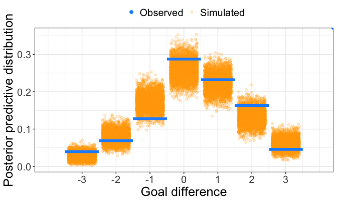
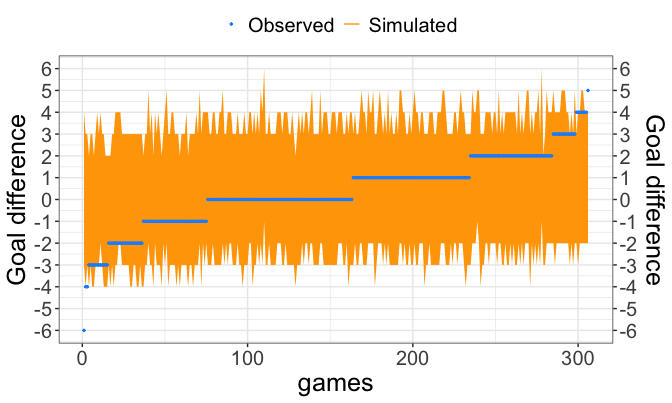
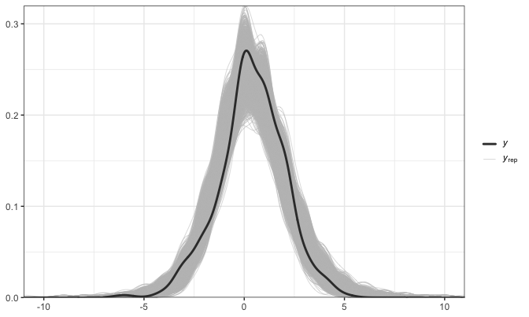

::: {.callout-note collapse="true"}
## Setup

The examples use the static bivariate Poisson model fitted in [Static models](static-models.qmd):

```r
library(footBayes)
library(dplyr)
library(ggplot2)
library(bayesplot)
library(loo)

n_iter <- 1000
n_chains <- 4
seed <- 2026

data("italy")
italy <- as.data.frame(italy)

italy_2000 <- italy %>%
  filter(Season == "2000") %>%
  arrange(Date) %>%
  select(periods = Season, home_team = home, away_team = visitor,
         home_goals = hgoal, away_goals = vgoal)

fit_bp <- stan_foot(
  data = italy_2000,
  model = "biv_pois",
  chains = n_chains,
  parallel_chains = n_chains,
  iter_sampling = n_iter,
  seed = seed
)
```
:::

Checking the model fit is a necessary part of the analysis: a model that cannot reproduce the main features of the data it was fitted to should not be trusted for inference or prediction. This article shows how to check a model fitted with `stan_foot()` through **posterior predictive checks**, which compare the observed results with results simulated from the fitted model. It also explains how to read the output of the tools that implement them:

| Tool | What is compared | Output |
|:--|:--|:--|
| `pp_foot(type = "aggregated")` | Relative frequencies of the goal differences from -3 to 3, observed against replicated | Frequency plot, Bayesian p-value of each goal difference |
| `pp_foot(type = "matches")` | Observed goal difference of each match against its posterior predictive interval | Plot of the ordered matches, empirical coverage of the intervals |
| `bayesplot` functions | Any feature of the data, using the replications `y_rep` stored in the fit | Plots such as the overlay of the observed and replicated densities |

## How posterior predictive checks work

### Convergence first

All the checks below are computed from the posterior draws, hence they are meaningful only if the MCMC sampler has converged. Before checking the fit, look at the split-$\hat{R}$ (`rhat`, which should be close to 1) and at the bulk and tail effective sample sizes (`ess_bulk`, `ess_tail`) returned by `print(fit_bp)`. This output is explained in [Static models](static-models.qmd), where it shows no convergence problems for `fit_bp`.

### Replicated data

We can evaluate hypothetical replications $\mathcal{D}^{\text{rep}}$ under the **posterior predictive distribution**

$$p(\mathcal{D}^{\text{rep}} \mid \mathcal{D}) = \int p(\mathcal{D}^{\text{rep}} \mid \boldsymbol{\theta}) \, \pi(\boldsymbol{\theta} \mid \mathcal{D}) \, d\boldsymbol{\theta},$$

and check whether these replications are close to the observed data. These comparisons are the **posterior predictive checks**; see @gelman2014bayesian for an overview. In practice $\mathcal{D}^{\text{rep}}$ is obtained by simulation: for each of the $S$ posterior draws $\boldsymbol{\theta}^{(s)}$, Stan simulates a new pair of goals for every match used in the fit, from the same model and with the same teams. The fitted object stores them as

- `y_rep`: the replicated home and away goals, an array with dimensions $S \times N \times 2$;
- `diff_y_rep`: the replicated goal differences (home minus away goals), an $S \times N$ matrix used by `pp_foot()` (the Student-$t$ model, which describes the goal difference directly, stores only this one).

Here $S = 4000$ (4 chains of 1000 iterations) and $N = 306$, the matches of the 2000/2001 Serie A, all used to fit `fit_bp`. Each draw $s$ is therefore a whole **replicated season**, played by the same teams in the same matches.

The replications `y_rep` and the out-of-sample predictions `y_prev` described in [Predictions](predictions.qmd) are simulated in the same way, but for different matches: `y_rep` re-generates the matches used in the fit, whereas `y_prev` generates the last `predict` matches, which the model has not seen. Since the replications concern data already used to estimate the parameters, a good agreement is a check of the model fit, not a measure of its predictive accuracy. To assess predictive accuracy, use out-of-sample predictions or the tools in [Model comparison](model-comparison.qmd).

### Bayesian p-values

A discrepancy between the data and the model is summarized by a test quantity $T(\mathcal{D})$, e.g. the proportion of draws in the season, and its observed value is compared with its distribution over the replications. The **Bayesian p-value** (or posterior predictive p-value) is

$$p_B = \text{Pr}\big(T(\mathcal{D}^{\text{rep}}) \geq T(\mathcal{D}) \mid \mathcal{D}\big) \approx \frac{1}{S} \sum_{s=1}^S I\big(T(\mathcal{D}^{\text{rep}, (s)}) \geq T(\mathcal{D})\big),$$

i.e. the proportion of replicated seasons in which the test quantity is at least as large as the observed one. It is read as follows:

- values around **0.5**: the observed value is typical of the replications, and the model reproduces this feature of the data;
- values close to **0**: the observed value is larger than almost all the replicated ones, i.e. the model **underestimates** $T$;
- values close to **1**: the observed value is smaller than almost all the replicated ones, i.e. the model **overestimates** $T$.

A Bayesian p-value is not the probability that the model is true: it only indicates in which direction, and how strongly, the model fails to reproduce a specific feature of the data.

## Goal difference frequencies with `pp_foot(type = "aggregated")`

The first check concerns the distribution of the goal differences $Z_n = X_n - Y_n$, where $X_n$ and $Y_n$ are the home and away goals of the $n$-th match. For each value $d$ from -3 to 3, the test quantity is the relative frequency of the matches that ended with goal difference $d$,

$$T_d(\mathcal{D}) = \frac{1}{N} \sum_{n=1}^N I(z_n = d),$$

computed on the observed season and on each of the $S$ replicated seasons. `pp_foot()` takes the fitted model, the same `data` used for the fit and the `type` of check; `type = "aggregated"` is the default:

``` r
pp_foot(object = fit_bp, data = italy_2000, type = "aggregated")
#> $pp_plot
```

{fig-align="center" width="700"}

How to read the plot:

- the horizontal axis is the goal difference, from -3 (an away win by three goals) to 3 (a home win by three goals);
- the **blue segments** are the observed relative frequencies $T_d(\mathcal{D})$: for instance, 88 of the 306 matches ended in a draw, a relative frequency of 0.288;
- the **orange points** are the replicated relative frequencies $T_d(\mathcal{D}^{\text{rep}, (s)})$, one for each of the 4000 replicated seasons, jittered horizontally so that the cloud is visible: their vertical spread shows how much the frequency of each goal difference varies from one replicated season to another;
- the blue dot in the top-right corner is only used to draw the legend and carries no information.

A blue segment inside its cloud means that the observed frequency is compatible with the model, whereas a segment at the edge of, or outside, the cloud signals a misfit. The `pp_table` element contains the corresponding Bayesian p-values:

```
#> 
#> $pp_table
#>   goal diff. Bayesian p-value
#> 1         -3            0.165
#> 2         -2            0.765
#> 3         -1            0.985
#> 4          0            0.156
#> 5          1            0.377
#> 6          2            0.074
#> 7          3            0.872
```

For each goal difference $d$, the `Bayesian p-value`, rounded to three decimals, is the proportion of the 4000 replicated seasons whose relative frequency of $d$ is greater than or equal to the observed one. Since the frequencies are multiples of $1/306$, replicated seasons with exactly the observed frequency are counted in the numerator.

The static bivariate Poisson model reproduces the overall shape of the distribution, including its asymmetry: home wins by one goal are more frequent than away wins by one goal, in both the observed and the replicated seasons. The p-values for $d = -3, -2, 1, 3$ (0.165, 0.765, 0.377, 0.872) indicate no clear misfit. For the remaining goal differences:

- **draws** ($d = 0$) are slightly more frequent than the model expects, but not clearly underestimated: 15.6% of the replicated seasons have at least as many draws as the observed season (p-value 0.156), and in the plot the blue segment lies in the upper part of the cloud;
- **away wins by one goal** ($d = -1$) are **overestimated**: only 1.5% of the replicated seasons have fewer of them than observed (p-value 0.985), and the blue segment lies near the bottom of the cloud;
- to a lesser extent, home wins by two goals are underestimated (0.074).

In this season, therefore, the static bivariate Poisson model does not clearly underestimate the draws. When a model underestimates the draws, `stan_foot()` provides the diagonal-inflated bivariate Poisson (`model = "diag_infl_biv_pois"`) and zero-inflated Skellam (`model = "zero_infl_skellam"`) models to better capture draw occurrences, in the spirit of @karlis2003analysis; see [Goal-based models](goal-based-models.qmd).

## Match-by-match intervals with `pp_foot(type = "matches")`

The second check looks at individual matches. For each match, `pp_foot()` computes the posterior predictive interval of its goal difference from the 4000 replicated values, using the $\alpha/2$ and $1 - \alpha/2$ quantiles, where $1 - \alpha$ is given by the `coverage` argument (default 0.95, i.e. the 2.5% and 97.5% quantiles):

```
pp_foot(object = fit_bp, data = italy_2000, type = "matches")
#> $pp_plot
```

{fig-align="center" width="700"}

How to read the plot:

- the horizontal axis (`games`) lists the 306 matches, **sorted by their observed goal difference**, from the largest away win on the left to the largest home win on the right;
- the **blue points** are the observed goal differences, which form a staircase because of the sorting;
- the **orange band** is the 95% posterior predictive interval of each match; the line of the posterior medians is drawn in the same color and cannot be distinguished from the band.

The `pp_table` element compares the nominal and the empirical coverage of the intervals:

```
#> 
#> $pp_table
#>   1-alpha emp. coverage
#> 1    0.95         0.938
```

- `1-alpha`: the nominal level of the intervals, i.e. the `coverage` argument;
- `emp. coverage`: the proportion of matches whose observed goal difference falls strictly inside its interval.

The empirical coverage, 0.938, corresponds to 287 of the 306 matches and is close to the nominal 0.95: as a whole, the intervals are neither too narrow nor too wide. All the draws and all the matches decided by one goal fall inside their interval. Hence the 19 matches outside their interval were all decided by two or more goals; they include the largest away win at the left end and the largest home win at the right end of the plot. However, most intervals span all the results from about -3 or -2 to 3 or 4: a 95% interval for the goal difference of a single match is wide, so this check mainly detects results that are extreme for the model.

Since the goal differences are integers and the comparison is strict, an observed value equal to one of the bounds counts as outside the interval. With narrow intervals, e.g. `coverage = 0.5`, the empirical coverage can therefore be well below the nominal level even for an adequate model.

## Other checks with `bayesplot`

Any other check can be obtained with the `bayesplot` package from the in-sample replications `y_rep` stored in the `CmdStanFit` object (the `fit` element of the `stanFoot` object). For instance, the following code overlays the density of the observed goal differences on the replicated ones:

``` r
draws_bp <- posterior::as_draws_rvars(fit_bp$fit$draws())
y_rep <- posterior::draws_of(draws_bp[["y_rep"]])
goal_diff <- italy_2000$home_goals - italy_2000$away_goals

ppc_dens_overlay(goal_diff, y_rep[, , 1] - y_rep[, , 2], bw = 0.5) +
  theme_bw()
```

{fig-align="center" width="700"}

The code works as follows:

- `draws_of()` returns the replications as an array with dimensions $4000 \times 306 \times 2$ (draws, matches, home/away goals). Hence `y_rep[, , 1]` and `y_rep[, , 2]` are the $4000 \times 306$ matrices of the replicated home and away goals, and their difference is the matrix of the replicated goal differences (the same values stored in `diff_y_rep`);
- `goal_diff` is the vector of the 306 observed goal differences;
- `ppc_dens_overlay()` draws a kernel density estimate of the observed data (`y`, thick dark line) and one of each replicated season (`y_rep`, thin light lines, one per row of the matrix);
- `bw = 0.5` is the bandwidth passed to `stats::density()`, i.e. the standard deviation of the Gaussian smoothing kernel. The goal differences are integers, and the bandwidth determines how much the density estimate smooths them.

The observed density lies within the bundle of the replicated ones, i.e. the model reproduces the overall distribution of the goal differences. In agreement with the Bayesian p-values above, the observed curve lies in the upper part of the bundle around zero (slightly more draws than the model expects). On the negative side, it lies close to the lower edge of the bundle (fewer away wins than the model expects). Since the smoothing mixes adjacent integer values, discrepancies concerning a single goal difference are less visible here than in `pp_foot()`.

For discrete data, bar charts and test statistics are often easier to read than densities. A few other checks use the same objects:

```r
diff_rep <- y_rep[, , 1] - y_rep[, , 2]

# observed counts of each goal difference (bars) against the replicated ones
ppc_bars(goal_diff, diff_rep)

# proportion of draws: observed value against its distribution over the replications
ppc_stat(goal_diff, diff_rep, stat = function(z) mean(z == 0))

# home goals only
ppc_bars(italy_2000$home_goals, y_rep[, , 1])
```

The `ppc_stat()` call is the graphical counterpart of the Bayesian p-value for draws in the `pp_table` above, since it uses the same test quantity and the same replications.

## Practical notes

- `pp_foot()` accepts a `stanFoot` object, the `CmdStanFit` object in its `fit` element, or an `rstan` `stanfit` object. It requires the replicated goal differences `diff_y_rep`, which are stored by all the goal-based models of `stan_foot()`. It does not work with the output of `mle_foot()`, which has no replications, nor with the Bradley-Terry-Davidson models fitted with `btd_foot()`.
- For the Student-$t$ model the replicated goal differences are continuous: `pp_foot(type = "aggregated")` rounds them to the nearest integer before computing the frequencies. This model stores `diff_y_rep` but not `y_rep`, so in the `bayesplot` code above use `posterior::draws_of(draws_bp[["diff_y_rep"]])` in place of the difference of the two columns of `y_rep`.
- `pp_foot()` reads the observed goals from the **fourth and fifth columns** of `data`: keep the column order `periods`, `home_team`, `away_team`, `home_goals`, `away_goals` required by `stan_foot()`.
- For a model fitted with `predict > 0`, the replications cover only the in-sample matches. In this case, pass only the in-sample rows of `data` to `pp_foot()`, because with `type = "aggregated"` the observed frequencies are otherwise computed on all the rows. For instance, use `data = italy_2000[1:(nrow(italy_2000) - 36), ]` for a model fitted with `predict = 36`.
- The aggregated check only considers the goal differences from -3 to 3: in this season, 11 of the 306 matches ended with a larger margin and are not shown.
- Another in-sample check reconstructs the final league table from the replications with `foot_rank()`, applied to a model fitted without out-of-sample matches: see [Predictions](predictions.qmd#in-sample-reconstruction).
