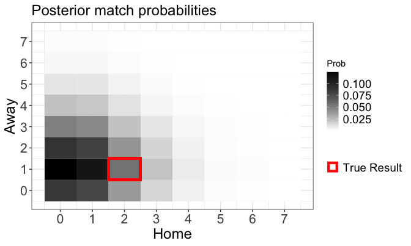
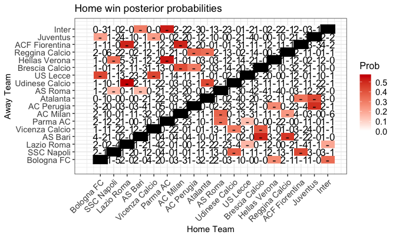
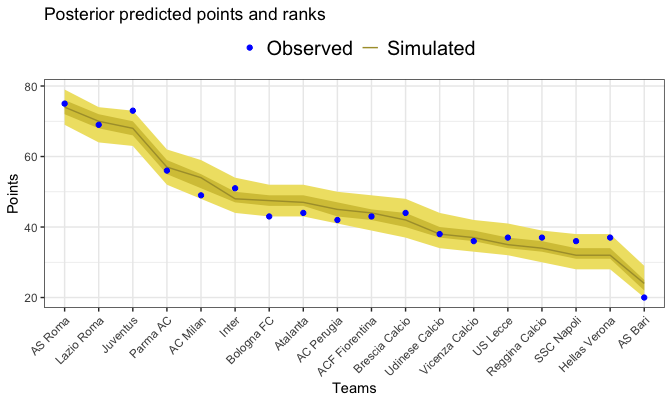
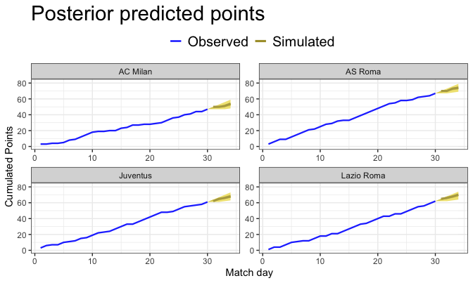

::: {.callout-note collapse="true"}
## Setup

The examples use the static bivariate Poisson model fitted in [Static models](static-models.qmd) and the weekly-dynamic model fitted in [Dynamic models](dynamic-models.qmd); the latter leaves the last four match days out-of-sample:

```r
library(footBayes)
library(dplyr)
library(ggplot2)
library(bayesplot)
library(loo)

n_iter <- 1000
n_chains <- 4
seed <- 2026

data("italy")
italy <- as.data.frame(italy)

italy_2000 <- italy %>%
  filter(Season == "2000") %>%
  arrange(Date) %>%
  select(periods = Season, home_team = home, away_team = visitor,
         home_goals = hgoal, away_goals = vgoal)

fit_bp <- stan_foot(
  data = italy_2000,
  model = "biv_pois",
  chains = n_chains,
  parallel_chains = n_chains,
  iter_sampling = n_iter,
  seed = seed
)

fit_weekly <- stan_foot(
  data = italy_2000,
  model = "biv_pois",
  dynamic_type = "weekly",
  predict = 36,
  chains = n_chains,
  parallel_chains = n_chains,
  iter_sampling = n_iter,
  seed = seed
)
```
:::

Predicting the results of future matches is often the final goal of a football model. This article shows how to obtain out-of-sample predictions with `footBayes` and how to read the output of the three functions that summarize them:

| Function | Question it answers | Output |
|:--|:--|:--|
| `foot_prob()` | How is a given match likely to end? | Home win, draw and away win probabilities, most likely score, score probability heatmap |
| `foot_round_robin()` | Which team is favoured in each future match? | Home win probability of every out-of-sample match, in a round-robin grid |
| `foot_rank()` | What will the final league table look like? | Predicted final points of each team, observed against simulated |

## How predictions work

### Leaving matches out-of-sample

Predictions are requested when the model is fitted, through the `predict` argument of `stan_foot()` (and of `mle_foot()`). The model is fitted to all the rows of `data` except the **last `predict` rows**, which are treated as future matches. For this reason the data must be sorted in chronological order, with the matches to predict at the bottom.

In the Setup, `fit_weekly` uses `predict = 36`. The 2000/2001 Serie A has 18 teams, i.e. 9 matches per match day, so the last **four match days** (from 31 to 34) are left out-of-sample. Their observed results are not used to fit the model, but they are kept in `data` so that the functions below can compare the predictions with what actually happened.

### The posterior predictive distribution

For a Bayesian model, the predictions come from the **posterior predictive distribution** of the future data $\tilde{\mathcal{D}}$,

$$p(\tilde{\mathcal{D}} \mid \mathcal{D}) = \int p(\tilde{\mathcal{D}} \mid \boldsymbol{\theta}) \, \pi(\boldsymbol{\theta} \mid \mathcal{D}) \, d\boldsymbol{\theta},$$

which averages the sampling model over the posterior distribution of the parameters, and therefore accounts for the full uncertainty about the team abilities and the other parameters. In practice it is obtained by simulation: for each of the $S$ posterior draws $\boldsymbol{\theta}^{(s)}$, Stan simulates the goals $(\tilde{x}^{(s)}, \tilde{y}^{(s)})$ of every out-of-sample match (they are stored as `y_prev` in the fitted object). Any probability of interest is then the proportion of simulations in which the event occurs. For instance, the probability of a home win is

$$p_{\text{home}} = \text{Pr}(\tilde{X} > \tilde{Y}) \approx \frac{1}{S} \sum_{s=1}^S I(\tilde{x}^{(s)} > \tilde{y}^{(s)}).$$

With 4 chains of 1000 iterations, every probability below is computed from $S = 4000$ simulated results of each match.

## Match probabilities with `foot_prob`

`foot_prob()` takes the fitted model, the same `data` used for the fit and, optionally, the `home_team` and `away_team` of the matches of interest. It requires a model fitted with `predict > 0`, and the selected matches must be among the out-of-sample ones. Consider, for instance, Reggina Calcio - AC Milan, one of the out-of-sample matches:

``` r
foot_prob(
  object = fit_weekly, data = italy_2000,
  home_team = "Reggina Calcio", away_team = "AC Milan"
)
#> $prob_table
#>        home_team away_team prob_h prob_d prob_a         mlo
#> 1 Reggina Calcio  AC Milan  0.251  0.249  0.501 0-1 (0.124)
#> 
#> $prob_plot
```

{fig-align="center" width="700"}

The `prob_table` element contains one row per match:

- `prob_h`, `prob_d`, `prob_a`: the posterior probabilities of a home win, a draw and an away win, which sum to 1;
- `mlo`: the **most likely outcome**, i.e. the single score with the highest probability, followed by that probability in brackets.

The model favours AC Milan, with an away win probability close to 0.5, and the most likely score is 0-1. Even this score has a probability of only 0.124: football scores are very uncertain, and a single score is rarely predicted with high probability.

The `prob_plot` element is a heatmap of the probabilities of all the scores, with the home goals on the horizontal axis and the away goals on the vertical axis: the darker the cell, the more likely the score. The red square marks the observed result, a 2-1 home win. The model assigned it a small but non-negligible probability (recall that football is about rare events).

A few other ways of calling the function:

```r
# several matches: home_team and away_team are matched by position
foot_prob(fit_weekly, italy_2000,
  home_team = c("Reggina Calcio", "AS Roma"),
  away_team = c("AC Milan", "Parma AC")
)

# all the out-of-sample matches
foot_prob(fit_weekly, italy_2000)
```

With more than one match, the heatmap shows one panel per match, limited to the scores from 0-0 to 4-4. For the Student-$t$ model, which describes the goal difference, only the table with the three outcome probabilities is returned. `foot_prob()` also accepts the output of `mle_foot()` fitted with `predict > 0`: in this case, it obtains the probabilities by simulating the goals from the maximum likelihood estimates and returns only the table.

## Home win probabilities with `foot_round_robin`

`foot_round_robin()` gives an overview of all the out-of-sample matches at once, arranged as in a round-robin tournament:

```r
foot_round_robin(object = fit_weekly, data = italy_2000)
```

{fig-align="center" width="700"}

How to read the plot:

- each **column** is a home team and each **row** an away team, so that every cell is a match; the black cells on the diagonal are the impossible matches of a team against itself;
- the **coloured cells** are the out-of-sample matches, and the colour encodes the posterior probability of a **home win**: the redder the cell, the more the home team is favoured, whereas white cells denote matches in which the home team is unlikely to win (an away win or a draw is more likely);
- the **scores** written in the cells are the observed results of the in-sample matches, i.e. the matches used to fit the model; the out-of-sample matches show a dash.

For instance, Lazio Roma - Udinese Calcio (0.577) and Parma AC - Hellas Verona (0.538) are among the matches with the strongest home favourites. In contrast, AS Bari - AS Roma (0.151) is one of the least likely home wins, with the last team of the league hosting the champion.

The same probabilities are returned in the `round_table` element, with one row per out-of-sample match (`Home_prob` is the home win probability, `Observed` is a dash for the matches not used in the fit):

::: {.callout-tip collapse="true"}
## Show the `round_table` output

```r
#> $round_table
#>              Home           Away Home_prob Observed
#> 1   Hellas Verona     Bologna FC     0.266        -
#> 2           Inter     Bologna FC     0.341        -
#> 3  Udinese Calcio     SSC Napoli     0.375        -
#> 4  ACF Fiorentina     SSC Napoli     0.429        -
#> 5        US Lecce     Lazio Roma     0.160        -
#> 6           Inter     Lazio Roma     0.198        -
#> 7  Brescia Calcio        AS Bari     0.513        -
#> 8  Reggina Calcio        AS Bari     0.475        -
#> 9  Udinese Calcio Vicenza Calcio     0.306        -
#> 10 Brescia Calcio Vicenza Calcio     0.389        -
#> 11        AS Roma       Parma AC     0.340        -
#> 12       US Lecce       Parma AC     0.144        -
#> 13        AS Roma       AC Milan     0.360        -
#> 14 Reggina Calcio       AC Milan     0.234        -
#> 15  Hellas Verona     AC Perugia     0.266        -
#> 16       Juventus     AC Perugia     0.488        -
#> 17 ACF Fiorentina       Atalanta     0.319        -
#> 18       Juventus       Atalanta     0.426        -
#> 19     SSC Napoli        AS Roma     0.160        -
#> 20        AS Bari        AS Roma     0.151        -
#> 21     Lazio Roma Udinese Calcio     0.577        -
#> 22       Atalanta Udinese Calcio     0.430        -
#> 23     Bologna FC       US Lecce     0.434        -
#> 24 Vicenza Calcio       US Lecce     0.439        -
#> 25       AC Milan Brescia Calcio     0.414        -
#> 26     AC Perugia Brescia Calcio     0.301        -
#> 27     SSC Napoli  Hellas Verona     0.341        -
#> 28       Parma AC  Hellas Verona     0.538        -
#> 29     AC Perugia Reggina Calcio     0.362        -
#> 30       Atalanta Reggina Calcio     0.337        -
#> 31     Lazio Roma ACF Fiorentina     0.510        -
#> 32       AC Milan ACF Fiorentina     0.513        -
#> 33     Bologna FC       Juventus     0.215        -
#> 34 Vicenza Calcio       Juventus     0.224        -
#> 35        AS Bari          Inter     0.300        -
#> 36       Parma AC          Inter     0.528        -
```
:::

Use the `teams` argument to restrict the grid to a subset of teams, and `output = "table"` or `output = "plot"` to return only one of the two elements.

## League table with `foot_rank`

Predicting the final league table is one of the most popular tasks in football analytics. `foot_rank()` converts the simulated results into **points** (3 for a win, 1 for a draw, 0 for a loss) and computes, for each team, the distribution of its final points. It works in two ways, depending on how the model was fitted:

| Model fitted with | Points of the played matches | Points of the future matches | What you get |
|:--|:--|:--|:--|
| `predict = 0` (or missing) | simulated from the model ($\mathcal{D}^{\text{rep}}$) | none | **in-sample reconstruction** of the table: a model check |
| `predict > 0` | observed | simulated ($\tilde{\mathcal{D}}$) | **out-of-sample prediction** of the final table |

The `visualize` argument controls the output: `"aggregated"` returns the final table and a plot of the final points of all the teams, whereas `"individual"` (the default) plots the cumulative points of each team over the match days. In the `rank_table` element, `obs. points` are the points actually obtained at the end of the season, and `median`, `q25` and `q75` are the median and the 25% and 75% quantiles of the simulated final points. In the plots, the blue points/lines are the observed points, the darker band is the 50% credible interval and the lighter band the 95% credible interval.

### In-sample reconstruction

The static model `fit_bp` has no out-of-sample matches, hence the whole season is replicated from the model:

``` r
foot_rank(object = fit_bp, data = italy_2000, visualize = "aggregated")
#> $rank_table
#>             teams obs. points median q25 q75
#> 1         AS Roma          75     62  56  68
#> 2        Juventus          73     62  56  68
#> 3      Lazio Roma          69     59  53  65
#> 4        Parma AC          56     55  50  62
#> 5        AC Milan          49     51  45  57
#> 6        Atalanta          44     48  42  54
#> 7  Brescia Calcio          44     48  41  53
#> 8  ACF Fiorentina          43     47  41  53
#> 9           Inter          51     46  40  52
#> 10     AC Perugia          42     45  39  51
#> 11     Bologna FC          43     45  39  50
#> 12 Udinese Calcio          38     42  37  48
#> 13 Vicenza Calcio          36     40  34  46
#> 14       US Lecce          37     40  35  46
#> 15 Reggina Calcio          37     39  33  45
#> 16     SSC Napoli          36     39  33  45
#> 17  Hellas Verona          37     38  32  44
#> 18        AS Bari          20     31  25  37
#> 
#> $rank_plot
```

{fig-align="center" width="700"}

The observed points of 14 of the 18 teams fall inside the 50% band, but the model compresses the table: the three top teams (AS Roma, Juventus, Lazio Roma) obtained more points than predicted, whereas AS Bari, last with 20 points, obtained fewer. This compression is typical of static models with exchangeable abilities, which shrink the teams towards the average and assume that the strength of a team does not change during the season.

### Out-of-sample prediction

`fit_weekly` left the last four match days out-of-sample. The points of the first 30 match days are the observed ones, and only the last four match days are simulated:

``` r
foot_rank(object = fit_weekly, data = italy_2000, visualize = "aggregated")
#> $rank_table
#>             teams obs. points median q25 q75
#> 1         AS Roma          75     74  72  76
#> 2      Lazio Roma          69     70  68  72
#> 3        Juventus          73     68  66  70
#> 4        Parma AC          56     57  55  59
#> 5        AC Milan          49     54  51  55
#> 6           Inter          51     48  47  50
#> 7      Bologna FC          43     48  46  49
#> 8        Atalanta          44     47  46  49
#> 9      AC Perugia          42     45  43  47
#> 10 ACF Fiorentina          43     44  42  45
#> 11 Brescia Calcio          44     42  40  44
#> 12 Udinese Calcio          38     38  37  40
#> 13 Vicenza Calcio          36     37  36  39
#> 14       US Lecce          37     35  34  37
#> 15 Reggina Calcio          37     34  33  36
#> 16     SSC Napoli          36     32  31  34
#> 17  Hellas Verona          37     32  31  34
#> 18        AS Bari          20     24  22  25
#> 
#> $rank_plot
```

{fig-align="center" width="700"}

Since only 12 points out of 102 are still to be played, the intervals are much narrower than in the in-sample reconstruction. The model correctly predicts AS Roma as the champion and AS Bari as the last team. Juventus, however, obtained more points than predicted in the last four match days (73 against a median of 68).

With `visualize = "individual"`, the plot shows the race of the selected teams over the season, with the observed cumulative points up to match day 30 followed by the simulated points of the last four match days and their credible intervals:

``` r
foot_rank(
  object = fit_weekly, data = italy_2000,
  teams = c("AS Roma", "Juventus", "Lazio Roma", "AC Milan"),
  visualize = "individual"
)
```

{fig-align="center" width="700"}

When predicting out-of-sample, `foot_rank()` requires the out-of-sample matches to belong to a single season (or value of `periods`) and to include at least two complete match days.
